# Autonomous Tax OS — Agent Hierarchy & Delegation Architecture

> **Status**: Approved System Specification  
> **Document Version**: 1.0.0  
> **Core Principle**: Strict Hierarchical Delegation — No Lateral Uncontrolled Swarming  

---

## 1. The Strict Supervisory Tree

Autonomous Tax OS enforces a rigid **Two-Tier Supervisory Tree**. Leaf-level worker agents are strictly forbidden from initiating arbitrary cross-domain conversations. All cross-domain collaboration is mediated by Domain Supervisors and the top-level **Tax Case Supervisor**.

```mermaid
graph TD
    TCS[TAX CASE SUPERVISOR<br/>Master State Machine & Lifecycle Controller]

    DS1[1. Intake Supervisor]
    DS2[2. Financial Intelligence Supervisor]
    DS3[3. Tax Intelligence Supervisor]
    DS4[4. Verification & Adversarial Supervisor]
    DS5[5. Calculation & Filing Supervisor]
    DS6[6. Professional Review Supervisor]
    DS7[7. Year-Round Planning Supervisor]
    DS8[8. Platform Safety Supervisor]

    TCS --> DS1
    TCS --> DS2
    TCS --> DS3
    TCS --> DS4
    TCS --> DS5
    TCS --> DS6
    TCS --> DS7
    TCS --> DS8

    subgraph Intake Domain
        DS1 --> IA[Intake Agent]
        DS1 --> DR[Document Router]
        DS1 --> DE[Document Extractor]
        DS1 --> IV[Identity Verifier]
        DS1 --> MD[Missing Document Agent]
    end

    subgraph Financial Intelligence Domain
        DS2 --> TN[Transaction Normalizer]
        DS2 --> IR[Income Reconstructor]
        DS2 --> EC[Expense Classifier]
        DS2 --> RM[Receipt Matcher]
        DS2 --> BP[Business Purpose Agent]
    end

    subgraph Tax Intelligence Domain
        DS3 --> DH[Deduction Hunter]
        DS3 --> CH[Credit Hunter]
        DS3 --> RR[Tax Rule Resolver]
        DS3 --> QB[QBI Agent]
        DS3 --> SA[State Modules CA/NY/NJ/IL/MA]
    end

    subgraph Adversarial Domain
        DS4 --> IC[IRS Challenger]
        DS4 --> EE[Evidence Examiner]
        DS4 --> RC[Reconciliation Agent]
        DS4 --> CE[Confidence Engine]
        DS4 --> MQ[Minimal Question Generator]
    end

    subgraph Calculation & Filing Domain
        DS5 --> TE[Tax Engine Adapter]
        DS5 --> FC[Federal Coordinator]
        DS5 --> SC[State Coordinator]
        DS5 --> FP[Filing Payload Agent]
        DS5 --> SB[Submission Agent]
    end
```



---

## 2. Delegation & Execution Protocols

### 2.1 The Downward Delegation Contract
1. The **Tax Case Supervisor** receives a state change event (e.g., `DATA_PROCESSING` complete) and queries its internal **Task Planner**.
2. The Planner determines which Domain Supervisors must execute next (e.g., dispatching `Financial Intelligence Supervisor` to normalize transactions).
3. The Domain Supervisor receives an explicit, typed **Delegation Envelope** containing:
   * Target `taxCaseId`
   * Read-only snapshot of required `TaxGraph` sub-graphs
   * Execution budget (maximum execution time in seconds, maximum token allowance)
   * Tool whitelist authorized for that execution phase.
4. The Domain Supervisor invokes only worker agents within its authorized domain.

### 2.2 The Upward Reporting Contract
1. Worker agents complete their assigned tasks and emit a typed `AgentResult<T>` back to their parent Domain Supervisor.
2. The Domain Supervisor aggregates worker results, resolves any intra-domain conflicts, validates evidence citations, and synthesizes a **Domain Status Report**.
3. The Domain Status Report is returned to the **Tax Case Supervisor**.
4. The Tax Case Supervisor evaluates state transition criteria. If all conditions are met, it advances the root state machine.

---

## 3. Anti-Pattern Guardrails & Circular Dependency Prevention

```
┌────────────────────────────────────────────────────────────────────────┐
│ PROHIBITED ARCHITECTURAL ANTI-PATTERNS                                 │
├────────────────────────────────────────────────────────────────────────┤
│ ❌ Lateral Swarming: A worker agent (e.g., Deduction Hunter) cannot   │
│    directly invoke another worker agent (e.g., Document Extractor).    │
│                                                                        │
│ ❌ Upward Command: A worker agent cannot command its supervisor to     │
│    change the lifecycle state of the TaxCase.                          │
│                                                                        │
│ ❌ Out-of-Domain Tool Execution: An Intake Agent cannot invoke a tool  │
│    belonging to the Filing Domain (e.g., cannot call MeF submit).      │
│                                                                        │
│ ❌ Unaudited Prompts: Agents cannot bypass the Agent Permission        │
│    Controller to execute un-sandboxed code.                            │
└────────────────────────────────────────────────────────────────────────┘
```

By enforcing strict topological sorting on agent task execution graphs, **circular dependencies are mathematically impossible in Autonomous Tax OS**.
