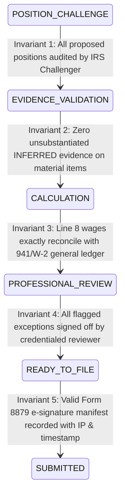

# Autonomous Tax OS — Agent State Machine Orchestration

> **Status**: Approved System Specification  
> **Document Version**: 1.0.0  
> **Orchestrator**: `TaxCaseStateManager` & `WorkflowCompletionValidator`  
> **Core Principle**: State Transitions Are Deterministic Gates Guarded by Invariant Checks  

---

## 1. Mapping Agents to the 20 TaxCase States

Agents do not execute arbitrarily. Each of the 20 states in the canonical `TaxCase` finite state machine authorizes a specific cohort of agents to execute:

```
┌─────────────────────────┬───────────────────────────────┬──────────────────────────────┐
│ TAXCASE STATE           │ ACTIVE DOMAIN SUPERVISOR      │ AUTHORIZED WORKER AGENTS     │
├─────────────────────────┼───────────────────────────────┼──────────────────────────────┤
│ 1. NEW                  │ Tax Case Supervisor           │ Task Planner, Scheduler      │
│ 2. DATA_COLLECTION      │ Intake Supervisor             │ Intake Agent, Account Agent  │
│ 3. DATA_PROCESSING      │ Intake Supervisor             │ Router, Splitter, Extractor  │
│ 4. FACT_RECONSTRUCTION  │ Financial Intelligence Sup.   │ Txn Normalizer, Reconciler   │
│ 5. INVESTIGATION        │ Financial Intelligence Sup.   │ Expense Class., Purpose Agt  │
│ 6. RULE_APPLICATION     │ Tax Intelligence Supervisor   │ Rule Resolver, Citations     │
│ 7. POSITION_PROPOSAL    │ Tax Intelligence Supervisor   │ Deduction Hunter, Credit Htr │
│ 8. POSITION_CHALLENGE   │ Verification Supervisor       │ IRS Challenger Agent         │
│ 9. EVIDENCE_VALIDATION  │ Verification Supervisor       │ Evidence Examiner Agent      │
│ 10. CALCULATION         │ Calculation / Filing Sup.     │ Tax Engine Adapter, Math     │
│ 11. RECONCILIATION      │ Verification Supervisor       │ Return Reconciliation Agent  │
│ 12. USER_REVIEW         │ Verification Supervisor       │ Minimal Question Generator   │
│ 13. PROFESSIONAL_REVIEW │ Professional Review Sup.      │ Review Brief, CPA/EA Agent   │
│ 14. READY_TO_FILE       │ Calculation / Filing Sup.     │ Form Mapping, Filing Payload │
│ 15. SIGNED              │ Calculation / Filing Sup.     │ Signature/Consent Agent      │
│ 16. SUBMITTED           │ Calculation / Filing Sup.     │ Submission Gateway Agent     │
│ 17. ACCEPTED            │ Planning Supervisor           │ Filing Status, Tax Twin      │
│ 18. REJECTED            │ Calculation / Filing Sup.     │ Rejection Resolution Agent   │
│ 19. AMENDMENT           │ Tax Case Supervisor           │ Amendment Agent, Diff Engine │
│ 20. CLOSED              │ Platform Safety Supervisor    │ Data Retention Agent         │
└─────────────────────────┴───────────────────────────────┴──────────────────────────────┘
```

---

## 2. Invariant Preconditions for Key State Transitions

Before the `TaxCaseStateManager` permits a transition, the `WorkflowCompletionValidator` executes strict invariant assertions:



### Detailed Invariant Assertions:
1. **Transition to `CALCULATION` (State 10)**:
   * Assertion: `TaxCase.openIssues.filter(i => i.severity == 'BLOCKING').length === 0`.
   * Assertion: Every active `TaxPosition` possesses a verified primary statutory authority citation.
2. **Transition to `READY_TO_FILE` (State 14)**:
   * Assertion: Federal AGI equals State Adjusted Starting Points plus/minus statutory modifications.
   * Assertion: If Mode 2 (CPA Verified), `TaxCase.professionalReviews` contains a valid credentialed sign-off.
3. **Transition to `SUBMITTED` (State 16)**:
   * Assertion: Form 8879 signature manifest contains a valid SHA-256 digital signature, IP address, and taxpayer timestamp.
   * Assertion: The compiled MeF XML payload validates against IRS Schematron business rules with zero schema errors.
