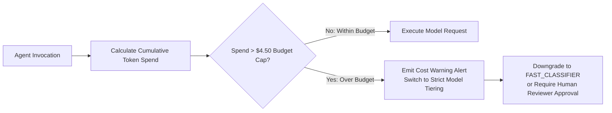

# Autonomous Tax OS — Agent Cost Control & Token Economics

> **Status**: Approved System Specification  
> **Document Version**: 1.0.0  
> **Engine**: `CostOptimizer` & `AgentCostAgent`  
> **Economic Benchmark**: Full Tax Engagement Unit Cost $< \$4.50$ per Return  

---

## 1. Unit Economics & Token Budgeting

To maintain superior gross margins while delivering frontier reasoning, Autonomous Tax OS establishes strict token expenditure budgets per filing engagement:

```
┌─────────────────────────────────┬───────────────────┬───────────────────┐
│ WORKFLOW PHASE                  │ ESTIMATED TOKENS  │ ESTIMATED COST    │
├─────────────────────────────────┼───────────────────┼───────────────────┤
│ 1. Document Extraction & OCR    │ 85,000 tokens     │ $0.85             │
│ 2. Transaction Normalization    │ 40,000 tokens     │ $0.10             │
│ 3. Income & Duplicate Reconcil. │ 25,000 tokens     │ $0.35             │
│ 4. Deduction & Credit Hunting   │ 60,000 tokens     │ $0.90             │
│ 5. IRS Challenger Audit         │ 45,000 tokens     │ $0.75             │
│ 6. Review Brief & Tax Inbox     │ 30,000 tokens     │ $0.45             │
│ 7. Deterministic Math & Filing  │ 0 LLM tokens      │ $0.00 (Pure Math) │
├─────────────────────────────────┼───────────────────┼───────────────────┤
│ TOTAL CASE ENGAGEMENT           │ 285,000 tokens    │ $3.40 (Under Cap) │
└─────────────────────────────────┴───────────────────┴───────────────────┘
```

---

## 2. Token Reduction & Caching Mechanics

1. **System Prompt Caching**: The static Tax Rule Graph definitions and legal instructions are placed in the prompt prefix, achieving up to 90% cache read discounts on supported providers (Anthropic, Gemini).
2. **Deterministic Pre-Filtering**: Before invoking an LLM, regex filters and exact hash lookups eliminate known transfers and repetitive monthly expenses (e.g., standard $14.99 Netflix charges are categorized deterministically without LLM calls).
3. **Semantic Embedding Cache**: Normalized merchant classifications (`UBER*TRIP` $\rightarrow$ `Ground Transportation / Travel`) are cached in Redis. Once classified for any taxpayer in a tenant, subsequent identical transactions incur zero LLM token costs.

---

## 3. Real-Time Budget Alerts & Throttling


