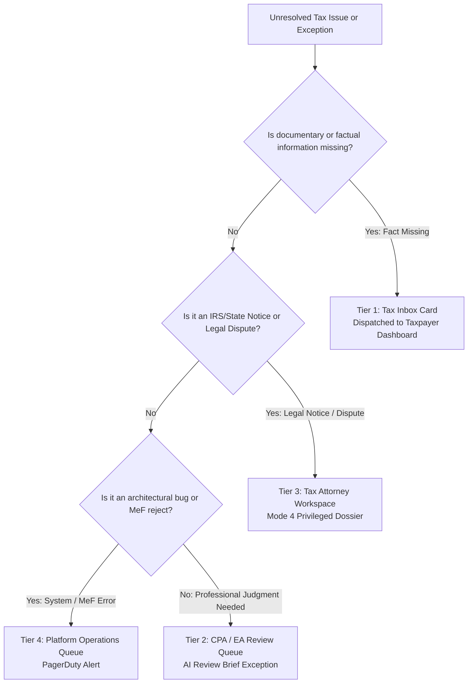

# Autonomous Tax OS — Human Escalation Matrix & Triage Protocols

> **Status**: Approved System Specification  
> **Document Version**: 1.0.0  
> **Engine**: `HumanEscalationRouter` & `TaxSupportRouter`  
> **Core Principle**: Escalate to the Right Specialist at the Right Time  

---

## 1. Multi-Tier Escalation Matrix

When an autonomous agent encounters an unresolvable issue or high-risk exception, the `HumanEscalationRouter` dispatches the matter according to the strict **Four-Tier Escalation Matrix**:

```
┌───────────┬───────────────────────────────────┬───────────────────────────┬──────────────┐
│ ESCALATION│ TRIGGER CONDITIONS                │ ESCALATION TARGET         │ TARGET SLA   │
├───────────┼───────────────────────────────────┼───────────────────────────┼──────────────┤
│ TIER 1    │ Missing factual predicate         │ Taxpayer (B2C)            │ 48 Hours     │
│ CLIENT    │ (e.g. business purpose of flight, │ via Tax Inbox Card        │ (Non-Block)  │
│ INBOX     │ home office square footage)       │                           │              │
├───────────┼───────────────────────────────────┼───────────────────────────┼──────────────┤
│ TIER 2    │ Material tax position exception,  │ Enrolled Agent (EA) /     │ 24 Hours     │
│ PRO CPA   │ multi-state nexus ambiguity,      │ Reviewing CPA             │ (Standard)   │
│ REVIEW    │ Section 179 vs bonus election     │ via AI Review Brief       │              │
├───────────┼───────────────────────────────────┼───────────────────────────┼──────────────┤
│ TIER 3    │ IRS audit notice (CP2000, CP504), │ Tax Controversy Attorney  │ 4 Hours      │
│ LEGAL     │ statutory authority conflict,     │ (Mode 4 Legal Workspace)  │ (Urgent)     │
│ CONTROV.  │ suspected fraud or sham txns      │                           │              │
├───────────┼───────────────────────────────────┼───────────────────────────┼──────────────┤
│ TIER 4    │ MeF schema rejection, provider    │ Platform Operations /     │ 15 Minutes   │
│ ENG / OPS │ API outage, database RLS error    │ Systems Engineering       │ (Critical)   │
└───────────┴───────────────────────────────────┴───────────────────────────┴──────────────┘
```

---

## 2. Escalation Workflow Decision Tree



---

## 3. De-Escalation & Resolution Protocols

1. **Client Resolution**: When a taxpayer answers a Tax Inbox card (e.g., confirming 220 sq ft studio space), the issue state transitions from `AWAITING_USER` to `RESOLVED`, the Evidence Graph updates provenance to `USER_CONFIRMED`, and the case automatically resumes execution.
2. **CPA Sign-Off**: When a CPA approves or overrides an exception on the AI Review Brief, the statutory rationale is recorded, the exception is closed, and the case advances to `READY_TO_FILE`.
3. **Attorney Opinion**: In Mode 4 matters, the Tax Attorney records a formal legal assessment. If the attorney approves the filing position, the case returns to the CPA for signature; if representation is required, the case is transferred to full legal representation status.
