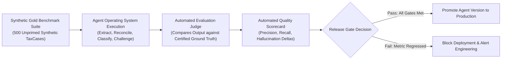

# Autonomous Tax OS — Agent Evaluation Matrix & Quality Benchmarks

> **Status**: Approved System Specification  
> **Document Version**: 1.0.0  
> **Judges**: `EvaluationJudge` & `RegressionJudge`  
> **Target Standard**: Gold-Standard Production Reliability  

---

## 1. Key Evaluation Metrics & Target Benchmarks

Autonomous Tax OS continuously evaluates agent accuracy, precision, and hallucination rates across synthetic and historical benchmark datasets:

```
┌─────────────────────────────────┬───────────────────┬───────────────────┐
│ EVALUATION DIMENSION            │ MINIMUM GATE PASS │ PRODUCTION TARGET │
├─────────────────────────────────┼───────────────────┼───────────────────┤
│ 1. Document Classification      │ $\ge 99.0\%$      │ $99.8\%$          │
│ 2. Fact Extraction (W-2, 1099)  │ $\ge 99.5\%$      │ $99.9\%$          │
│ 3. Expense Categorization       │ $\ge 96.0\%$      │ $98.5\%$          │
│ 4. Income Reconcil. (Dupe Elim) │ $100.0\%$         │ $100.0\%$         │
│ 5. Deduction Precision          │ $\ge 97.0\%$      │ $99.0\%$          │
│ 6. Deduction Recall             │ $\ge 94.0\%$      │ $97.5\%$          │
│ 7. Citation Correctness         │ $100.0\%$         │ $100.0\%$         │
│ 8. Wrong-Year Retrieval Rate    │ $0.00\%$ (Zero)   │ $0.00\%$ (Zero)   │
│ 9. Wrong-State Retrieval Rate   │ $0.00\%$ (Zero)   │ $0.00\%$ (Zero)   │
│ 10. Hallucination Rate          │ $0.00\%$ (Zero)   │ $0.00\%$ (Zero)   │
│ 11. Questions to File (QTF)     │ $\le 5$ questions │ $\le 3$ questions │
│ 12. Professional Override Rate  │ $\le 8.0\%$       │ $\le 4.0\%$       │
│ 13. Calculation Consistency     │ $100.0\%$ Exact   │ $100.0\%$ Exact   │
└─────────────────────────────────┴───────────────────┴───────────────────┘
```

---

## 2. Benchmark Suite Architecture



---

## 3. Strict Zero-Tolerance Invariants

Three metrics carry an absolute **Zero-Tolerance Threshold**:
1. **Wrong-Year Retrieval = 0.00%**: An agent applying a 2024 mileage rate ($0.67) to a 2026 return ($0.70) fails the release gate immediately.
2. **Wrong-State Retrieval = 0.00%**: An agent applying California rules (e.g., HSA disallowance) to a New York return fails the release gate immediately.
3. **Hallucination Rate = 0.00%**: Fabricating a non-existent Internal Revenue Code section or citing an imaginary revenue procedure trips an emergency build breaker.
