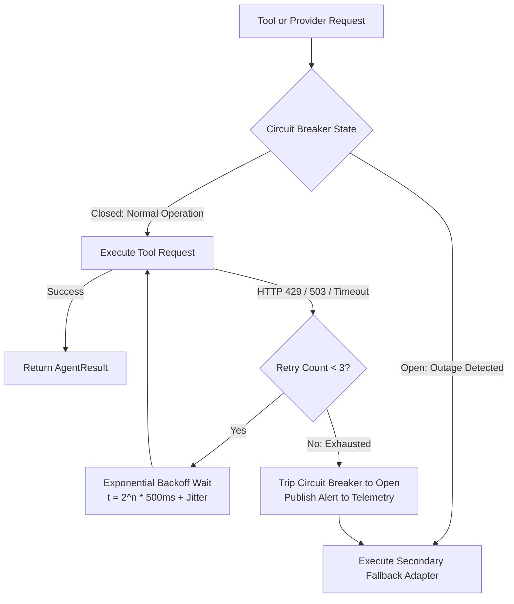

# Autonomous Tax OS — Agent Failure Modes & Recovery Matrix

> **Status**: Approved System Specification  
> **Document Version**: 1.0.0  
> **Engine**: `RetryRecoveryAgent` & `ProviderFailureAgent`  
> **Core Principle**: Resilient Degradation & Self-Healing Workflows  

---

## 1. Primary Failure Modes & Recovery Strategies

```
┌───────────────────────┬───────────────────────────────────┬──────────────────────────────────┐
│ FAILURE MODE          │ ROOT CAUSE                        │ AUTOMATED RECOVERY STRATEGY      │
├───────────────────────┼───────────────────────────────────┼──────────────────────────────────┤
│ FM-01: Document OCR   │ Blurry camera photo, corrupted    │ 1. Attempt image contrast enhance│
│ Extraction Failure    │ PDF stream, encrypted file        │ 2. Fall back to Vision Multimodal│
│                       │                                   │ 3. If unreadable: Prompt user    │
├───────────────────────┼───────────────────────────────────┼──────────────────────────────────┤
│ FM-02: Banking Sync   │ Bank session expired, 2FA prompt  │ 1. Exponential backoff retry     │
│ Disconnect (Plaid/MX) │ required, provider rate limit     │ 2. If credential revoked: Emit   │
│                       │                                   │    "Reconnect Account" Inbox Card│
├───────────────────────┼───────────────────────────────────┼──────────────────────────────────┤
│ FM-03: Hallucinated   │ LLM generated invalid IRC code    │ 1. Citation Validator flags error│
│ Citation or Rule      │ or cited non-existent regulation  │ 2. Reject proposal immediately   │
│                       │                                   │ 3. Fall back to Rule Graph lookup│
├───────────────────────┼───────────────────────────────────┼──────────────────────────────────┤
│ FM-04: MeF Schema     │ IRS Schematron business rule      │ 1. Parse XML error code (e.g. AGI│
│ Validation Rejection  │ rejected submission packet        │ 2. Route to Rejection Resolver   │
│                       │                                   │ 3. Solicit missing prior-year AGI│
├───────────────────────┼───────────────────────────────────┼──────────────────────────────────┤
│ FM-05: Model Outage   │ Primary LLM provider returns 500  │ 1. Provider Health detects outage│
│ or Latency Spike      │ or latency exceeds 30 seconds     │ 2. Circuit breaker opens         │
│                       │                                   │ 3. Seamless failover to secondary│
└───────────────────────┴───────────────────────────────────┴──────────────────────────────────┘
```

---

## 2. Exponential Backoff & Circuit Breaker Architecture



---

## 3. Dead-Letter Queue (DLQ) & State Rollback

When a task fails repeatedly after exhausting retry budgets:
1. **Case State Freeze**: The `TaxCaseStateManager` locks the case at its current state and prevents unauthorized forward promotion.
2. **DLQ Persistence**: The full task payload, stack trace, and execution context are written to the Dead Letter Queue for engineering inspection.
3. **Transaction Rollback**: Any partial mutations to the `TaxGraph` are rolled back using database transaction savepoints, preventing corrupted partial states.
