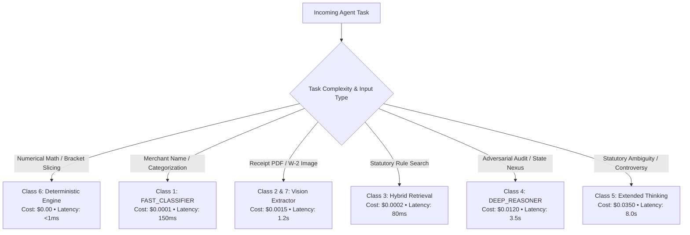

# Autonomous Tax OS — Model Routing Architecture & Cost Optimization

> **Status**: Approved System Specification  
> **Document Version**: 1.0.0  
> **Engine**: `ModelRouter` & `CostOptimizer`  
> **Core Principle**: Right Model for the Right Task — Never Burn Frontier Tokens on Simple Classification  

---

## 1. Model Tiering Matrix

Autonomous Tax OS defines eight specialized model classes. Dispatched tasks are routed to the most cost-effective and capable class:

```
┌─────────────────────────┬───────────────────────────────┬──────────────────────────────┐
│ MODEL CLASS             │ TARGET CAPABILITY             │ DEFAULT PROVIDER ADAPTERS    │
├─────────────────────────┼───────────────────────────────┼──────────────────────────────┤
│ 1. FAST_CLASSIFIER      │ High throughput, low latency  │ Claude 3.5 Haiku             │
│                         │ (<200ms), merchant cleaning   │ Gemini 2.5 Flash             │
├─────────────────────────┼───────────────────────────────┼──────────────────────────────┤
│ 2. DOCUMENT_EXTRACTOR   │ High-fidelity document OCR,   │ Google Document AI           │
│                         │ bounding boxes, table parsing │ AWS Textract / Vision API    │
├─────────────────────────┼───────────────────────────────┼──────────────────────────────┤
│ 3. SEMANTIC_RETRIEVAL   │ Hybrid keyword + vector RAG,  │ pgvector + Voyage AI         │
│                         │ Tax Rule Graph traversal      │ Google text-embedding-004    │
├─────────────────────────┼───────────────────────────────┼──────────────────────────────┤
│ 4. DEEP_REASONER        │ Complex statutory reasoning,  │ Claude 3.7 Sonnet            │
│                         │ IRS Challenger, multi-state   │ Gemini 2.5 Pro               │
├─────────────────────────┼───────────────────────────────┼──────────────────────────────┤
│ 5. TAX_RESEARCH_REASONER│ Resolving circuit conflicts,  │ Extended Reasoning Mode      │
│                         │ non-precedential rulings      │ (Claude Thinking / o3-mini)  │
├─────────────────────────┼───────────────────────────────┼──────────────────────────────┤
│ 6. DETERMINISTIC_MATH   │ Authoritative tax math,       │ TypeScript / Python Engine   │
│ (ZERO LLM TOKENS)       │ bracket indexing, form lines  │ (Deterministic Runtime)      │
├─────────────────────────┼───────────────────────────────┼──────────────────────────────┤
│ 7. VISION_MULTIMODAL    │ Scanned receipts, photo IDs,  │ Gemini 2.5 Pro Vision        │
│                         │ handwritten mileage logs      │ Claude 3.7 Sonnet Vision     │
├─────────────────────────┼───────────────────────────────┼──────────────────────────────┤
│ 8. EMBEDDINGS           │ Document chunk indexing,      │ text-embedding-3-small       │
│                         │ semantic rule vectorization   │ Voyage-finance-2             │
└─────────────────────────┴───────────────────────────────┴──────────────────────────────┘
```

---

## 2. Dynamic Routing & Cost Optimization Logic



### Cost Optimization Strategies:
1. **Prompt Caching**: The static Tax Rule Graph schema and IRC prompt templates are structured to leverage provider prompt caching (saving 90% on input tokens).
2. **Context Compression**: The `ContextManager` prunes resolved transactions from agent contexts, ensuring working prompt sizes remain under 8,000 tokens for routine tasks.
3. **Budget Caps**: Each `TaxCase` operates with a default token budget cap ($4.50 total LLM cost per filing). Exceeding this budget triggers alert telemetry to the `CostOptimizer`.
