# Autonomous Tax OS — Data Lineage & Provenance Architecture

> **Status**: Approved System Architecture  
> **Document Version**: 1.0.0  
> **Domain**: End-to-End Audit Lineage & Proof Traceability  
> **Guaranteed Standard**: 100% Bit-Exact Provenance for Every Material Tax Value  

---

## 1. The Core Lineage Invariant

> [!IMPORTANT]
> **Lineage Invariant**: No numerical value may appear on an official tax return form (Form 1040, Schedule C, State Return) without an unbroken, cryptographically verified lineage path back to raw primary source records.

In traditional tax software, values are stored as raw floating-point numbers on form fields (e.g., `Schedule_C_Line_8 = 7482.00`). If an auditor or taxpayer asks "Why is this number $7,482?", the legacy software has zero internal record of how that number was assembled.

In Autonomous Tax OS, **every tax line is a pointer to a Calculation Node in the Evidence Lineage Graph**.

---

## 2. The 7-Stage End-to-End Lineage Pipeline

```mermaid
flowchart LR
    Stage1["1. Raw Ingestion<br/>PDFs, Scans, Bank APIs"]
    Stage2["2. Document Extraction<br/>OCR Tokens, Bounding Boxes, SHA-256"]
    Stage3["3. Normalized Ledger<br/>Cleaned Txns & Deduplicated Inflows"]
    Stage4["4. Fact Formulation<br/>Categorized Spend & Income Events"]
    Stage5["5. Rule Binding<br/>IRC / State Authority Conditions Met"]
    Stage6["6. Deterministic Math<br/>Math Engine Aggregation"]
    Stage7["7. Tax Form Line<br/>MeF Form 1040 Field"]

    Stage1 --> Stage2
    Stage2 --> Stage3
    Stage3 --> Stage4
    Stage4 --> Stage5
    Stage5 --> Stage6
    Stage6 --> Stage7
```



### Stage 1: Raw Ingestion
* Source files are uploaded via TaxDrop or fetched via Plaid OAuth.
* Raw byte streams are encrypted at rest with AES-256-GCM.

### Stage 2: Document Intelligence & Cryptographic Fingerprinting
* The file is assigned an immutable SHA-256 hash (e.g., `hash_9a8f1...`).
* Multimodal OCR extracts text chunks, bounding boxes, and metadata keys.
* Documents are linked to their source transaction if matched.

### Stage 3: Normalized Financial Ledger
* Raw bank descriptions (e.g., `SQ *STUDIO SOUNDS BROOKLYN NY`) are normalized to standard merchant entities (`Studio Sounds NYC`) and MCC codes (`7399`).
* Overlapping inflows are reconciled: if a bank deposit of $4,500 matches a Stripe payout record that stems from 3 customer invoices, the invoices are linked and duplicate gross income is eliminated.

### Stage 4: Tax Fact Formulation
* Expenses and income streams are evaluated against business reality.
* A `TaxFact` object is minted with explicit references to the supporting transaction IDs.

### Stage 5: Rule Binding
* The `TaxRuleResolver` tests the `TaxFact` against the conditions of the versioned `TaxRuleGraph` (e.g., verifying that camera equipment meets IRC § 179 qualified property criteria).
* The rule ID, rule version, and primary statutory citations are bound to the fact.

### Stage 6: Deterministic Calculation Engine
* The deterministic tax calculation engine sums all verified, rule-bound facts for that category.
* A `TaxCalculation` node is recorded, capturing the mathematical formula, input values, and intermediate results.

### Stage 7: Form Mapping & MeF XML Generation
* The final computed total is mapped directly onto the target tax form line (e.g., `IRS1040ScheduleC/OtherExpenses/Amount`).
* The return form line stores a foreign key to the `TaxCalculation` node.

---

## 3. Lineage Data Schema (`LineageNode`)

```typescript
export interface LineageTrace {
  targetForm: string;                  // "Form 1040, Schedule C"
  targetLine: string;                  // "Line 8 (Advertising)"
  reportedAmountCents: number;         // 748200 ($7,482.00)
  calculationId: string;               // "calc-sch-c-adv-2026"
  formulaApplied: string;              // "SUM(contributing_expense_facts)"
  
  contributingFacts: Array<{
    factId: string;
    factType: string;
    amountCents: number;
    businessPurpose: string;
    ruleCitation: string;              // "IRC § 162(a); Treas. Reg. § 1.162-1"
    
    underlyingTransactions: Array<{
      transactionId: string;
      date: string;
      merchant: string;
      amountCents: number;
      accountName: string;
      source: 'PLAID_OAUTH' | 'STRIPE_API' | 'MANUAL_IMPORT';
      
      documentaryEvidence?: {
        documentId: string;
        fileName: string;
        sha256Hash: string;
        pageNumber: number;
        receiptLineItems: string[];
      };
    }>;
  }>;
  
  auditValidation: {
    adversarialChallengePassed: boolean;
    challengerAgentId: string;
    reviewedByProfessional: boolean;
    cpaSignaturePtin?: string;
    signedAt?: string;
  };
}
```

This lineage structure enables instantaneous generation of IRS-ready audit workpapers at the click of a button.
