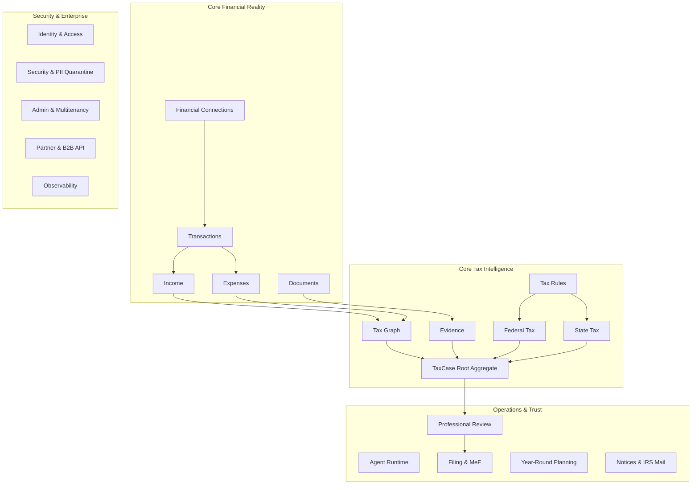

# Autonomous Tax OS — Domain Boundaries & Context Architecture

> **Status**: Approved System Architecture  
> **Document Version**: 1.0.0  
> **Pattern**: Domain-Driven Design (DDD) with Bounded Contexts & Strict Interface Contracts  

---

## 1. Domain Decomposition Overview

To maintain extreme modularity and prevent system sprawl, Autonomous Tax OS decomposes the tax compliance problem into **26 distinct bounded domains**. Each domain owns its data models, business invariants, and internal logic. Cross-domain interactions occur strictly through typed asynchronous events and versioned interfaces.

---

## 2. Directory of the 26 Bounded Domains

### Domain 1: Identity & Access Management (IAM)
* **Scope**: User authentication, WebAuthn/FIDO2 hardware keys, SMS/TOTP MFA, role authorization (Taxpayer, Preparer, CPA, Attorney, Admin).
* **Isolation Rule**: IAM never stores financial records or tax case data; it issues scoped JWT/OAuth tokens with tenant and role claims.

### Domain 2: Taxpayer Profiles
* **Scope**: Taxpayer legal identity, SSN/ITIN encryption, marital status, dependent registries, residency domicile history.
* **Isolation Rule**: SSNs are stored in dedicated encrypted token vaults; downstream domains reference surrogate `taxpayerId` tokens.

### Domain 3: TaxCase Aggregate
* **Scope**: The root state machine orchestrating case state transitions, open issues, task queues, and case-level locks.
* **Isolation Rule**: Owns lifecycle state; does not perform calculations directly.

### Domain 4: Tax Graph
* **Scope**: Normalized graph of economic facts, households, businesses, accounts, and income sources.
* **Isolation Rule**: Agnostic to tax return line numbers; represents objective financial reality.

### Domain 5: Evidence
* **Scope**: Cryptographic hashing of documentary proof, receipt-to-transaction linkages, and the "Prove This Number" DAG.
* **Isolation Rule**: Rejects unhashed documents; immutable append-only storage.

### Domain 6: Documents
* **Scope**: Ingestion, virus scanning, OCR transcript generation, document splitting, and bounding-box extraction.
* **Isolation Rule**: Treats all uploaded files as untrusted raw input; isolates raw bytes from execution environments.

### Domain 7: Financial Connections
* **Scope**: Plaid, MX, and Finicity integrations; OAuth token refresh cycles; bank webhook ingestion.
* **Isolation Rule**: Encapsulates external banking provider credentials; normalizes external account schemas into Tax OS models.

### Domain 8: Transactions
* **Scope**: Transaction deduplication, merchant name cleaning, MCC classification, transfer elimination.
* **Isolation Rule**: Internal transfers between accounts owned by the same taxpayer are eliminated to prevent phantom income.

### Domain 9: Income
* **Scope**: Reconstruction of gross receipts across 1099-NEC, 1099-K, Stripe, and bank deposits; overlap elimination.
* **Isolation Rule**: Must never sum overlapping gross reports (e.g., Stripe payouts + 1099-K issued by Stripe).

### Domain 10: Expenses
* **Scope**: Categorization of commercial spend under IRC § 162; home office, vehicle, travel, meals allocation.
* **Isolation Rule**: Separates personal spend from trade/business deductions with strict substantiation tracking.

### Domain 11: Tax Rules
* **Scope**: Versioned repository of federal and state tax rules, conditions, thresholds, and authorities.
* **Isolation Rule**: Read-only to runtime agents; mutations restricted to the rule update governance pipeline.

### Domain 12: Federal Tax
* **Scope**: Form 1040 compilation, Schedule A–SE assembly, QBI deduction, self-employment tax, AMT.
* **Isolation Rule**: Strictly decoupled from state additions/subtractions; outputs clean Federal AGI and taxable income.

### Domain 13: State Tax
* **Scope**: Sovereign state return logic (CA 540, NY IT-201, NJ NJ-1040, IL IL-1040, MA Form 1); non-conformity adjustments.
* **Isolation Rule**: State packages are modular plugins. Modifying California rules cannot affect New York or federal calculations.

### Domain 14: Agent Runtime
* **Scope**: Sandboxed agent execution, tool dispatching, context management, model routing, cost tracking.
* **Isolation Rule**: Agents execute in stateless ephemeral workers with strict tool whitelists; agents cannot execute arbitrary shell code.

### Domain 15: Professional Review
* **Scope**: EA/CPA/Attorney review queues, AI Review Brief generation, override logging, PTIN signature workflows.
* **Isolation Rule**: Enforces the four distinct review modes (Autopilot, CPA Verified, Preparer, Attorney).

### Domain 16: Filing (MeF Pipeline)
* **Scope**: IRS Modernized e-File (MeF) XML packaging, digital signature manifests, A2A transmission, submission polling.
* **Isolation Rule**: Encapsulates IRS ETIN/EFIN credentials; manages transmission state machines.

### Domain 17: Planning & Tax Twin
* **Scope**: Year-round liability forecasting, quarterly estimated tax calculations (Form 1040-ES), scenario simulation.
* **Isolation Rule**: Operates on simulated shadow cases without altering filed return history.

### Domain 18: Notices & IRS Mail
* **Scope**: Ingestion of IRS/State mail (CP2000, CP504, 1099-C), deadline calculation, automated response drafting.
* **Isolation Rule**: Escalates legal controversies directly to the Tax Attorney queue (Mode 4).

### Domain 19: Billing & Subscriptions
* **Scope**: Stripe Billing integration, firm seat licensing, per-return volume tracking, credits.
* **Isolation Rule**: Completely isolated from taxpayer tax calculations.

### Domain 20: Support
* **Scope**: Ticket routing, customer communications, masked diagnostics.
* **Isolation Rule**: Support agents see masked PII by default; cannot access raw SSNs or bank account numbers.

### Domain 21: Security & PII Shield
* **Scope**: Field-level encryption, tokenization vaults, KMS key rotation, intrusion detection.
* **Isolation Rule**: Sits as an interceptor between the database layer and all application services.

### Domain 22: Compliance & Audit
* **Scope**: SOC 2 compliance reporting, IRS Pub 1075 audit trail generation, GDPR/CCPA data disposal.
* **Isolation Rule**: Append-only immutable audit store; cannot be truncated by application code.

### Domain 23: Observability
* **Scope**: OpenTelemetry distributed tracing, Prometheus metrics, structured PII-redacted logs, agent cost dashboards.
* **Isolation Rule**: Automatically scrubs 9-digit SSNs, credit card numbers, and banking credentials from all trace spans.

### Domain 24: Admin & Multi-Tenancy
* **Scope**: Tenant provisioning, firm organizational hierarchy, feature flag management, emergency kill switches.
* **Isolation Rule**: Partition key enforcement (`tenant_id`) across all tenant queries.

### Domain 25: Analytics
* **Scope**: Anonymized macro-metrics: average Questions to File (QTF), e-file acceptance rates, review latency.
* **Isolation Rule**: Operates exclusively on de-identified, k-anonymized datasets.

### Domain 26: Partner / B2B2C API
* **Scope**: Headless REST endpoints, webhooks, and partner SDKs for embedded tax workflows.
* **Isolation Rule**: Enforces partner rate limits, API key authentication, and scoped tenant authorization.
