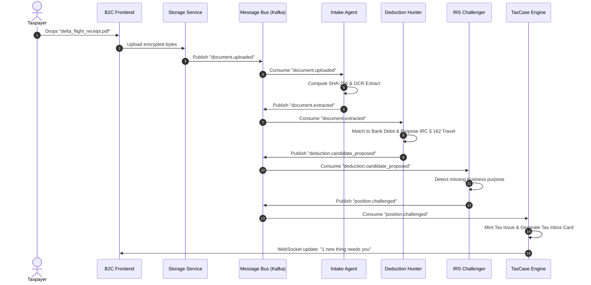

# Autonomous Tax OS — Event-Driven Architecture & Event Catalog

> **Status**: Approved System Architecture  
> **Document Version**: 1.0.0  
> **Pattern**: Event Sourcing with CQRS & Idempotent Asynchronous Message Bus  
> **Broker Engine**: Apache Kafka / AWS EventBridge / Redis Streams  

---

## 1. Architectural Principles

Autonomous Tax OS employs an **asynchronous event-driven architecture** to orchestrate interactions across its 26 bounded domains:

1. **Immutability**: Once an event is published, it cannot be modified or deleted. The event stream is an append-only ledger.
2. **Idempotency**: Every event carries a globally unique `eventId` and `idempotencyKey`. Event consumers must guarantee idempotent execution to safely tolerate retries.
3. **Dead-Letter Handling (DLQ)**: Failed event processing attempts are automatically retried with exponential backoff; persistent failures drop to a Dead Letter Queue with alert telemetry.
4. **Zero Cross-Tenant Event Bleed**: Every event envelope contains `tenantId` and `taxCaseId`. Topic partitions and consumer filters enforce strict tenant isolation.

---

## 2. Standard Event Envelope Schema

All system events conform to the CloudEvents v1.0 standard envelope:

```typescript
export interface TaxEvent<T = any> {
  specversion: '1.0';
  id: string;                          // UUID v4
  source: string;                      // e.g. "taxos://services/intake-agent"
  type: TaxEventType;                  // Fully qualified event type
  subject: string;                     // TaxCase ID or Document ID
  time: string;                        // ISO 8601 UTC timestamp
  datacontenttype: 'application/json';
  
  // Security & Multitenancy Metadata
  tenantId: string;                    // Organization / Firm ID
  taxCaseId: string;                   // Target TaxCase
  actor: {
    actorType: 'USER' | 'AGENT' | 'PROFESSIONAL' | 'SYSTEM';
    actorId: string;
    role?: string;
  };
  
  // Idempotency & Tracing
  idempotencyKey: string;
  traceId: string;                     // W3C Trace Context
  spanId: string;
  
  // Event-Specific Payload
  data: T;
}
```

---

## 3. Canonical Event Catalog

```
┌────────────────────────────────────────────────────────────────────────┐
│ DOMAIN       EVENT TYPE                    TRIGGER / MEANING           │
├────────────────────────────────────────────────────────────────────────┤
│ TAXCASE      taxcase.created               Case initialized            │
│              taxcase.state_changed         State machine transition    │
│              taxcase.locked                Locked during calculation   │
├────────────────────────────────────────────────────────────────────────┤
│ INGESTION    document.uploaded             Raw file received in S3     │
│              document.hashed               SHA-256 fingerprint minted │
│              document.extracted            OCR extraction complete     │
│              document.rejected             Invalid format or virus     │
├────────────────────────────────────────────────────────────────────────┤
│ FINANCIAL    financial.account_connected   Plaid/Stripe OAuth success  │
│              transactions.ingested         Batch of bank debits synced │
│              income.reconciled             Overlapping sources resolved│
│              income.duplicate_detected     1099-K / Stripe match found │
├────────────────────────────────────────────────────────────────────────┤
│ TAX AGENTS   deduction.candidate_proposed  Deduction Hunter found item │
│              position.challenged           IRS Challenger issued audit │
│              position.consensus_reached    Adversarial review resolved │
│              issue.opened                  Tax Inbox card required     │
│              issue.resolved                User or CPA answered        │
├────────────────────────────────────────────────────────────────────────┤
│ CALCULATION  calculation.started           Deterministic engine lock   │
│              calculation.completed         Line-item totals compiled   │
│              calculation.discrepancy_found Cross-check mismatch        │
├────────────────────────────────────────────────────────────────────────┤
│ REVIEW       review.assigned               Case routed to EA/CPA       │
│              review.approved               CPA signed workpapers       │
│              review.escalated              Sent to Tax Attorney        │
├────────────────────────────────────────────────────────────────────────┤
│ FILING       filing.payload_generated      MeF XML compiled & validated│
│              filing.signed                 Form 8879 e-signature done  │
│              filing.transmitted            Sent to IRS/State MeF A2A   │
│              filing.accepted               IRS 901 Ack Code received   │
│              filing.rejected               IRS Error code returned     │
└────────────────────────────────────────────────────────────────────────┘
```

---

## 4. Event Processing Flow Example: Document Drop to Tax Inbox


