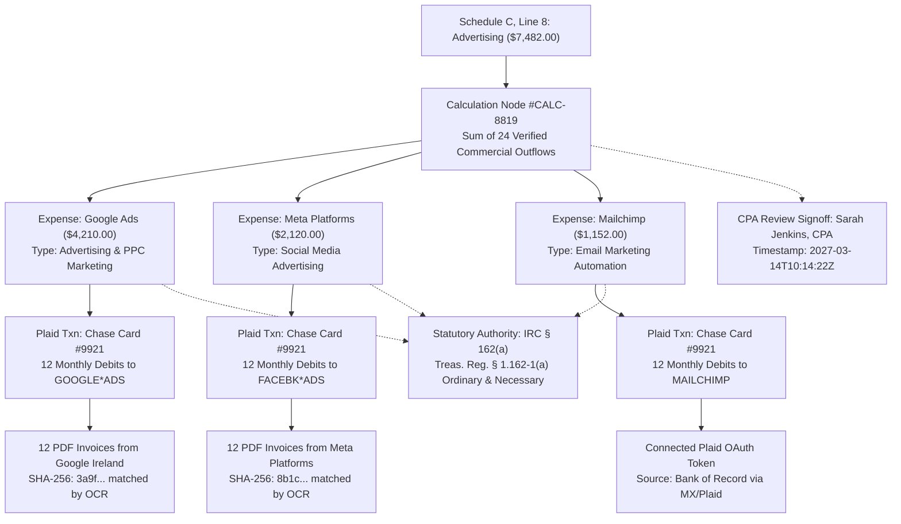

# Autonomous Tax OS — The Evidence Graph Architecture

> **Status**: Approved System Architecture  
> **Document Version**: 1.0.0  
> **Domain**: Cryptographic Substantiation & Audit Lineage Engine  
> **Core UX Driver**: "Prove This Number" Lineage Traceability  

---

## 1. Executive Summary & Purpose

Under United States tax jurisprudence (specifically the *Cohan* rule doctrine and strict statutory substantiation under Internal Revenue Code § 274), taxpayers bear the burden of proof for deductions and credits claimed.

The **Evidence Graph** is an immutable directed acyclic graph (DAG) that establishes an unbroken chain of custody between final tax return form lines and underlying real-world proof.

```
Tax Form Line ──> Calculation ──> Contributing Records ──> Transactions ──> Receipts ──> Authority & Sign-Off
```

---

## 2. The Five Strict Evidence Classifications

Autonomous Tax OS enforces a rigid hierarchy of evidence types. **The system is architecturally forbidden from presenting an inferred value as documentary proof.**

```
┌────────────────────────────────────────────────────────────────────────┐
│ EVIDENCE CLASS     DESCRIPTION                   EXAMPLES              │
├────────────────────────────────────────────────────────────────────────┤
│ DOCUMENTARY        Primary source files with     • Scanned PDF receipt │
│ (Highest Strength) cryptographic SHA-256 hash.   • Issued Form W-2     │
│                    Immutable physical proof.     • Form 1099-NEC PDF   │
├────────────────────────────────────────────────────────────────────────┤
│ CONNECTED_SOURCE   Direct authenticated API data • Plaid OAuth ledger  │
│ (High Strength)    from financial institutions   • Stripe balance txn  │
│                    or merchant gateways.         • Chase webhook feed  │
├────────────────────────────────────────────────────────────────────────┤
│ USER_CONFIRMED     Explicit taxpayer statement   • "Flight was 100%    │
│ (Medium Strength)  provided in response to a       business travel"    │
│                    Tax Inbox question card.      • Square footage form │
├────────────────────────────────────────────────────────────────────────┤
│ DERIVED            Deterministically calculated  • Depreciation schedule│
│ (Mathematical)     from other verified facts     • Standard mileage    │
│                    via mathematical code.          rate calculation    │
├────────────────────────────────────────────────────────────────────────┤
│ INFERRED           Probabilistic suggestion      • Category guessed    │
│ (Lowest Strength)  generated by LLM/classifier.    from merchant name  │
│                    MUST BE CONFIRMED TO FILE.    • Unmatched cash spend│
└────────────────────────────────────────────────────────────────────────┘
```

> [!CAUTION]
> **Substantiation Guardrail**: Any tax position supported solely by `INFERRED` evidence is flagged as `HIGH_RISK_UNSUBSTANTIATED`. It cannot be included on a final filed return until it is promoted to `USER_CONFIRMED` or substantiated with `DOCUMENTARY` proof.

---

## 3. "Prove This Number" Lineage Resolution

When a taxpayer, CPA, or IRS revenue agent inspects a value on the return (e.g., Schedule C Line 8 Advertising: $7,482), the Evidence Graph executes a deterministic reverse trace:



---

## 4. Cryptographic Hashing & Tamper-Evident Storage

1. **Content Addressable Storage (CAS)**: Every document ingested through TaxDrop is hashed immediately upon receipt using SHA-256:
   $$\text{Storage Key} = \text{sha256}(\text{Document Byte Stream})$$
2. **Immutable Audit Hashes**: Changes to evidence status (e.g., user confirming a business purpose) generate an append-only audit event containing:
   * Previous event hash
   * Current event payload hash
   * Cryptographic signature of the agent or user executing the mutation.
3. **Audit Defense Dossier Generation**: In the event of an IRS or state examination, the Evidence Graph can instantly compile a self-contained, hyperlinked **Audit Defense Package** with all receipts, bank traces, and primary authority citations organized by tax form line number.
