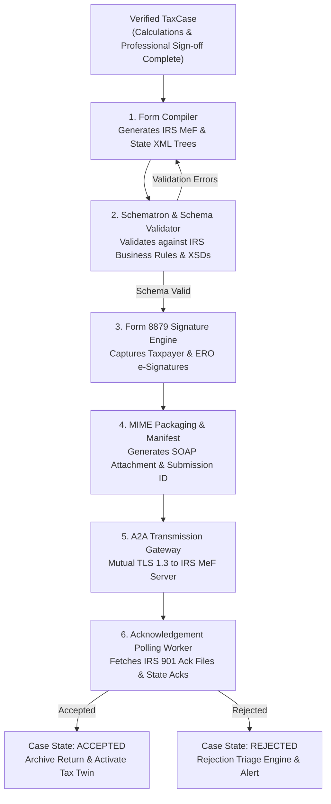

# Autonomous Tax OS — Electronic Filing & MeF Pipeline Architecture

> **Status**: Approved System Architecture  
> **Document Version**: 1.0.0  
> **Protocols**: IRS Modernized e-File (MeF), State A2A Web Services, OASIS LegalXML  
> **Standards Compliance**: IRS Publication 4164 (MeF Guide for Software Developers), IRS Publication 1345  

---

## 1. Executive Summary & Pipeline Topology

The **Filing Domain** is responsible for compiling verified TaxCase data into legally compliant, cryptographically signed XML submission archives and transmitting them to the Internal Revenue Service and sovereign state tax agencies.



---

## 2. The Filing State Machine

The filing lifecycle transitions through a strict, auditable state machine:

```
READY_TO_FILE
  │
  ├── [Taxpayer & Preparer Sign Form 8879]
  ▼
SIGNED
  │
  ├── [MeF Packaging & Transmission Batch Created]
  ▼
BATCHED
  │
  ├── [SOAP Request Sent via Mutual TLS to IRS MeF]
  ▼
TRANSMITTED
  │
  ├── [Awaiting Acknowledgement from IRS Gateway]
  ▼
PENDING_ACKNOWLEDGEMENT
  │
  ├── [IRS Acknowledgment Code: 'A' (Accepted)] ──> ACCEPTED (Final Filed State)
  │
  └── [IRS Acknowledgment Code: 'R' (Rejected)] ──> REJECTED (Enters Remediation)
```

---

## 3. Form 8879 Electronic Signature Workflow

Under IRS Publication 1345, electronic signatures for Form 8879 (IRS e-file Signature Authorization) must adhere to rigorous identity verification:
1. **Knowledge-Based Authentication (KBA)** or Verified SMS OTP paired with prior-year AGI verification.
2. **Cryptographic Signing Manifest**:
   ```json
   {
     "form": "IRS-8879",
     "taxYear": 2026,
     "taxpayerSsnHash": "sha256:4a81b...",
     "federalAgiCents": 12640000,
     "totalTaxCents": 1845000,
     "refundAmountCents": 284000,
     "eroPtin": "P01849201",
     "taxpayerSignatureDate": "2027-04-10T14:22:01Z",
     "ipAddress": "198.51.100.42",
     "signatureSha256": "e3b0c44298fc1c149afbf4c8996fb92427ae41e4649b934ca495991b7852b855"
   }
   ```
3. **Tamper-Evident PDF Rendering**: Form 8879 and state equivalents (e.g., California FTB 8879) are generated as PDF/A compliant documents embedded with cryptographic signature seals.

---

## 4. Rejection Triage & Automated Diagnostics

When an e-file transmission returns an IRS or state reject code (e.g., `IND-031-04` - *Prior Year AGI Mismatch*, or `R0000-500-01` - *Dependent SSN Already Claimed*):
1. **Instant Translation**: The raw MeF error XML is parsed and converted into a plain-English diagnostic.
2. **Automated Remediation Route**:
   * If `IND-031-04`: Solicits prior-year return PDF or IRS transcript via TaxDrop to verify actual prior-year line 11 AGI.
   * If Dependent SSN conflict: Flags case to professional reviewer and prepares paper filing package if necessary.
3. **Resubmission Window**: Under IRS rules, rejected returns resubmitted within the statutory 5-day transmission perfection period retain their original timely filing date.
