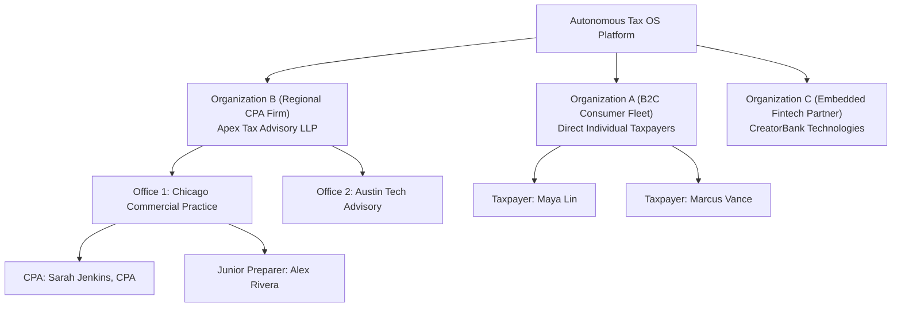

# Autonomous Tax OS — B2B Multitenancy & Enterprise Isolation

> **Status**: Approved System Architecture  
> **Document Version**: 1.0.0  
> **Isolation Pattern**: Shared-Process Multi-Tenant with Row-Level Security & Schema Partitions  
> **Core Mandate**: Never Compromise B2C Simplicity to Achieve B2B Flexibility  

---

## 1. Multitenancy Philosophy

Autonomous Tax OS natively serves both **individual direct taxpayers (B2C)** and **accounting firms / platform partners (B2B)** on a single unified architecture.

To achieve this without degrading the consumer experience:
* A direct B2C taxpayer is simply a tenant of the special platform organization (`org_autonomous_tax_consumer`).
* An accounting firm or fintech partner is an enterprise tenant (`org_apex_cpa_partners`).
* The data structures, calculation engines, and agent runtime are identical; only the access policies, review routing, and branding parameters vary.

---

## 2. Hierarchical Organization Model



---

## 3. Defense-in-Depth Tenant Isolation

Tenant isolation is enforced across all four infrastructure tiers:

### Tier 1: PostgreSQL Row-Level Security (RLS)
Every database table containing tenant data carries a `tenant_id` column. PostgreSQL Row-Level Security enforces that queries cannot access rows belonging to other tenants:

```sql
-- PostgreSQL RLS Policy Enforcement
ALTER TABLE tax_cases ENABLE ROW LEVEL SECURITY;

CREATE POLICY tenant_isolation_policy ON tax_cases
    AS RESTRICTIVE
    USING (tenant_id = current_setting('app.current_tenant_id', true)::uuid);
```
Application connections set `app.current_tenant_id` inside transactional connection pool wrappers before query dispatch.

### Tier 2: S3 Object Storage Prefix Partitions
Documents and receipts are stored under cryptographically isolated S3 prefixes:
```
s3://taxos-production-vault/tenants/{tenant_id}/cases/{tax_case_id}/docs/{sha256_hash}.pdf
```
IAM policies and S3 bucket access points restrict access strictly to the authenticated tenant prefix.

### Tier 3: Vector Database Metadata Filtering
When agents perform semantic retrieval over tax documents or research notes, vector queries enforce hard metadata filtering:
```json
{
  "filter": {
    "tenant_id": { "$eq": "org_apex_cpa_partners" },
    "tax_case_id": { "$eq": "case_maya_lin_2026" }
  }
}
```
Cross-case or cross-tenant semantic leakage is mathematically impossible.

### Tier 4: Agent Runtime Isolation
Agent execution sandboxes are provisioned with short-lived session context bound exclusively to a single `tenantId` and `taxCaseId`. Tool dispatchers reject any attempt by an agent to access files or facts outside its assigned case.
