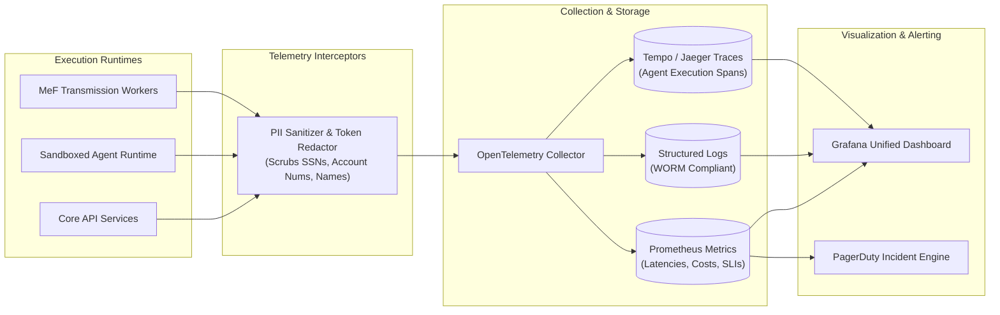

# Autonomous Tax OS — Observability, Telemetry & Agent Auditing

> **Status**: Approved System Architecture  
> **Document Version**: 1.0.0  
> **Standards**: OpenTelemetry v1.30, W3C Distributed Trace Context, Prometheus Metrics  
> **Mandate**: 100% Observable Agent Runtime with Zero PII Leakage  

---

## 1. Observability Architecture Topology

Autonomous Tax OS deploys a unified three-pillar telemetry stack across all infrastructure tiers and agent runtimes:



---

## 2. Agent Execution Telemetry Record (`AgentRunRecord`)

Every autonomous agent invocation logs a structured telemetry record capturing full operational context:

```typescript
export interface AgentRunRecord {
  runId: string;                       // Unique execution UUID
  taxCaseId: string;                   // Target TaxCase
  tenantId: string;                    // Organization partition
  agentName: string;                   // e.g. "DeductionHunter"
  agentVersion: string;                // e.g. "2.4.1"
  modelClass: 'FAST_CLASSIFIER' | 'DEEP_REASONER' | 'TAX_RESEARCH';
  modelEndpoint: string;               // e.g. "claude-3-7-sonnet" / "gemini-2.5-pro"
  
  // Performance & Cost
  executionDurationMs: number;
  inputTokenCount: number;
  outputTokenCount: number;
  estimatedCostUsd: number;
  
  // Cognitive Results
  confidenceScore: number;             // 0.00 to 1.00
  toolCallsExecuted: Array<{
    toolName: string;
    durationMs: number;
    success: boolean;
  }>;
  
  // Provenance & Audit Pointers
  inputStateRef: string;               // SHA-256 hash of input TaxCase snapshot
  outputDeltaRef: string;              // SHA-256 hash of proposed state mutations
  humanOverride: boolean;              // True if CPA subsequently modified result
  finalDisposition: 'ACCEPTED' | 'CHALLENGED' | 'DISCARDED' | 'ESCALATED';
}
```

---

## 3. Platform Health Indicators (SLIs / SLOs)

The Operations Cockpit monitors six critical Service Level Objectives:

| Metric | Target SLO | Warning Alert | Critical PagerDuty Alert |
| :--- | :--- | :--- | :--- |
| **Questions to File (QTF)** | $\le 4$ average | $> 6$ average | $> 10$ average |
| **Document OCR Latency** | $< 15$ sec (95th %) | $> 30$ sec | $> 60$ sec |
| **Agent Hallucination Rate** | $0.00\%$ | $> 0.01\%$ | $> 0.05\%$ (Triggers Kill Switch) |
| **IRS MeF Rejection Rate** | $< 1.0\%$ | $> 2.5\%$ | $> 5.0\%$ (Halts Transmission Batch) |
| **Professional Review Time** | $< 8$ min / return | $> 15$ min | $> 25$ min |
| **Token Cost per TaxCase** | $< \$4.50$ | $> \$8.00$ | $> \$15.00$ |
