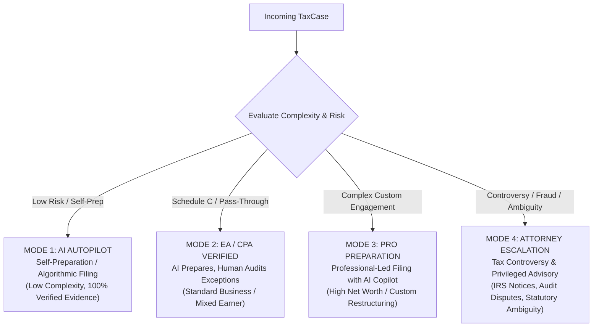

# Autonomous Tax OS — Professional Review Architecture & Modes

> **Status**: Approved System Architecture  
> **Document Version**: 1.0.0  
> **Compliance Standard**: Circular 230 (Regulations Governing Practice before the IRS), AICPA SSTS  
> **Core Principle**: Human Reviewers Review Exceptions, Not Repeat AI Work  

---

## 1. The Four Professional Execution Modes

Autonomous Tax OS recognizes that tax engagements vary from straightforward single-state filings to complex multi-state audits and legal controversies. The platform structures work into **four distinct professional operating modes**:



### Detailed Mode Specifications:

#### MODE 1: AI AUTOPILOT (Self-Preparation)
* **Target Audience**: Straightforward freelancers, sole proprietors, and mixed earners with 100% documentary evidence and zero open factual issues.
* **Legal Posture**: Taxpayer signs Form 8879 directly as an unassisted self-preparer.
* **Safeguards**: Only permitted when the case achieves $\ge 95\%$ AI confidence and passes all automated adversarial tests.

#### MODE 2: EA / CPA VERIFIED (Collaborative Exception Review)
* **Target Audience**: Small businesses, multi-platform creators, and freelancers who demand professional assurance without paying legacy hourly rates.
* **Workflow**: Autonomous Tax OS reconstructs facts, applies rules, and drafts the return. A credentialed Enrolled Agent (EA) or CPA inspects the **AI Review Brief**, reviews flagged exceptions, approves tax positions, and signs Form 8879 as a verified reviewer.
* **Time Target**: Under 8 minutes per standard return.

#### MODE 3: PROFESSIONAL PREPARATION (Firm Full Engagement)
* **Target Audience**: Accounting firms handling full-service concierge clients.
* **Workflow**: The professional leads the engagement, utilizing the agent runtime to chase missing documents, match receipts, and calculate multi-state allocations while retaining hands-on control over election decisions.

#### MODE 4: TAX ATTORNEY ESCALATION (Legal Controversy & Defense)
* **Target Audience**: IRS audits (CP2000, CP504, revenue agent examinations), formal statutory conflicts, and tax fraud alerts.
* **Safeguard Rule**: Tax attorneys are **NEVER** assigned to routine return review by default. Attorneys operate exclusively on escalated legal controversy dossiers in a privileged legal workspace.

---

## 2. The AI Review Brief & Exception Workflow

The primary working interface for reviewing professionals is the **AI Review Brief**:

```typescript
export interface AIReviewBrief {
  caseId: string;
  taxpayerName: string;
  taxYear: number;
  overallConfidenceScore: number;     // e.g. 0.94
  
  executiveSummary: {
    grossReconstructedIncome: number;
    totalDeductionsClaimed: number;
    effectiveFederalRate: number;
    stateAllocations: Record<string, number>;
  };
  
  auditSections: {
    incomeReconciliation: AuditSectionStatus;
    expenseSubstantiation: AuditSectionStatus;
    federalFormCompliance: AuditSectionStatus;
    stateConformityAdjustments: AuditSectionStatus;
  };
  
  exceptionsRequiringSignOff: Array<{
    exceptionId: string;
    category: 'STATUTORY_AMBIGUITY' | 'HIGH_VALUE_DEDUCTION' | 'MULTI_STATE_SOURCING';
    description: string;
    recommendedTreatment: string;
    authorityCitation: string;
    alternativeTreatments: string[];
    riskAssessment: 'LOW' | 'MEDIUM' | 'HIGH';
    resolutionStatus: 'PENDING' | 'APPROVED' | 'OVERRIDDEN';
  }>;
  
  adversarialChallengeLog: {
    challengerAgentFindings: string[];
    defenseRebuttals: string[];
    consensusVerdict: 'CLEARED' | 'ESCALATED';
  };
}
```

---

## 3. Override Logging & Circular 230 Compliance

Whenever a reviewing professional modifies an AI classification or overrides a proposed tax position:
1. **Mandatory Statutory Reason**: The professional must select or type a recognized statutory justification (e.g., "Treas. Reg. § 1.280A-2(b) principal place of business exception applies").
2. **Immutable Audit Record**: The system records the preparer's PTIN, timestamp, original value, modified value, and stated justification.
3. **No Silent Overwrites**: The original AI hypothesis and the human override are permanently preserved in the Evidence Graph for audit defense.
