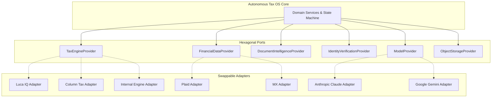

# Autonomous Tax OS — Vendor-Neutral Provider Abstractions

> **Status**: Approved System Architecture  
> **Document Version**: 1.0.0  
> **Pattern**: Hexagonal Architecture (Ports & Adapters)  
> **Core Principle**: Zero Tight Coupling to External Commercial Vendors  

---

## 1. Architectural Philosophy

Autonomous Tax OS must maintain operational independence and strategic resilience. The system must never be held hostage by vendor pricing changes, API deprecations, or sudden outages.

All external dependencies—including tax calculation engines, banking aggregators, document extractors, and LLM providers—are accessed exclusively through **strongly typed TypeScript interfaces (Ports)**. Concrete vendor SDKs exist solely as swappable **Adapters**.



---

## 2. Directory of Key Provider Abstractions

### 2.1 `TaxEngineProvider` (Authoritative Math & Form Engine)
```typescript
export interface TaxEngineProvider {
  providerName: string;
  supportedTaxYears: number[];
  
  validateFacts(caseData: NormalizedTaxFacts): Promise<ValidationResult>;
  calculateFederal(caseData: NormalizedTaxFacts): Promise<FederalCalculationResult>;
  calculateState(stateCode: string, caseData: NormalizedTaxFacts): Promise<StateCalculationResult>;
  generateForms(caseId: string, calcResult: CombinedCalculation): Promise<CompiledTaxForms>;
  validateForms(forms: CompiledTaxForms): Promise<FormValidationDiagnostics>;
  generateFilingPayload(forms: CompiledTaxForms): Promise<MeFXmlPayload>;
  validateFilingPayload(payload: MeFXmlPayload): Promise<MeFBusinessRuleResult>;
}
```
* **Supported Adapters**: `InternalDeterministicEngineAdapter` (default reference), `ColumnTaxAdapter`, `AprilTaxAdapter`, `LucaIqAdapter`.

---

### 2.2 `FinancialDataProvider` (Banking & Transaction Aggregation)
```typescript
export interface FinancialDataProvider {
  createLinkToken(userId: string, tenantId: string): Promise<string>;
  exchangePublicToken(publicToken: string): Promise<FinancialAccountCredentials>;
  syncTransactions(accountId: string, cursor?: string): Promise<TransactionSyncBatch>;
  fetchInstitutions(): Promise<InstitutionMetadata[]>;
  revokeAccess(accountId: string): Promise<void>;
}
```
* **Supported Adapters**: `PlaidAdapter`, `MxPlatformAdapter`, `FinicityAdapter`, `MockBankAdapter` (for automated testing).

---

### 2.3 `DocumentIntelligenceProvider` (Multimodal Extraction & OCR)
```typescript
export interface DocumentIntelligenceProvider {
  extractDocument(fileBytes: Buffer, mimeType: string): Promise<ExtractedDocumentContent>;
  classifyDocumentType(extractedText: string): Promise<TaxDocumentClassification>;
  extractBoundingBoxes(fileBytes: Buffer): Promise<FieldBoundingBoxes>;
}
```
* **Supported Adapters**: `GoogleDocumentAiAdapter`, `AwsTextractAdapter`, `MultimodalVisionAdapter`.

---

### 2.4 `IdentityVerificationProvider` (KYC & CIP Compliance)
```typescript
export interface IdentityVerificationProvider {
  createVerificationSession(taxpayerId: string): Promise<VerificationSession>;
  verifyGovernmentId(frontImage: Buffer, backImage: Buffer): Promise<IdValidationResult>;
  verifyFacialLiveness(selfieVideo: Buffer): Promise<LivenessResult>;
}
```
* **Supported Adapters**: `PersonaAdapter`, `StripeIdentityAdapter`, `SocureAdapter`.

---

### 2.5 `ModelProvider` (LLM & Embeddings Orchestration)
```typescript
export interface ModelProvider {
  providerName: string;
  completeChat(request: ModelChatRequest): Promise<ModelChatResponse>;
  generateEmbeddings(text: string[]): Promise<number[][]>;
  checkHealth(): Promise<boolean>;
}
```
* **Supported Adapters**: `AnthropicClaudeAdapter` (3.7 Sonnet / Haiku), `GoogleGeminiAdapter` (Flash / Pro), `OpenAiAdapter`, `LocalVllmAdapter`.

---

### 2.6 `ESignProvider` (Cryptographic Electronic Signatures)
```typescript
export interface ESignProvider {
  createSignaturePackage(request: ESignPackageRequest): Promise<ESignPackage>;
  getSignatureStatus(packageId: string): Promise<SignatureStatus>;
  downloadSignedArtifact(packageId: string): Promise<Buffer>;
}
```
* **Supported Adapters**: `InternalCryptographicESignAdapter` (Form 8879 SHA-256 compliant), `DocuSignAdapter`, `HelloSignAdapter`.

---

### 2.7 Storage, Messaging & Vector Abstractions
* **`ObjectStorageProvider`**: `S3StorageAdapter`, `CloudflareR2Adapter`, `GoogleCloudStorageAdapter`.
* **`VectorSearchProvider`**: `PgVectorAdapter` (PostgreSQL native), `QdrantAdapter`, `PineconeAdapter`.
* **`NotificationProvider`**: `TwilioSmsAdapter`, `SendGridEmailAdapter`, `PostmarkAdapter`, `FcmAdapter`.
