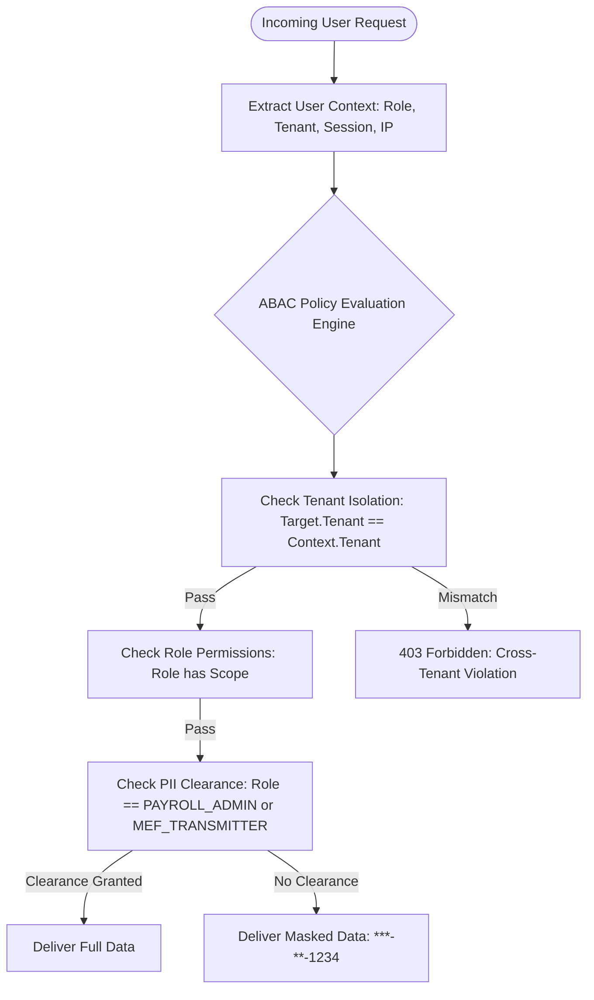

# Autonomous Tax OS — Comprehensive Security, Cryptography & Privacy Architecture

> **Status**: Approved Security Architecture Baseline  
> **Compliance Benchmarks**: SOC 2 Type II, IRS Publication 1075, IRS Publication 1345, FTC Safeguards Rule, NIST SP 800-53  
> **Threat Model**: High-Value Nation-State & Criminal Financial Target  

---

## 1. Security Philosophy & The PII Vault Principle

Autonomous Tax OS processes the most sensitive financial and personal data in the digital economy:
* Social Security Numbers (SSNs) and Individual Taxpayer Identification Numbers (ITINs)
* Full Bank Account and Routing Numbers
* Employer Identification Numbers (EINs)
* Prior-Year Federal and State Tax Returns
* Detailed Personal and Business Transaction Histories
* Government-Issued Photo Identity Documents.

> [!IMPORTANT]
> **Production Isolation Invariant**: Production taxpayer data must **NEVER** under any circumstance become development fixtures, staging database dumps, or training data for machine learning models. All non-production environments operate strictly on synthetic mock data.

---

## 2. Cryptographic Architecture & Key Management

```
┌────────────────────────────────────────────────────────────────────────┐
│                        ENVELOPE ENCRYPTION TOPOLOGY                    │
├────────────────────────────────────────────────────────────────────────┤
│  Level 1: Master Key (KMS Root Key)                                   │
│  • HSM-backed AWS KMS / Cloud KMS Customer Managed Key (CMK)          │
│  • Automatic annual key rotation; FIPS 140-3 Level 3 compliance        │
│                                                                        │
│  Level 2: Tenant Data Encryption Key (TDEK)                            │
│  • Unique DEK generated per organization / tax firm tenant             │
│  • Encrypted under Level 1 KMS CMK                                     │
│                                                                        │
│  Level 3: Field-Level Secret Key (Tokenization Vault)                  │
│  • AES-256-GCM authenticated cipher applied to SSNs & Bank Acct Nums   │
│  • Plaintext values exist only within transient hardware memory        │
└────────────────────────────────────────────────────────────────────────┘
```

1. **Encryption in Transit**: Strict TLS 1.3 enforcement with HSTS (`max-age=63072000; includeSubDomains; preload`). Deprecated TLS 1.0/1.1/1.2 ciphers rejected at edge proxies.
2. **Encryption at Rest**:
   * Database storage: PostgreSQL encrypted using AWS KMS managed keys.
   * Object storage: S3 buckets enforced with `aws:kms` server-side encryption and bucket key enablement.
   * Backups: Point-in-time recovery WAL archives encrypted with independent KMS backup keys.
3. **The SSN Tokenization Vault**:
   * Raw SSNs are ingested into an isolated, zero-privilege microservice vault.
   * The vault returns a surrogate, non-reversible token: `tok_ssn_9921_x881a`.
   * Only the IRS MeF XML Transmission Gateway is authorized to request detokenization during final encrypted transmission to the IRS.

---

## 3. Zero-Trust Access Control (RBAC + ABAC)



### Role-Based Access Matrix:
```
┌─────────────────────────┬────────────┬───────────┬──────────────┬────────────┐
│ ROLE                    │ TAX RETURN │ WAGE AGG. │ INDIV. SAL.  │ RAW SSN    │
├─────────────────────────┼────────────┼───────────┼──────────────┼────────────┤
│ Taxpayer (B2C)          │ Own Only   │ Own Only  │ N/A          │ Masked     │
│ Paid Preparer           │ Full Case  │ Full Case │ Masked       │ Masked     │
│ Reviewing CPA / EA      │ Full Case  │ Full Case │ Review-Only  │ Masked     │
│ Tax Attorney (Controv.) │ Full Case  │ Full Case │ Review-Only  │ Authorized │
│ Tax Operations Manager  │ Anonymized │ Aggregates│ Blocked      │ Blocked    │
│ Platform Super Admin    │ Audit Only │ Blocked   │ Blocked      │ Blocked    │
└─────────────────────────┴────────────┴───────────┴──────────────┴────────────┘
```

---

## 4. PII Scrubbing in Logs & Observability

All telemetry pipelines (OpenTelemetry collectors, Datadog forwarders, Sentry error monitors) pass through an active **PII Redaction Interceptor**:
* **Regex Filtering**: Scans payloads for 9-digit SSN patterns (`\b\d{3}-\d{2}-\d{4}\b`), credit card numbers (Luhn algorithm validation), and routing numbers.
* **Replacement Tokens**: Matched entities are replaced with `[REDACTED_SSN]`, `[REDACTED_BANK_ACCOUNT]`.
* **Zero Logging of Prompts Containing Documents**: Raw document OCR strings and taxpayer financial statements are classified as `CONFIDENTIAL_TAX_DATA` and excluded from debug log output.

---

## 5. Security Incident Response & Audit Integrity

* **IRS Publication 1075 Compliance**: Audit logs capture every read, write, modification, or export of taxpayer data.
* **Immutable WORM Storage**: Audit logs are streamed directly to Write-Once-Read-Many (WORM) storage with S3 Object Lock in compliance mode (retained for 7 statutory tax years).
* **Automated Kill Switches**: In the event of anomalous access velocity or credential leakage, automated security breakers instantly revoke active JWT sessions and freeze transmission pipelines.
