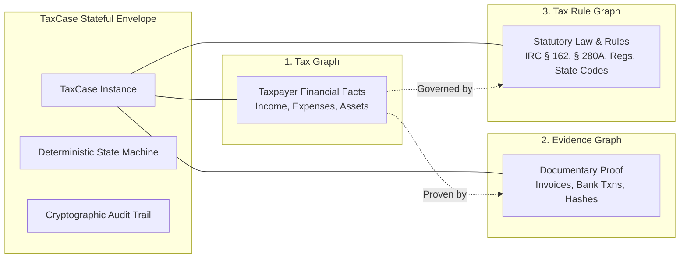

# Autonomous Tax OS — Master System Overview & High-Level Architecture

> **Status**: Approved System Architecture  
> **Document Version**: 1.0.0  
> **Architectural Paradigm**: Event-Driven Multi-Agent Tri-Graph Operating System  
> **Security Baseline**: SOC 2 Type II, IRS Pub 1075 / Pub 1345, FTC Safeguards Rule  

---

## 1. Executive Architecture Summary

**Autonomous Tax OS** is an agentic, event-driven operating system architected specifically for high-trust U.S. tax compliance. Unlike traditional software that layers LLMs onto forms or simple OCR pipelines, Autonomous Tax OS isolates probabilistic AI cognition from authoritative deterministic tax law computation.

The system is organized around three foundational architectural pillars:
1. **The Canonical TaxCase**: The stateful, immutable entity around which all taxpayer facts, documents, calculations, agent decisions, and audit trails revolve.
2. **The Tri-Graph Topology**:
   * **The Tax Graph**: A structured representation of the taxpayer's objective financial reality.
   * **The Evidence Graph**: A directed acyclic graph (DAG) tracing every financial number to cryptographic documentary proof.
   * **The Tax Rule Graph**: A versioned, declarative graph of statutory authorities (IRC, Treasury Regs, state codes) and applicability conditions.
3. **The Clean Boundary Between AI Cognition and Deterministic Math**: LLM agents interpret documents, investigate facts, generate hypotheses, and retrieve applicable law; **authoritative tax calculations, bracket evaluations, and form generation are executed exclusively by deterministic compilation engines**.

---

## 2. High-Level Component Topology

```mermaid
flowchart TD
    subgraph Client Layer
        WebB2C["B2C Taxpayer Web App<br/>(Tailwind / React / Mobile Ready)"]
        WebB2B["B2B Professional Cockpit<br/>(EA/CPA/Manager/Attorney)"]
        API["Partner Headless B2B2C API<br/>(REST / Webhooks)"]
    end

    subgraph Security & Ingress Boundary
        Gateway["Cloudflare WAF / Envoy API Gateway<br/>(MFA, Rate Limiting, TLS 1.3 Termination)"]
        AuthZ["Zero-Trust RBAC & ABAC Engine<br/>(Tenant Isolation & Field-Level PII Shield)"]
    end

    subgraph Core Orchestration & Ingestion
        IngressQueue["TaxDrop Ingestion Queue<br/>(S3 Encrypted Object Store + Hashing)"]
        Supervisor["Tax Case Supervisor & Orchestrator<br/>(State Machine Engine)"]
        AgentRuntime["Multi-Agent Runtime<br/>(Sandboxed Contexts & Tool Execution)"]
    end

    subgraph The Tri-Graph Knowledge Engine
        TaxGraph[("1. Tax Graph<br/>(PostgreSQL + JSONB Entities)")]
        EvidenceGraph[("2. Evidence Graph<br/>(Document Hashes & Provenance DAG)")]
        TaxRuleGraph[("3. Tax Rule Graph<br/>(Versioned Statutes, Regs & Codes)")]
    end

    subgraph Deterministic Tax Infrastructure
        TaxEngine["Deterministic Tax Computation Engine<br/>(Statutory Math, Bracket Slicing, Phaseouts)"]
        FormCompiler["MeF IRS/State XML Form Compiler<br/>(Schema Validation & Schematron Rules)"]
    end

    subgraph Human-in-the-Loop & Filing
        ProReview["Professional Review Matrix<br/>(Modes 1–4 Sign-Off & Workpapers)"]
        MeFGateway["IRS / State MeF Transmission Pipeline<br/>(A2A Transmission & Status Polling)"]
    end

    Client Layer --> Gateway
    Gateway --> AuthZ
    AuthZ --> Supervisor
    Supervisor --> IngressQueue
    Supervisor --> AgentRuntime
    AgentRuntime <--> TaxGraph
    AgentRuntime <--> EvidenceGraph
    AgentRuntime <--> TaxRuleGraph
    Supervisor --> TaxEngine
    TaxEngine --> FormCompiler
    FormCompiler --> ProReview
    ProReview --> MeFGateway
```

---

## 3. The Tri-Graph Architecture: Connecting Through TaxCase

The core innovation of Autonomous Tax OS is the **Tri-Graph Architecture**, mediated entirely through the canonical `TaxCase`:



1. **Tax Graph**: Encapsulates the taxpayer's real-world economic facts (e.g., "Elena incurred $4,200 in travel expenses to Austin, TX").
2. **Evidence Graph**: Provides the chain of custody proving those facts (e.g., Flight receipt PDF hash `sha256:7f9...` linked to Chase Checking transaction `txn_99182` via connected Plaid feed).
3. **Tax Rule Graph**: Declares the legal conditions required to treat that fact as a tax deduction (e.g., IRC § 162(a)(2) ordinary and necessary traveling expenses while away from home in pursuit of a trade or business).

---

## 4. Architectural Invariants

The system enforces six strict invariants across all execution paths:
* **Invariant I (No Math in Prompts)**: No LLM agent is ever instructed or permitted to add, subtract, multiply, or compute tax brackets. All math is performed by deterministic TypeScript/Python math modules.
* **Invariant II (Immutable Calculation Provenance)**: Every dollar amount mapped onto a return form carries an unbroken lineage pointer back to underlying transactions, source documents, and statutory citations.
* **Invariant III (Zero Cross-Tenant Leakage)**: Every database query, vector search, and agent memory access is partitioned by `tenant_id` and `tax_case_id` at the database engine level via Row Level Security (RLS).
* **Invariant IV (Temporal Versioning)**: All tax rules and computations are tagged with `tax_year` and `rule_version`. A 2025 return executed in 2028 evaluates against the 2025 rule graph snapshot.
* **Invariant V (Adversarial Internal Validation)**: No tax position is presented to a taxpayer or CPA without first passing through the **IRS Challenger Agent**, which stress-tests the position against published audit standards.
* **Invariant VI (Least Privilege Role Segregation)**: Tax preparers see only aggregate business wages on corporate/pass-through returns; raw employee compensation and SSNs are quarantined behind explicit payroll-clearance RBAC.
