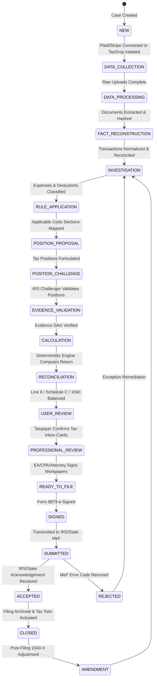
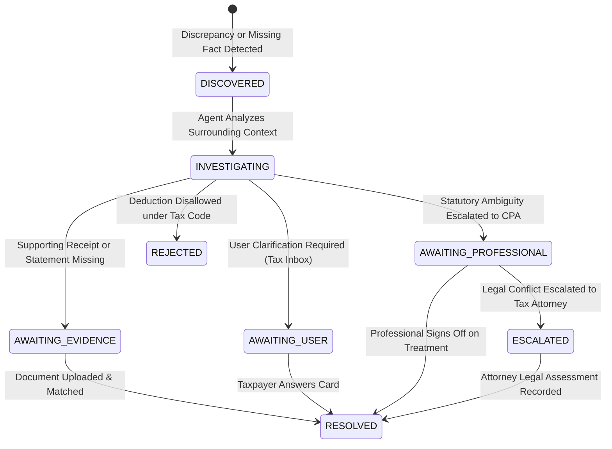

# Autonomous Tax OS — The Canonical TaxCase Architecture

> **Status**: Approved System Architecture  
> **Document Version**: 1.0.0  
> **Entity Type**: Root Aggregate Entity (`TaxCase`)  
> **State Machine Paradigm**: Deterministic Finite State Automaton with Event Sourcing  

---

## 1. The Core Philosophy of TaxCase

In Autonomous Tax OS, **the TaxCase is the single source of truth for an entire filing lifecycle**. 

Agents do not chat loosely with one another. Agents read from the structured state of a `TaxCase`, execute bounded tools, and write structured mutations back to the `TaxCase` through audited event streams.

```
┌────────────────────────────────────────────────────────────────────────┐
│                               TAX CASE                                 │
│  The Stateful Container for Financial Reality, Law & Evidence         │
├────────────────────────────────────────────────────────────────────────┤
│  • Identity & Household: Taxpayer, Spouse, Dependents, Residency       │
│  • Financial Accounts: Connected Banks, Brokerages, Processors         │
│  • Ingested Documents: W-2s, 1099s, Receipts, Invoices, Prior Returns   │
│  • Reconstructed Facts: Reconciled Incomes, Categorized Expenses       │
│  • Evidence Graph Pointers: Hashes, Lineage DAGs, Source Feeds         │
│  • Tax Positions: Legal Hypotheses, Code Sections, Challenges          │
│  • Open Issues: Active Inquiries (Tax Inbox Cards)                     │
│  • Calculations: Deterministic Line-by-Line Math Results               │
│  • Review & Filing: Mode Sign-offs, Form 8879, MeF Submission State    │
│  • Audit Trail: Cryptographic Event Sequence of Every AI Mutation      │
└────────────────────────────────────────────────────────────────────────┘
```

---

## 2. Compositional Multi-Domain Entity Architecture

In Autonomous Tax OS, a `TaxCase` is an Enterprise Root Aggregate that composes typed domain obligations rather than forcing a monolithic single-return hierarchy:

```
TaxCase (Root Enterprise Engagement Aggregate)
    │
    ├── IncomeTaxCase (Annual Federal Form 1040/1120-S & 5-State Income Returns)
    ├── SalesTaxObligation[] (Periodic Jurisdictional Filings & Composite Sourcing)
    ├── PayrollTaxObligation[] (Deposit Runs, Form 941, 940, W-2/W-3, SUTA)
    ├── TaxRegistrations (EIN, CDTFA, NY DTF, SUTA ID State Accounts)
    ├── TaxDeadlines (Unified Calendar & Statutory Cutoffs)
    └── TaxPayments (Treasury Remittances & Confirmation Proofs)
```

```typescript
export interface TaxCase {
  id: string;                          // UUID v4
  tenantId: string;                    // Organization / Firm Partition
  entityId: string;                    // Associated Legal Entity / Individual
  taxYear: number;                     // Primary Calendar Year Anchor (e.g. 2026)
  lifecycleState: TaxCaseState;        // Overall Engagement Lifecycle State
  
  // 1. Compositional Domain Obligations
  incomeTaxCase?: IncomeTaxCase;                 // Annual Federal & State Income Return
  salesTaxObligations: SalesTaxObligation[];     // Jurisdictional Periodic Filings (Monthly/Quarterly)
  payrollTaxObligations: PayrollTaxObligation[]; // Deposit & Reporting Cycles (941, 940, W-2)
  
  // 2. Shared Enterprise Compliance & Operations
  registrations: RegistrationProfile;            // Federal & State Tax Agency Accounts
  deadlines: TaxDeadline[];                      // Aggregated Universal Compliance Calendar
  payments: TaxPaymentRecord[];                  // Master Treasury Remittance Receipts
  
  // 3. Financial & Business Graph References
  businessEntityIds: string[];
  connectedAccountIds: string[];
  documentIds: string[];
  transactionIds: string[];
  
  // 4. Intelligence & Shared Provenance
  openIssues: TaxIssue[];                        // Tax Inbox Inquiries
  pendingQuestions: TaxQuestion[];
  activeTasks: AgentTask[];
  evidenceGraphRef: string;                      // Pointer to immutable DAG of documentary proofs
  taxGraphRef: string;                           // Pointer to normalized economic reality graph
  auditLedgerId: string;                         // Hash-chained WORM audit sequence identifier
  lockVersion: number;                           // Optimistic Concurrency Control
}
```

---

## 3. The 20-State Deterministic State Machine

A `TaxCase` transitions through strict, deterministic workflow states. No stage may be skipped.



### State Definitions:
1. `NEW`: Case initialized for taxpayer and tax year.
2. `DATA_COLLECTION`: Active gathering of financial connections and document drops.
3. `DATA_PROCESSING`: OCR extraction, format validation, document splitting, duplicate detection.
4. `FACT_RECONSTRUCTION`: Income sources, transaction normalization, bank vs. processor reconciliation.
5. `INVESTIGATION`: Categorizing spend, investigating business purpose under IRC § 162.
6. `RULE_APPLICATION`: Resolving federal and state tax rules against reconstructed facts.
7. `POSITION_PROPOSAL`: Deduction Hunter and Credit Hunter formulate candidate positions.
8. `POSITION_CHALLENGE`: IRS Challenger agent stress-tests proposed positions against audit standards.
9. `EVIDENCE_VALIDATION`: Evidence Examiner confirms documentary proof meets IRC § 274 substantiation.
10. `CALCULATION`: Deterministic calculation engine compiles numbers onto official tax forms.
11. `RECONCILIATION`: Triple-checking return math against general ledger, bank balances, and W-2/1099s.
12. `USER_REVIEW`: Taxpayer reviews high-level summary and answers minimal Tax Inbox cards.
13. `PROFESSIONAL_REVIEW`: Credentialed EA or CPA reviews AI Review Brief and approves positions.
14. `READY_TO_FILE`: Forms 1040 and state returns compiled into compliant MeF XML payloads.
15. `SIGNED`: Taxpayer and paid preparer execute electronic signatures (Form 8879).
16. `SUBMITTED`: Cryptographically secured MeF package transmitted to IRS and state gateways.
17. `ACCEPTED`: Official IRS/State XML acknowledgment received with submission tracking number.
18. `REJECTED`: MeF business rule validation error received; routes directly to rejection triage.
19. `AMENDMENT`: Superseding or amended return (Form 1040-X) initiated due to subsequent 1099-C/K.
20. `CLOSED`: Case finalized, archived in immutable storage, and continuously monitored by Tax Twin.

---

## 4. The Tax Issue Lifecycle

Independent of the top-level case state, individual tax questions, missing documents, and discrepancies are tracked as discrete **Tax Issues**:


