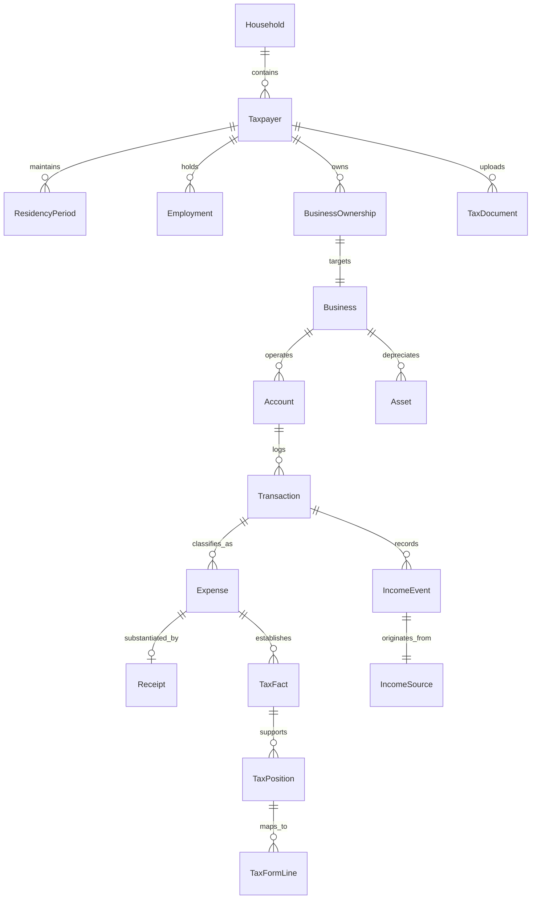

# Autonomous Tax OS — The Tax Graph Architecture

> **Status**: Approved System Architecture  
> **Document Version**: 1.0.0  
> **Domain**: Taxpayer Financial Reality Model  
> **Storage Engine**: Hybrid Relational + Document Graph (PostgreSQL with pgvector & JSONB)  

---

## 1. Purpose & Domain Scope

The **Tax Graph** is the structured, semantic representation of the taxpayer’s objective financial reality. It models people, businesses, accounts, transactions, assets, and liabilities as a coherent, connected knowledge graph.

The Tax Graph is completely decoupled from tax forms. A transaction or an asset exists in the Tax Graph as a real-world economic event; the Tax Rule Graph then determines how that event projects onto federal and state tax returns.

---

## 2. Core Entities Modeled in the Tax Graph

The Tax Graph models at minimum the following 36 canonical entities:



### 2.1 Identity, Household & Demographics
1. `Taxpayer`: Primary legal individual (SSN/ITIN, DOB, citizenship, filing status, contact).
2. `Spouse`: Marital partner for Married Filing Jointly / Separately returns.
3. `Dependent`: Qualifying child or qualifying relative under IRC § 152 (relationship, months lived together, support test).
4. `Household`: Family unit encapsulating joint assets, shared domicile, and dependent claims.
5. `Address`: Physical and mailing addresses with geocoding, jurisdictional FIPS codes, and municipality identifiers.
6. `ResidencyPeriod`: Temporal intervals (`startDate`, `endDate`, `stateCode`, `domicileStatus`) establishing state residency for statutory allocation.

### 2.2 Commercial Entities & Employment
7. `Employer`: Corporate or governmental entity issuing Form W-2 (EIN, legal name, address, state payroll withholding IDs).
8. `Employment`: Taxpayer employment agreement (title, start/end dates, statutory employee flag).
9. `Business`: Trade or business entity (Sole Proprietorship, Single-Member LLC, Partnership) with NAICS code and accounting method.
10. `BusinessOwnership`: Equity or member percentage, active participation flag under passive activity loss rules (IRC § 469).
11. `Client`: Commercial counterparty paying freelance or consulting invoices (Form 1099-NEC issuer).

### 2.3 Financial Accounts & Payment Infrastructure
12. `Account`: Financial account (checking, savings, credit card, loan) with routing/masking.
13. `FinancialInstitution`: Bank or credit union (Plaid/MX institution ID, OAuth credentials).
14. `PaymentProcessor`: Merchant platform (Stripe, Square, PayPal, Shopify Payments) tracking processing fees and gross volume.
15. `Brokerage`: Investment institution (Schwab, Fidelity, Robinhood) tracking cost basis and wash sale adjustments under IRC § 1091.

### 2.4 Economic Activity: Income & Expenses
16. `IncomeSource`: Inflow stream (W-2 wages, 1099-NEC nonemployee compensation, 1099-K card volume, 1099-INT interest, 1099-DIV dividends).
17. `IncomeEvent`: Discrete economic receipt with gross amount, withholding, and source currency.
18. `Transaction`: Granular bank or card ledger entry (date, raw description, normalized counterparty, amount).
19. `Merchant`: Enriched commercial counterparty (MCC code, Google Maps business place ID, standard category).
20. `Expense`: Commercial outflow evaluated under IRC § 162 (ordinary and necessary test, percentage business use).
21. `Receipt`: Scanned or digital proof of purchase (merchant name, line items, sales tax, currency).
22. `Invoice`: Commercial bill issued to clients or received from contractors (terms, payment status).

### 2.5 Tangible & Intangible Assets
23. `Asset`: Capitalized property subject to depreciation (placed-in-service date, cost basis, asset class).
24. `Vehicle`: Automobile used for business purposes (odometer logs, business mileage, actual expense vs. standard mileage rate under Rev. Proc. 2024-40).
25. `Property`: Real estate (residential rental, commercial, personal residence with home office square footage).
26. `RetirementAccount`: Traditional IRA, Roth IRA, SEP-IRA, Solo 401(k) tracking annual contribution limits and basis.
27. `Insurance`: Qualified health plan, dental, long-term care, or commercial liability policy.
28. `Education`: Post-secondary institution attended (Form 1098-T, qualified tuition, half-time student status).

### 2.6 Tax Intelligence, Filings & Provenance
29. `TaxDocument`: Ingested file (PDF, scan, CSV) with cryptographic SHA-256 hash, OCR transcript, and entity bounding boxes.
30. `TaxFact`: Atomic verified proposition (e.g., `Fact(Subject: MayaLin, Property: GrossScheduleCIncome, Value: 165000.00, Year: 2026)`).
31. `TaxPosition`: Formal legal stance taken on a tax return (e.g., deducting 100% of camera purchase under IRC § 179).
32. `TaxQuestion`: Clarification card rendered in Tax Inbox to resolve a factual ambiguity.
33. `TaxDecision`: Historical resolution of an issue by AI consensus or human reviewer.
34. `TaxCalculation`: Line-item numerical computation with mathematical dependency graph.
35. `TaxReturn` / `TaxForm` / `TaxFormLine`: Concrete tax forms compiled for submission (Form 1040 Line 1a, Schedule C Line 31, etc.).
36. `StateReturn`: Sovereign state tax return package (CA Form 540, NY Form IT-201, etc.).

---

## 3. Strict Provenance Tracking on Every Graph Node

Every node and edge in the Tax Graph implements the `CalculationProvenance` contract:

```typescript
export interface CalculationProvenance {
  sourceType: 'DOCUMENTARY' | 'CONNECTED_SOURCE' | 'USER_CONFIRMED' | 'DERIVED' | 'INFERRED';
  sourceDocumentIds: string[];        // Specific uploaded PDFs/images
  sourceTransactionIds: string[];     // Plaid/Stripe bank transactions
  ruleId?: string;                    // Associated statutory rule from Rule Graph
  ruleVersion?: string;               // e.g. "2026.Q1.01"
  confidenceScore: number;            // 0.00 to 1.00
  computedByAgent: string;            // Agent ID that generated or classified this node
  timestamp: string;                  // ISO 8601
  reviewStatus: 'PROPOSED' | 'CHALLENGED' | 'VERIFIED' | 'OVERRIDDEN';
  reviewedBy?: string;                // EA / CPA credentialed reviewer ID if audited
}
```

No value is permitted to enter the calculation pipeline without a fully resolved `CalculationProvenance` block.
