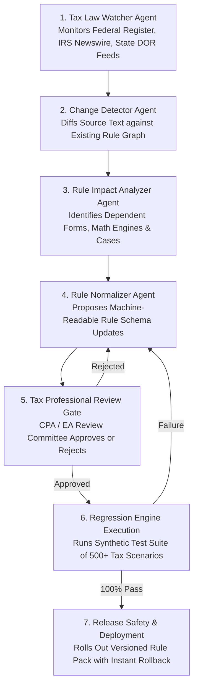

# Autonomous Tax OS — The Tax Rule Graph Architecture

> **Status**: Approved System Architecture  
> **Document Version**: 1.0.0  
> **Domain**: Versioned Statutory Knowledge & Authority Representation  
> **Rule Engine Paradigm**: Declarative Directed Graph with Deterministic Code Bindings  

---

## 1. Executive Summary & Core Philosophy

The **Tax Rule Graph** is the authoritative, versioned repository of tax law across the United States federal government and sovereign states.

> [!IMPORTANT]
> **Anti-Pattern Prohibited**: Tax rules **never** exist solely inside LLM system prompts. Tax law cannot be entrusted to probabilistic model memory. Rules are formalized as declarative, machine-readable specifications that link statutory citations to deterministic calculation routines.

---

## 2. Primary Authority Hierarchy & Source Precedence

Autonomous Tax OS establishes an unbreachable hierarchy of legal authority. A lower authority or secondary source may **never** silently contradict or override a higher authority.

```
LEVEL 1: PRIMARY STATUTORY LAW (Highest Precedence)
├── Federal: United States Internal Revenue Code (Title 26 USC)
└── State: State Revenue & Taxation Codes (e.g., Cal. Rev. & Tax. Code, NY Tax Law)

LEVEL 2: ADMINISTRATIVE REGULATIONS (Promulgated Rules)
├── Federal: Treasury Regulations (26 CFR Part 1)
└── State: State Administrative Codes (e.g., 18 CCR § 1502 for California)

LEVEL 3: OFFICIAL TAX AUTHORITY GUIDANCE
├── Federal: IRS Revenue Rulings, Revenue Procedures, Official Forms & Instructions
└── State: FTB Legal Rulings, NY TSB-Ms, NJ Technical Bulletins, DOR Directives

LEVEL 4: JUDICIAL PRECEDENT & TAX COURT DECISIONS
├── Precedential: U.S. Supreme Court, Federal Circuit Courts, U.S. Tax Court Regular Opinions
└── Non-Precedential: Tax Court Summary Opinions, Memorandum Decisions, IRS PLRs

LEVEL 5: SECONDARY SOURCES (Informational Only — Never Overrides Primary)
└── Professional Commentary, RIA Checkpoint, CCH Standard Federal Tax Reports
```

---

## 3. Normalized Declarative Tax Rule Schema

Every rule in the Tax Rule Graph is formalized according to the strict `TaxRule` schema:

```typescript
export interface TaxRule {
  ruleId: string;                      // e.g. "RULE-FED-2026-IRC-162-ADVERTISING"
  jurisdiction: string;                // e.g. "US-FED", "US-CA", "US-NY"
  taxYear: number;                     // e.g. 2026
  topic: string;                       // "BUSINESS_EXPENSE_ADVERTISING"
  description: string;                 // Plain English statutory summary
  
  // Logic & Conditions
  conditions: RuleCondition[];         // Declarative JSON-Logic predicate tree
  requiredFacts: string[];             // Required Tax Graph fact keys
  exceptions: RuleException[];         // Disallowance triggers (e.g. personal use)
  
  // Numerical Parameters
  thresholds?: Record<string, number>; // e.g. { standardDeductionSingle: 15000 }
  phaseOuts?: PhaseOutRule[];          // AGI phaseout floors and ceilings
  elections?: TaxElectionDefinition[]; // e.g. Section 179 expensing election
  
  // Form Mapping & Math
  calculationReference: string;        // ID of deterministic TypeScript function
  formMappings: FormMapping[];         // Line bindings: [{ form: '1040-SCH-C', line: '8' }]
  stateAdjustments?: StateConformity;  // Difference from federal baseline
  
  // Authorities & Provenance
  authorityRefs: AuthorityCitation[];  // Citations to Level 1–4 primary sources
  effectivePeriod: {
    startDate: string;                 // ISO 8601
    endDate?: string;                  // Sunset date if applicable
  };
  ruleVersion: string;                 // e.g. "2026.1.0"
  reviewStatus: 'DRAFT' | 'APPROVED' | 'ACTIVE' | 'SUPERSEDED' | 'DEPRECATED';
  approvedByCpaId?: string;            // Professional who validated the rule
}
```

---

## 4. Rule Update & Governance Workflow

Tax law is dynamic. When the U.S. Congress, state legislatures, or taxing agencies pass legislation (e.g., annual inflation adjustments, TCJA extensions), rules are updated through a rigorous, seven-stage pipeline:



> [!IMPORTANT]
> **Zero In-Place Overwrites**: An older rule version is **never deleted or overwritten in place**. When a rule changes, a new version is created (e.g., `2026.2.0`), while older versions (`2026.1.0`, `2025.1.0`) remain immutable. This guarantees that prior-year returns or audits can be reproduced with 100% mathematical fidelity.
