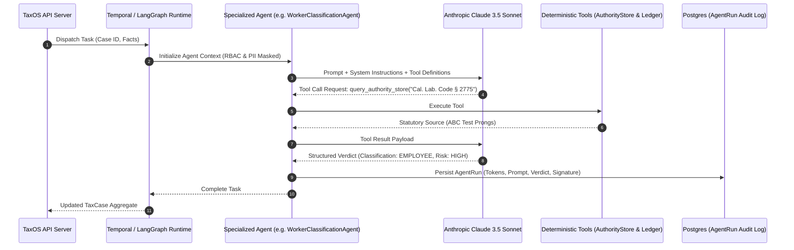

# TaxOS Autonomous Agent Systems Reality & Gap Analysis

**Document Version:** 1.0.0  
**Audit Date:** October 8, 2026  
**Auditor:** AI Systems Architect & Production Readiness Auditor  
**Primary Finding:** The purported 40+ autonomous agents exist **exclusively as architectural markdown specifications** in `.agents/skills/` and documentation. **Zero executable autonomous agents exist in code.**

---

## 1. Documentation vs. Code Implementation Reality

### 1.1 The Documentation Inventory
The repository contains 27 skill markdown files in `.agents/skills/` and 9 agent architecture documents in `docs/agents/`, defining:
- **Supervisor Agents:** `TaxCaseSupervisor`, `IncomeTaxSupervisor`, `SalesTaxSupervisor`, `PayrollTaxSupervisor`.
- **Specialist Agents:** `NexusAgent`, `PhysicalNexusAgent`, `EconomicNexusAgent`, `ProductTaxabilityAgent`, `FICA Agent`, `FUTA Agent`, `WorkerClassificationAgent`, `DeductionHunterAgent`, `MissingDocumentAgent`, `EvidenceAgent`.
- **Adversarial Agents:** `AdversarialChallenger`, `IRSPrecedentAuditor`, `ConsensusArbitrator`.

### 1.2 The Codebase Inventory
In [`src/agent-os/`](file:///Users/macbookpro/.gemini/antigravity/scratch/tax-ai/src/agent-os), only abstract scaffolding exists:

| Source File | Lines | Actual Implemented Logic | Missing Runtime Requirements |
| :--- | :--- | :--- | :--- |
| [`Supervisor.ts`](file:///Users/macbookpro/.gemini/antigravity/scratch/tax-ai/src/agent-os/Supervisor.ts) | 78 | Abstract class `DomainSupervisor` and static `TaxCaseSupervisor` dispatcher map. | **Zero concrete domain supervisors implemented.** Neither `IncomeTaxSupervisor` nor `SalesTaxSupervisor` has a concrete class. |
| [`ConsensusEngine.ts`](file:///Users/macbookpro/.gemini/antigravity/scratch/tax-ai/src/agent-os/ConsensusEngine.ts) | 78 | Procedural boolean arbitration (`if (hasProof && hasCitation)`). | No multi-agent dialogue, debate protocol, or LLM reasoning. |
| [`ModelRouter.ts`](file:///Users/macbookpro/.gemini/antigravity/scratch/tax-ai/src/agent-os/ModelRouter.ts) | 92 | Simple task string matching returning adapter name strings. | **No LLM SDKs installed.** Strings like `'AnthropicClaude37SonnetAdapter'` point to nonexistent classes. |
| [`PermissionController.ts`](file:///Users/macbookpro/.gemini/antigravity/scratch/tax-ai/src/agent-os/PermissionController.ts) | 88 | Validates tool whitelist array and applies simple regex masking to JSON fields. | Operates in-memory only; no sandboxing, containerization, or process isolation. |
| [`KillSwitchManager.ts`](file:///Users/macbookpro/.gemini/antigravity/scratch/tax-ai/src/agent-os/KillSwitchManager.ts) | 68 | In-memory `Map<string, boolean>` tracking active kill switches. | State is lost on Node process restart; not distributed across server nodes. |

---

## 2. Detailed Agent Reality Matrix

| Purported Agent | Claimed Role | Executable Class? | Input Schema? | Output Schema? | LLM Client? | Tool Calling Loop? | Reality Classification |
| :--- | :--- | :--- | :--- | :--- | :--- | :--- | :--- |
| **TaxCaseSupervisor** | Global pipeline orchestrator | Partial (`TaxCaseSupervisor`) | In types | In types | None | None | **BACKEND_PROTOTYPE** |
| **IncomeTaxSupervisor** | Income tax orchestration | **No** (Abstract only) | None | None | None | None | **CONCEPT** |
| **SalesTaxSupervisor** | Sales tax pipeline | **No** (Abstract only) | None | None | None | None | **CONCEPT** |
| **PayrollTaxSupervisor**| Payroll pipeline | **No** (Abstract only) | None | None | None | None | **CONCEPT** |
| **NexusAgent** | Economic nexus calculation | **No** | None | None | None | None | **CONCEPT** |
| **ProductTaxabilityAgent**| SaaS & goods classification | **No** | None | None | None | None | **CONCEPT** |
| **WorkerClassificationAgent**| CA AB 5 & IRS 20-Factor | Partial (`WorkerClassificationGuard` procedural helper) | Static TS | Static TS | None | None | **BACKEND_PROTOTYPE** |
| **FICA / FUTA Agent** | Payroll withholding | Partial (`PayrollEngine` procedural helper) | Static TS | Static TS | None | None | **BACKEND_PROTOTYPE** |
| **DeductionHunter** | Ledger deduction discovery | **No** (Static UI cards in React) | None | None | None | None | **UI_PROTOTYPE** |
| **MissingDocumentAgent** | Document expectation engine| **No** (Static task generator) | None | None | None | None | **UI_PROTOTYPE** |
| **EvidenceAgent** | Provenance traversal | Partial (`TaxGraph.traceProvenance`) | Static TS | Static TS | None | None | **BACKEND_PROTOTYPE** |
| **AdversarialChallenger**| IRS position stress tester | Partial (`AdversarialReviewEngine` procedural helper) | Static TS | Static TS | None | None | **BACKEND_PROTOTYPE** |

---

## 3. Critical Agent Gaps

### 3.1 Total Absence of LLM SDKs & Model Execution
- **Finding:** Inspection of [`package.json`](file:///Users/macbookpro/.gemini/antigravity/scratch/tax-ai/package.json) reveals zero model dependencies:
  - No `@anthropic-ai/sdk`
  - No `openai`
  - No `@google/genai`
  - No LangChain, LlamaIndex, or Vercel AI SDK (`ai`)
- **Impact:** The system cannot invoke any large language model. The mock server endpoint `/api/ai/ask` uses hardcoded substring matching (`q.includes('california')`).

### 3.2 Absence of ReAct / Tool-Calling Framework
- In autonomous agent architecture, an agent must:
  1. Receive an observation/goal.
  2. Plan action steps.
  3. Emit structured tool calls (e.g. `query_authority_store`, `inspect_ledger_transactions`, `calculate_macrs_depreciation`).
  4. Receive tool execution results.
  5. Iterate until consensus or termination.
- **Finding:** No tool-execution loop exists in the codebase. Agents cannot invoke tools or inspect databases dynamically.

### 3.3 No Agent Run Persistence (`AgentRun`)
- In production tax compliance, IRS Circular 230 and enterprise audits mandate recording:
  - Exact prompt passed to model
  - Model version and snapshot ID (e.g., `claude-3-5-sonnet-20241022`)
  - Tool invocations and responses
  - Token consumption and latency
  - Final structured verdict and cryptographic signature
- **Finding:** No `agent_runs` table or persistent execution trace exists anywhere in the repository.

---

## 4. Production Agent Implementation Blueprint

