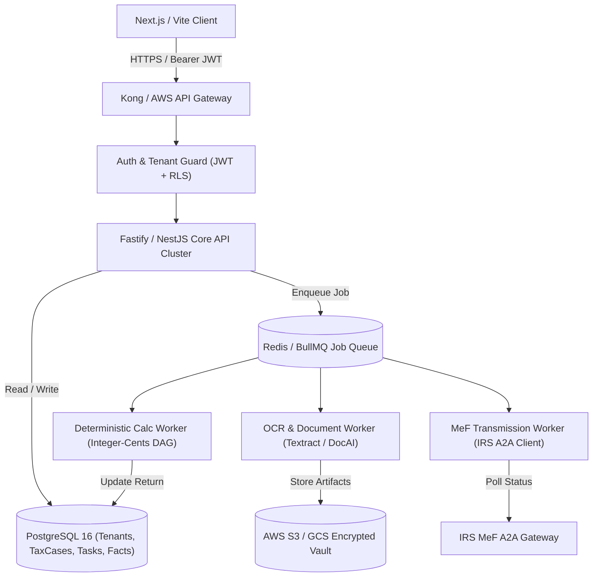

# TaxOS Backend Architecture & Implementation Gap Analysis

**Document Version:** 1.0.0  
**Audit Date:** October 8, 2026  
**Auditor:** Principal Backend Engineer & Production Readiness Auditor  
**Primary Finding:** The current backend is a monolithic in-memory mock HTTP server (`src/server/index.ts`) serving as a local development mock, NOT a production API platform.

---

## 1. Current State of the Backend

The entire backend infrastructure lives in a single 601-line file: [`src/server/index.ts`](file:///Users/macbookpro/.gemini/antigravity/scratch/tax-ai/src/server/index.ts).

### 1.1 Server Runtime Architecture
- Uses Node.js native `http.createServer()` without an enterprise framework (Express, Fastify, NestJS, or Hono).
- Implements rudimentary manual path parsing (`url.startsWith('/api')`, `url.match(/^\/api\/tasks\/[^\/]+\/resolve$/)`).
- Contains no HTTP request validation middleware (no Zod, Joi, or JSON Schema validation).
- Operates on a single port (default 3001) without worker clustering, health check probing for container orchestrators (Kubernetes liveness/readiness), or graceful shutdown handlers for in-flight transactions.

### 1.2 State Storage & Ephemerality
All application state is stored in Node.js global memory variables:
```typescript
// src/server/index.ts Line 30-70
let activeTaxCase: ServerTaxCaseState = { ... };
let tasksQueue: TaxTask[] = [ ... ];
let documentVault: VaultDoc[] = [ ... ];
```
**Consequences:**
1. **Zero Data Durability:** If the Node process restarts or crashes, all created TaxCases, resolved tasks, uploaded documents, and audit logs are permanently lost.
2. **Horizontal Scaling Impossible:** Multiple server instances cannot share state. Requests hitting different replicas will see different, conflicting in-memory objects.
3. **Memory Leaks:** `documentVault` and `tasksQueue` grow indefinitely in memory with no eviction policy or database pagination.

---

## 2. Detailed Endpoint Audit

| Endpoint | Method | Claimed Capability | Actual Implementation | Reality Classification |
| :--- | :--- | :--- | :--- | :--- |
| `/api/health` | `GET` | System health & runtime metrics | Returns static JSON with hardcoded strings (`"ACTIVE_PROD"`, `activeAgents: 22`). Does not ping databases, caches, or external providers. | **UI_PROTOTYPE** |
| `/api/taxcase` | `GET` | Fetches active canonical tax case | Returns singleton `activeTaxCase` in-memory object (`case-2026-alex-rivera`). Cannot fetch by ID or user token. | **BACKEND_PROTOTYPE** |
| `/api/intake` | `POST` | Smart Start intake & case creation | Mutates `activeTaxCase` in memory. Returns static route `/app/taxpayer`. Does not create tenant, user, or persistent case. | **BACKEND_PROTOTYPE** |
| `/api/tasks` | `GET` | Fetches open tax clarification tasks | Returns in-memory `tasksQueue` (3 static items). | **BACKEND_PROTOTYPE** |
| `/api/tasks/:id/resolve` | `POST` | Resolves clarification question | Hardcodes mathematical mutations directly in endpoint handler (`federalRefund += 142`, `federalRefund += 326`). | **UI_PROTOTYPE** |
| `/api/taxdrop/upload` | `POST` | Document ingestion & OCR extraction | Generates pseudo-hash via string concat; prepends mock object to in-memory array. Discards file bytes. | **UI_PROTOTYPE** |
| `/api/taxdrop/documents` | `GET` | Retrieves document vault | Returns in-memory `documentVault` array. | **UI_PROTOTYPE** |
| `/api/ai/ask` | `POST` | Contextual Tax AI with legal citations | Uses basic `if (q.includes(...))` substring checks to return hardcoded answers. Zero LLM or vector calls. | **UI_PROTOTYPE** |
| `/api/efile/transmit` | `POST` | Form 8879 authorization & MeF submission | Mutates `efileSubmitted = true` and returns instant `ACCEPTED_BY_IRS_GATEWAY` response. Zero IRS connection. | **UI_PROTOTYPE** |
| `/api/planning/simulate` | `POST` | Forward planning simulator | Executes simplified algebraic calculation for Section 179 and IRA deductions in handler. | **BACKEND_PROTOTYPE** |

---

## 3. Critical Backend Gaps

### Gap 1: Complete Absence of Authentication & Authorization Middleware
- **Finding:** The server does not inspect `Authorization` headers. There is no JWT verification, session cookie decryption, or API key validation.
- **Risk:** Anyone who can reach `http://localhost:3001` or the production endpoint can invoke `POST /api/efile/transmit` or read `/api/taxcase` without supplying credentials.
- **Production Requirement:** Implement OAuth 2.0 / OIDC middleware, cryptographic JWT verification, and RBAC permission guards on every single route handler.

### Gap 2: In-Memory "AI" Query Engine
- **Finding:** In [`src/server/index.ts`](file:///Users/macbookpro/.gemini/antigravity/scratch/tax-ai/src/server/index.ts#L464-L501):
  ```typescript
  if (q.includes('california') || q.includes('1,840') || q.includes('owe') || q.includes('hsa')) {
    answer = "You owe California $1,840 primarily because California does not conform to the Federal HSA tax deduction...";
  } else if (q.includes('18,490') || q.includes('aws')) {
    answer = "Your $18,490 in Schedule C business deductions comes from 100% verified receipts...";
  }
  ```
- **Risk:** Any query that does not contain these exact substrings falls back to a generic static string. The system does not call Anthropic, OpenAI, or Google GenAI models, nor does it perform semantic search.
- **Production Requirement:** Deploy a true Model Router service with tool-calling capabilities, vector embeddings, and fallback retries.

### Gap 3: Hardcoded Tax Math in Route Handlers
- **Finding:** In [`src/server/index.ts`](file:///Users/macbookpro/.gemini/antigravity/scratch/tax-ai/src/server/index.ts#L374-L382):
  ```typescript
  if (taskId === 'task-ny-01' && choice?.includes('Business')) {
    activeTaxCase.federalRefund += 142;
    activeTaxCase.completionPercent = Math.min(100, activeTaxCase.completionPercent + 3);
  }
  ```
- **Risk:** Tax arithmetic is hardcoded into imperative if-statements in API routes rather than invoking the deterministic calculation engine (`TaxCalculationEngine.calculate()`) with updated input parameters.
- **Production Requirement:** Any task resolution must mutate the canonical `TaxFact` or `TaxPosition` in the database, trigger a dirty flag on the calculation graph, and run a deterministic re-computation of the entire Form 1040 / 540 return.

### Gap 4: Absence of Asynchronous Job Queues
- **Finding:** There is no queueing infrastructure (BullMQ, Celery, Temporal, SQS, or RabbitMQ).
- **Risk:** OCR extraction, tax calculation graphs, batch MeF transmissions, and third-party webhook ingestions are inherently asynchronous and long-running. Running them inside synchronous HTTP request-response cycles causes HTTP timeouts (504 Gateway Timeout) and drops jobs during server crashes.
- **Production Requirement:** Implement an asynchronous job queue (e.g., BullMQ backed by Redis) for document processing, background tax calculations, and e-file transmission status polling.

---

## 4. Required Production Architecture


