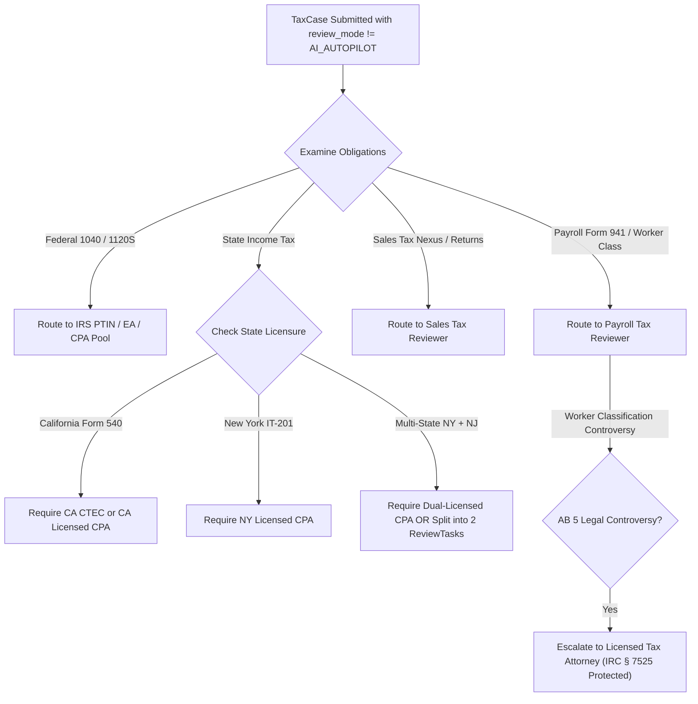

# TaxOS Professional Review Architecture & Routing Gap Analysis

**Document Version:** 1.0.0  
**Audit Date:** October 8, 2026  
**Auditor:** CPA/EA Workflow Designer & Principal Backend Engineer  
**Scope:** Review Models, Review Modes, State Review Routing, Domain Review Routing, and Legal Privilege Boundaries

---

## 1. Professional Review Reality Audit Summary

| Required Architecture | Specification Standard | Current Codebase Status | Reality Classification |
| :--- | :--- | :--- | :--- |
| **`ProfessionalUser` Model** | Stores credential type, status, authorized jurisdictions, domains, capacity | **Missing.** Not defined in TypeScript types or backend database. | **CONCEPT** |
| **`ReviewTask` Entity** | Tracks case, position, jurisdiction, domain, required role, risk, decision | **Missing.** Not defined in TypeScript types or backend database. | **CONCEPT** |
| **`review_mode` in TaxCase** | Persisted enum (`AI_AUTOPILOT`, `HUMAN_VERIFIED`, `FULL_SERVICE`) | **Missing in Backend.** Defined only as local React `useState` in `TaxpayerWorkspace.tsx`. | **UI_PROTOTYPE** |
| **State Review Routing** | Routes returns strictly to reviewers licensed in that specific state | Simulated via dropdown filter in React component (`TaxProfessionalView.tsx`). | **UI_PROTOTYPE** |
| **Sales Tax Review Routing** | Routes nexus & taxability exceptions to indirect tax specialists | Handled via React component tabs; no backend router. | **UI_PROTOTYPE** |
| **Payroll Review Routing** | Routes Form 941 & classification issues to payroll specialists | Handled via React component tabs; no backend router. | **UI_PROTOTYPE** |
| **Attorney Boundary Shield** | Strict cryptographic boundary between AI research briefs and attorney work product | Visual purple styling; no cryptographic isolation or legal signature gating. | **UI_PROTOTYPE** |

---

## 2. In-Depth Code Inspection

### 2.1 The Missing `review_mode` Field
In [`src/types/taxCase.ts`](file:///Users/macbookpro/.gemini/antigravity/scratch/tax-ai/src/types/taxCase.ts#L31-L47), the base `TaxCase` interface lacks `review_mode`:
```typescript
export interface TaxCase {
  id: string;
  businessId: string;
  taxYear: number;
  domain: TaxDomain;
  title: string;
  status: CaseStatus;
  readinessScore: number;
  // review_mode is MISSING!
}
```
In [`src/server/index.ts`](file:///Users/macbookpro/.gemini/antigravity/scratch/tax-ai/src/server/index.ts#L31-L50), `ServerTaxCaseState` also completely omits `review_mode`.
When a user selects "AI Autopilot" or "Human Verified" on the frontend, this choice is stored only in ephemeral component memory:
```typescript
// src/components/ux/TaxpayerWorkspace.tsx Line 61
const [reviewMode, setReviewMode] = useState<'AI_AUTOPILOT' | 'HUMAN_VERIFIED' | 'FULL_SERVICE'>('HUMAN_VERIFIED');
```
**Risk:** Refreshing the page or calling the backend API resets or ignores the user's explicit legal review tier selection.

### 2.2 Absence of `ProfessionalUser` and `ReviewTask` Models
A global grep of the entire codebase confirms that:
- `ProfessionalUser` does not appear in any `.ts` or `.tsx` file.
- `ReviewTask` does not appear in any `.ts` or `.tsx` file.
- In `src/types/task.ts`, there is only a generic `TaxTask` interface primarily designed for consumer clarification questions ("Needs You").

---

## 3. Required Models Specification

To fulfill the production human review architecture, the following TypeScript interfaces and database tables must be implemented:

```typescript
// Required Model 1: ProfessionalUser
export interface ProfessionalUser {
  id: string;
  organizationId: string;
  fullName: string;
  email: string;
  credentialType: 'CPA' | 'ENROLLED_AGENT' | 'TAX_ATTORNEY' | 'CTEC_PREPARER' | 'STAFF_PREPARER';
  credentialStatus: 'ACTIVE' | 'SUSPENDED' | 'EXPIRED' | 'PENDING_VERIFICATION';
  ptin: string;
  stateBarOrCpaLicenseNumbers: Record<string, string>; // e.g. { 'US-CA': 'CPA-94821', 'US-NY': 'CPA-11029' }
  authorizedJurisdictions: string[]; // e.g. ['US-FED', 'US-CA', 'US-NY']
  authorizedTaxDomains: Array<'INCOME_TAX' | 'SALES_USE_TAX' | 'PAYROLL_TAX'>;
  maxActiveCaseCapacity: number;
  activeAssignedCaseCount: number;
  isAvailableForRouting: boolean;
}

// Required Model 2: ReviewTask
export interface ReviewTask {
  id: string;
  taxCaseId: string;
  taxObligationId?: string;
  taxPositionId?: string;
  jurisdiction: string;
  taxDomain: 'INCOME_TAX' | 'SALES_USE_TAX' | 'PAYROLL_TAX';
  requiredRole: 'CPA' | 'EA' | 'TAX_ATTORNEY' | 'SENIOR_REVIEWER';
  assignedUserId?: string;
  riskScore: number;
  materialityCents: number;
  status: 'PENDING_ROUTING' | 'IN_REVIEW' | 'CHANGES_REQUESTED' | 'APPROVED' | 'ESCALATED';
  statutoryDeadline: string;
  decision?: {
    action: 'APPROVE' | 'OVERRIDE' | 'REQUEST_INFO' | 'ESCALATE_LEGAL';
    overriddenAmountCents?: number;
    statutoryJustification?: string;
    signedAt: string;
    signatureHash: string;
  };
  auditTrail: Array<{
    timestamp: string;
    actorId: string;
    action: string;
    notes: string;
  }>;
}
```

---

## 4. State & Domain Review Routing Engine Specification


