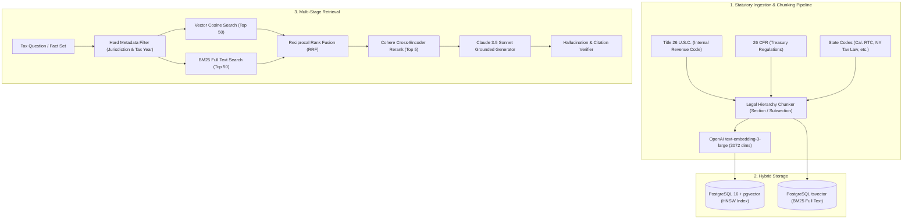

# TaxOS Legal RAG & Retrieval Engine Reality & Gap Analysis

**Document Version:** 1.0.0  
**Audit Date:** October 8, 2026  
**Auditor:** AI Systems Architect & Tax Knowledge Systems Auditor  
**Primary Principle:** **A static array of tax citations is NOT a RAG (Retrieval-Augmented Generation) pipeline.**

---

## 1. RAG Reality Audit Summary

| RAG Pipeline Component | Required Industry Standard | Current TaxOS Implementation | Gap Severity |
| :--- | :--- | :--- | :--- |
| **Source Ingestion Pipeline** | Ingests IRC (Title 26), Treasury Regs, State Codes, IRS Revenue Rulings | **None.** 12 hardcoded records in `AuthorityStore.ts`. | **P0 (Critical)** |
| **Legal Chunking Engine** | Hierarchical statutory chunking (Title -> Subtitle -> Section -> Subsection) | **None.** Each record contains a 1–2 sentence snippet. | **P0 (Critical)** |
| **Metadata Tagging** | Tax year, sovereign jurisdiction, precedential level, effective dates | Basic TypeScript interface properties on static objects. | **P1 (Moderate)** |
| **Embeddings Generation** | Vector embeddings (e.g., `text-embedding-3-large` or `legal-bert`) | **None.** Zero embedding models installed or called. | **P0 (Critical)** |
| **Vector Database Index** | PostgreSQL `pgvector`, Qdrant, or Pinecone | **None.** In-memory JavaScript `Array`. | **P0 (Critical)** |
| **Hybrid Search (Dense + Sparse)**| Reciprocal Rank Fusion (BM25 keyword + Cosine similarity) | JavaScript `Array.prototype.filter()` with `toLowerCase().includes()`. | **P0 (Critical)** |
| **Cross-Encoder Re-Ranking** | Cohere Rerank or BGE-Reranker for legal relevance | **None.** Picks first matching array element (`matchingAuthorities[0]`). | **P1 (High)** |
| **Live Citation Validation** | Verifies statute is not superseded, repealed, or struck down | Regex pattern checker in `CitationValidator.ts` (checks formatting only). | **P1 (High)** |

---

## 2. In-Depth Code Inspection

### 2.1 The "Search" Algorithm in `TaxResearchEngine.ts`
In [`src/tax-authority/TaxResearchEngine.ts`](file:///Users/macbookpro/.gemini/antigravity/scratch/tax-ai/src/tax-authority/TaxResearchEngine.ts#L87-L93):
```typescript
// STAGE 2: L2 HYBRID AUTHORITY RETRIEVAL (< 150ms)
const matchingAuthorities = filteredAuthorities.filter(auth => {
  const inTitle = auth.title.toLowerCase().includes(normalizedQuestion);
  const inTags = auth.topicTags.some(tag => normalizedQuestion.includes(tag.replace(/_/g, ' ')));
  const inText = auth.fullText?.toLowerCase().includes(normalizedQuestion);
  return inTitle || inTags || inText;
});

if (matchingAuthorities.length > 0) {
  const topAuth = matchingAuthorities[0]; // Naive first element selection
  ...
}
```
**Technical Reality:**
- This is basic string substring searching on 12 static objects in memory.
- If a taxpayer asks about "traveling to a client conference in San Francisco", it checks if the string contains words in `auth.title` or `auth.topicTags`.
- Semantic concepts like "itinerary", "per diem", or "lodging" fail to match because there is zero embedding-based vector semantic understanding.

### 2.2 Disconnect Between Research Engine and API Server
Even more critically, the Node backend server does not even invoke `TaxResearchEngine`!
In [`src/server/index.ts`](file:///Users/macbookpro/.gemini/antigravity/scratch/tax-ai/src/server/index.ts#L464-L501), `/api/ai/ask` uses hardcoded if-else statements:
```typescript
if (q.includes('california') || q.includes('1,840') || q.includes('owe') || q.includes('hsa')) {
  answer = "You owe California $1,840 primarily because California does not conform to the Federal HSA tax deduction under Cal. RTC § 17215.4...";
  citations = ['Cal. Rev. & Tax. Code § 17215.4', '26 U.S.C. § 199A', 'Cal. Rev. & Tax. Code § 17041'];
}
```
The sophisticated architectural contracts documented in `docs/tax-authority/retrieval.md` are completely bypassed in the actual backend.

---

## 3. Production Legal RAG Architecture Blueprint



---

## 4. Key Recommendations

1. **Ingest Real Statutory Corpora:** Bulk ingest official XML/HTML statutes from the U.S. House Office of the Law Revision Counsel (Title 26) and state legislative portals.
2. **Deploy pgvector:** Store document chunks alongside their vector embeddings in PostgreSQL with an HNSW index.
3. **Connect API Server to Engine:** Refactor `/api/ai/ask` in `src/server/index.ts` to call a real model with RAG retrieval context instead of hardcoded if/else string matching.
