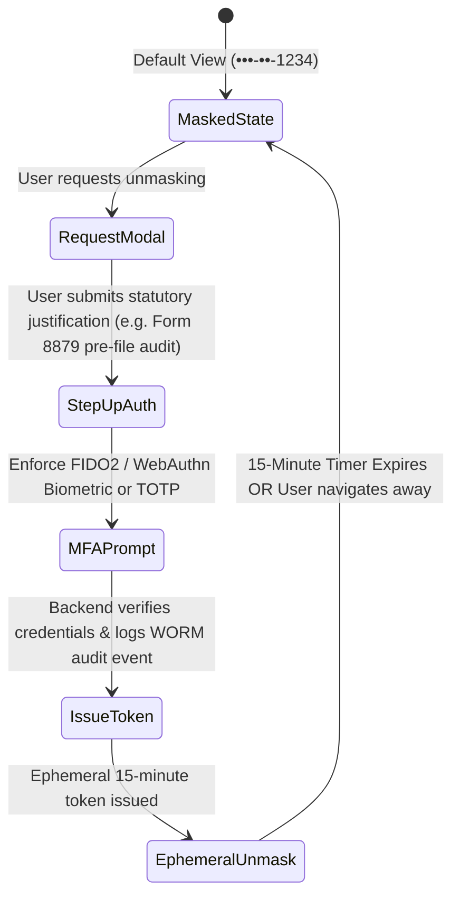

# TaxOS Enterprise Security, PII & Access Control Gap Analysis

**Document Version:** 1.0.0  
**Audit Date:** October 8, 2026  
**Auditor:** Enterprise Security Architect & Compliance Engineering Lead  
**Standards Evaluated:** IRS Pub 1075, SOC 2 Type II, IRC § 7216, IRC § 7525, NIST SP 800-63B

---

## 1. Security & Compliance Reality Matrix

| Security Domain | Claimed Standard | Actual Implementation in Codebase | Vulnerability / Gap Severity |
| :--- | :--- | :--- | :--- |
| **API Authentication** | OAuth 2.0 / Mutual TLS / Bearer JWT | **Zero API authentication.** `src/server/index.ts` does not check tokens or session headers. | **CRITICAL (P0)** |
| **Multi-Tenant Isolation**| Strict PostgreSQL RLS & Schema Isolation | **Unit test simulation only.** `redTeamSecurity.ts` simulates `if (tenantA !== tenantB) throw`. Zero database or API enforcement. | **CRITICAL (P0)** |
| **Supervisor PII Unmasking**| Privileged access workflow (MFA + reason + ephemeral token) | **Hardcoded PIN string (`'2026'`).** Unmasks in React state permanently until manually toggled. | **HIGH (P1)** |
| **Audit Ledger Hashing** | Immutable SHA-256 cryptographic provenance chain | **Non-cryptographic bitshift loop** in `AuditLedger.ts` (`(hash << 5) - hash + char`) padded to 64 hex characters. | **HIGH (P1)** |
| **Attorney Workpaper Shield** | IRC § 7525 cryptographic envelope | Visual purple styling in React; no separate KMS key derivation or restricted storage. | **MEDIUM (P2)** |
| **Data at Rest Encryption** | AES-256-GCM via AWS KMS / HSM | In-memory memory structures only; no persistent storage layer to encrypt. | **CRITICAL (P0)** |
| **Role-Based Access (RBAC)**| Enforced on every mutation and query | In-memory `Set<Permission>` checked inside UI components; zero HTTP middleware. | **CRITICAL (P0)** |

---

## 2. In-Depth Penetration & Access Control Analysis

### 2.1 Direct API Exploitation (Bypassing Frontend UI Guards)
While the frontend UI cleanly gates navigation based on selected user roles, **the backend server has no authentication layer**:
```bash
# Any unauthenticated actor can extract the active case:
curl -X GET http://localhost:3001/api/taxcase

# Any unauthenticated actor can forge an IRS e-file acceptance:
curl -X POST http://localhost:3001/api/efile/transmit \
  -H "Content-Type: application/json" \
  -d '{"taxpayerSignature": "Attacker", "declarationAgreed": true}'
```
**Finding:** A malicious user or script can completely bypass all UI role switchers, permissions checks, and PII masking by making raw HTTP requests directly to the Node server.

### 2.2 The Casual PII Unlock Flaw
In [`src/components/ux/OperationsManagerView.tsx`](file:///Users/macbookpro/.gemini/antigravity/scratch/tax-ai/src/components/ux/OperationsManagerView.tsx#L254-L265):
```typescript
const handleAuthorizeUnmask = (e: React.FormEvent) => {
  e.preventDefault();
  if (pinInput === '2026' || pinInput.length >= 4) {
    setIsPiiUnmasked(true);
    setShowPinModal(false);
    ...
  }
};
```
**Compliance Violation (IRS Pub 1075 & NIST SP 800-63B):**
1. The PIN is hardcoded into the client-side JavaScript bundle (`pinInput === '2026'`).
2. There is no step-up hardware token or TOTP MFA verification.
3. Once unlocked, `isPiiUnmasked = true` persists indefinitely in component memory. There is no automated session timeout (e.g. 15 minutes) or automatic re-masking trigger.
4. The audit log is recorded into local component state and in-memory arrays; it is not sent to a secure, write-once-read-many (WORM) audit repository.

### 2.3 Simulated SHA-256 in Audit Ledger
In [`src/platform/AuditLedger.ts`](file:///Users/macbookpro/.gemini/antigravity/scratch/tax-ai/src/platform/AuditLedger.ts#L27-L37):
```typescript
private static computeHash(dataString: string): string {
  let hash = 0;
  for (let i = 0; i < dataString.length; i++) {
    const char = dataString.charCodeAt(i);
    hash = (hash << 5) - hash + char;
    hash |= 0;
  }
  const hex = Math.abs(hash).toString(16).padStart(8, '0');
  // Expand to 64 chars for realistic SHA-256 appearance
  return (hex + hex + hex + hex + hex + hex + hex + hex).substring(0, 64);
}
```
**Finding:** This is a 32-bit hash function (Java `String.hashCode` equivalent) padded with repetitions to *resemble* a 64-character SHA-256 hex string. It provides zero cryptographic collision resistance and zero tamper-evidence.

---

## 3. Required Production Security Architecture

### 3.1 Privileged Access Management (PAM) Workflow for PII
To meet IRS Pub 1075 standards, PII unmasking must follow this exact state machine:



### 3.2 True Cryptographic Ledger Implementation
Replace the bitshift loop with native Node/Web Crypto:
```typescript
import crypto from 'crypto';

public static computeHash(payload: string): string {
  return crypto.createHash('sha256').update(payload, 'utf8').digest('hex');
}
```
And store all ledger entries in an append-only PostgreSQL table with a cryptographic trigger preventing `UPDATE` or `DELETE` operations.
