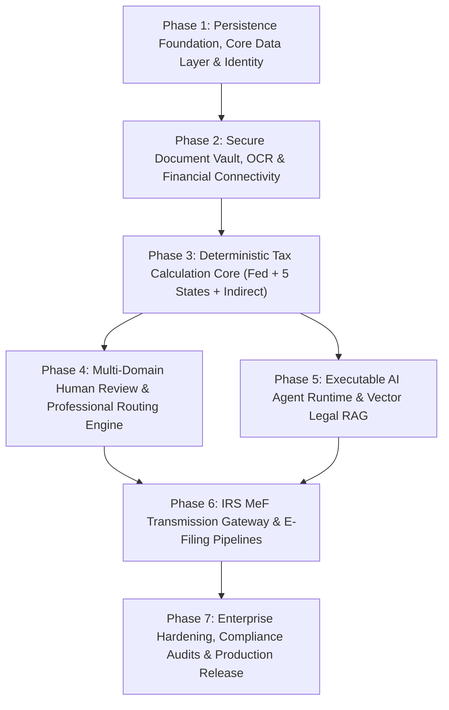

# TaxOS Production Engineering & Execution Roadmap

**Document Version:** 1.0.0  
**Audit Date:** October 8, 2026  
**Auditor:** CTO & Principal Backend Systems Architect  
**Principle:** Ordered strictly by technical dependencies. No arbitrary time estimates.

---

---

## Phase 1: Persistence Foundation, Core Data Layer & Identity

### 1. Objective
Establish durable, multi-tenant relational persistence and zero-trust identity authentication upon which all subsequent tax operations depend.

### 2. Dependencies
None (Root Foundation).

### 3. Services & Infrastructure
- Provision PostgreSQL 16 (Multi-AZ) with Row-Level Security (RLS) enabled.
- Provision Redis 7 Cluster for session management, distributed locks, and BullMQ queues.
- Deploy Fastify / NestJS API service replacing `src/server/index.ts`.
- Integrate Drizzle ORM with automated TypeScript migration tooling.

### 4. Agents & Providers
- **Providers:** Auth0 / Supabase Auth / AWS Cognito (OIDC + WebAuthn FIDO2).
- **Agents:** None in this phase.

### 5. Schemas & Tables
- `organizations`, `users`, `tax_cases`, `tax_obligations`, `audit_ledger`.
- Enforce RLS policy: `USING (organization_id = current_setting('app.current_tenant_id')::UUID)`.

### 6. Tests & Security Gates
- Unit & integration tests for multi-tenant isolation: Tenant A cannot read Tenant B data under any query parameter.
- JWT verification middleware test: All unauthenticated HTTP requests return `401 Unauthorized`.
- Secret scanning gate: Zero hardcoded credentials or PINs in code.

### 7. Definition of Done
- Complete database schema migrated and running.
- Authenticated users can register, sign in with MFA, and retrieve only their organization's data via authenticated REST/GraphQL API.

---

## Phase 2: Secure Document Vault, OCR & Financial Connectivity

### 2.1 Objective
Enable ingestion, encryption, persistent storage, and automated data extraction of tax documents and live banking transactions.

### 2.2 Dependencies
Phase 1 (Requires user identity, organizations, and database).

### 2.3 Services & Infrastructure
- AWS S3 bucket with customer-managed AWS KMS encryption (`aws:kms`) and presigned upload URLs.
- BullMQ asynchronous worker pool for document processing and OCR.
- Real SHA-256 computation service (`crypto.createHash('sha256')`) executed on binary streams.

### 2.4 Agents & Providers
- **Providers:** Google Cloud Document AI / AWS Textract (Form W-2, 1099, Receipt extraction).
- **Providers:** Plaid (Transactions & Balance APIs via real OAuth link tokens).
- **Providers:** Stripe (1099-K & Balance transactions API).

### 2.5 Schemas & Tables
- `documents` (with `s3_storage_key`, `sha256_hash`, `ocr_raw_text`, `extracted_facts`).
- `transactions` (normalized ledger transactions from Plaid/Stripe).
- `tax_facts` (atomic facts extracted from verified evidence).

### 2.6 Tests & Security Gates
- Document hash collision and deduplication integration tests.
- File bytes validation: Verify PDF/image bytes are written to S3 and never lost.
- Prompt injection filter test: Verify malicious receipt text cannot alter numeric facts.

### 2.7 Definition of Done
- Taxpayers can drag-and-drop a real multi-page W-2 or 1099 PDF; file bytes are encrypted in S3, parsed by Document AI, and facts populate the database.
- Real bank accounts connect via Plaid Link and sync live transactions into the database.

---

## Phase 3: Deterministic Tax Calculation Core (Fed + 5 States + Indirect)

### 3.1 Objective
Build a mathematically complete, zero-hallucination tax calculation engine covering federal Form 1040, launch states, sales tax, and payroll withholding.

### 3.2 Dependencies
Phase 1 & Phase 2 (Requires database schema, extracted facts, and normalized transactions).

### 3.3 Services & Infrastructure
- Stateless deterministic calculation engine operating in pure integer cents (`BigInt`).
- Line-item mapping engine binding calculation nodes to official IRS and state tax form line numbers.
- Calculation provenance DAG generator recording cryptographic input hashes for "Prove This Number".

### 3.4 Agents & Providers
- **Providers:** Avalara AvaTax or Anrok (for 13,000+ sales tax jurisdiction rates and CASS address geocoding).
- **Providers:** Official IRS Pub 15-T algorithmic engine (for payroll withholding).

### 3.5 Schemas & Tables
- `tax_positions` (statutory citations, line numbers, computed amounts).
- `tax_returns` (compiled form line values and provenance hashes).
- `sales_tax_jurisdictions` & `sales_tax_rates` (if self-hosted).

### 3.6 Tests & Security Gates
- IRS Tax Table Golden Master Tests: 1,000 synthetic returns verified against official IRS instructions down to the penny.
- Sovereign State Conformity Tests: California RTC additions, New York convenience factors, New Jersey netting bans, Illinois flat tax, and Massachusetts surtax.
- Withholding validation: Eliminate hardcoded 15% refund formula; verify `refund = withholdings - totalTax`.

### 3.7 Definition of Done
- Engine produces accurate Form 1040, Schedule C, Schedule SE, Form 8995, CA Form 540, and NY IT-201 line numbers across all income brackets ($0 to $10,000,000+).
- Sales tax correctly computes multi-tier rates for any valid U.S. street address.
- Payroll withholding accurately executes IRS Pub 15-T percentage method.

---

## Phase 4: Multi-Domain Human Review & Professional Routing Engine

### 4.1 Objective
Implement licensed professional review queues, jurisdiction-gated routing, exception overrides, and the four review modes (`review_mode`).

### 4.2 Dependencies
Phase 1 & Phase 3 (Requires authenticated users and complete calculation returns).

### 4.3 Services & Infrastructure
- Professional queue dispatcher matching `ReviewTask` requirements against `ProfessionalUser` state licenses.
- Override ledger recording licensed practitioner PTIN, statutory justification, and dollar variance.
- Privileged Access Management (PAM) service enforcing temporary, MFA-gated PII unmasking (replacing hardcoded PIN `2026`).

### 4.4 Agents & Providers
- **Providers:** Twilio (SMS alerts) & SendGrid / AWS SES (email client notifications).
- **Providers:** State Board of Accountancy / IRS RPO license verification APIs.

### 4.5 Schemas & Tables
- `professional_users` (credentials, state bar numbers, authorized jurisdictions).
- `review_tasks` (case ID, risk score, status, statutory deadline, decision, override notes).
- `pii_access_audit` (time-limited authorization tokens, supervisor reasons, audit logs).

### 4.6 Tests & Security Gates
- Jurisdiction routing security test: A CPA licensed only in California is rejected from opening a New York-only return.
- Legal privilege boundary test: Non-attorney staff cannot view IRC § 7525 legal workpapers.
- PII timeout test: Ephemeral unmasking token automatically expires after 15 minutes.

### 4.7 Definition of Done
- Taxpayers select `review_mode` (`AI_AUTOPILOT`, `HUMAN_VERIFIED`, `FULL_SERVICE`); selection is persisted in PostgreSQL.
- Tax returns route automatically to licensed CPAs matching state jurisdictions.
- CPAs review AI briefs, log overrides, and submit cryptographic sign-offs.

---

## Phase 5: Executable AI Agent Runtime & Vector Legal RAG

### 5.1 Objective
Transition agents from static markdown skill documentation into a containerized, executable multi-agent runtime backed by hybrid vector search over primary tax law.

### 5.2 Dependencies
Phase 1, Phase 2 & Phase 3 (Requires database, tools, and calculation engine).

### 5.3 Services & Infrastructure
- Containerized Agent Orchestrator (LangGraph / Temporal).
- PostgreSQL with `pgvector` extension storing Title 26 (IRC), Treasury Regs, and state code embeddings.
- Model Router service enforcing tiered routing (Deterministic Math -> Fast Classifier -> Deep Reasoner) with hard $4.50 budget caps.

### 5.4 Agents & Providers
- **Providers:** Anthropic (Claude 3.5 Sonnet), OpenAI (text-embedding-3-large), Cohere (Rerank v3).
- **Agents:** Executable `TaxCaseSupervisor`, `WorkerClassificationAgent`, `DeductionHunterAgent`, `AdversarialChallenger`.

### 5.5 Schemas & Tables
- `agent_runs` (prompt, model version, tool calls, token usage, latency, signature).
- `legal_document_chunks` (statute text, embedding vector, jurisdiction, citation string).

### 5.6 Tests & Security Gates
- Hallucination Defense Test: Zero fabricated statutory citations allowed; all citations must validate against `AuthorityStore`.
- Budget Cap Enforcement Test: Model Router hard-halts LLM execution if a case exceeds $4.50 in token costs.
- Tool sandboxing: Agents can only invoke whitelisted read-only tools.

### 5.7 Definition of Done
- Agents execute autonomously in background worker threads, emit structured tool calls, query the vector database, and persist complete `AgentRun` audit records.

---

## 6. Phase 6: IRS MeF Transmission Gateway & E-Filing Pipelines

### 6.1 Objective
Build the certified electronic transmission pipeline to submit tax returns to the IRS and state tax authorities via Modernized e-File (MeF).

### 6.2 Dependencies
Phase 1, Phase 3, Phase 4 (Requires calculation returns, Form 8879 sign-offs, and database).

### 6.3 Services & Infrastructure
- IRS MeF XML Generation Engine converting internal calculation models into official IRS Form 1040 / 1120-S XML schemas.
- IRS A2A Web Services client implementing SOAP with MTOM attachments, WS-Security, and digital certificates.
- Asynchronous transmission polling worker managing ACK/NACK status queues.

### 6.4 Agents & Providers
- **Providers:** IRS e-Services (ETIN, EFIN, ATS certification environment).
- **Providers:** Approved Certificate Authority (IdenTrust / DigiCert digital signature).
- **Providers:** State Revenue Department Direct Gateways (CA FTB, NY DTF, NJ Div of Tax, IL DOR, MA DOR).

### 6.5 Schemas & Tables
- `mef_transmissions` (submission ID, transmission XML hash, status, ACK timestamp, rejection codes).

### 6.6 Tests & Security Gates
- IRS Assurance Testing System (ATS) test packets: 100% acceptance on official IRS test returns.
- XML Schema Validation: All generated returns pass XSD validation without error.
- Jurat & E-Sign Compliance: Form 8879 jurat captured with compliant IP, timestamp, and signature proof.

### 6.7 Definition of Done
- Real returns transmit to the IRS MeF ATS test environment, receive real cryptographic submission receipts, and handle ACK/NACK responses cleanly.

---

## 7. Phase 7: Enterprise Hardening, Compliance Audits & Production Release

### 7.1 Objective
Achieve SOC 2 Type II compliance, IRS Pub 1075 certification, disaster recovery validation, and public commercial availability.

### 7.2 Dependencies
All preceding phases (Phases 1 through 6).

### 7.3 Services & Infrastructure
- Datadog / OpenTelemetry APM, distributed tracing, and Sentry exception tracking.
- Immutable WORM audit ledger backed by AWS QLDB or PostgreSQL append-only cryptographic tables.
- Automated Disaster Recovery (DR) pipeline with RPO < 1 hour and RTO < 4 hours.

### 7.4 Tests & Security Gates
- Independent third-party SOC 2 Type II audit.
- Full external red-team penetration test of all API endpoints and multi-tenant barriers.
- Automated chaos engineering testing (Kubernetes pod termination during calculations).

### 7.5 Definition of Done
- Platform certified for production commercial operation by external auditors and ready to file real taxpayer returns with the IRS.
