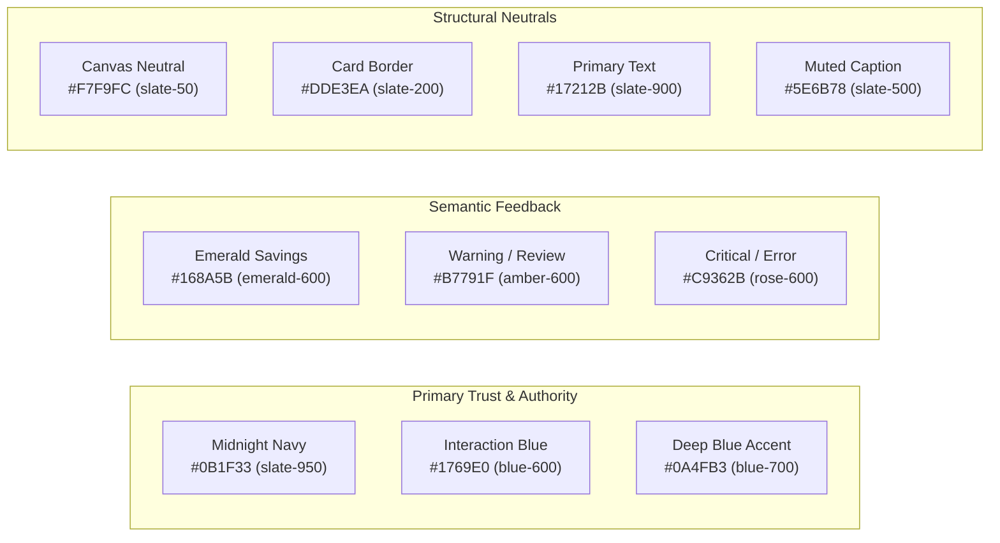

# Autonomous Tax OS — Color System & Palette Specification
**Compliance:** WCAG 2.2 Level AA / AAA (Contrast Ratio $\ge$ 4.5:1 for Normal Text, $\ge$ 3.0:1 for Large Text)

---

## 1. Palette Philosophy

The palette avoids gimmicky neon crypto colors and sterile gray government forms. Instead, it anchors on classic private-banking trust, high-clarity status cues, and calm neutrals.

---

## 2. Token Definitions & Contrast Audit

| Token | Hex | Tailwind Utility | Semantic Application | Contrast vs `#FFFFFF` | Contrast vs `#F7F9FC` |
| :--- | :--- | :--- | :--- | :--- | :--- |
| `color-primary-navy` | `#0B1F33` | `slate-950` / `brand-navy` | Primary headers, navbars, executive cards | 15.8:1 (AAA) | 14.6:1 (AAA) |
| `color-action-blue` | `#1769E0` | `blue-600` | Primary buttons, active tabs, clickable links | 5.1:1 (AA) | 4.8:1 (AA) |
| `color-success-green` | `#168A5B` | `emerald-600` | Refund amounts, verified tax positions, passed audits | 4.6:1 (AA) | 4.3:1 (AA Large) |
| `color-warning-amber` | `#B7791F` | `amber-600` | Pending questions, multi-state conflict notices | 4.5:1 (AA) | 4.2:1 (AA Large) |
| `color-critical-red` | `#C9362B` | `rose-600` | Filing rejections, statutory deadlines within 24h | 5.2:1 (AA) | 4.8:1 (AA) |
| `color-surface-bg` | `#F7F9FC` | `slate-50` | Primary viewport background | 1.05:1 (N/A) | 1.00:1 (N/A) |
| `color-card-border` | `#DDE3EA` | `slate-200` | 1px card borders, table dividers | 1.3:1 (Structural) | 1.2:1 (Structural) |
| `color-text-main` | `#17212B` | `slate-900` | Primary body text, tabular numbers | 14.2:1 (AAA) | 13.1:1 (AAA) |
| `color-text-subtle` | `#5E6B78` | `slate-500` | Explanatory captions, metadata timestamps | 5.3:1 (AA) | 4.9:1 (AA) |

---

## 3. Invariant Rule: Never Rely on Color Alone

In compliance with WCAG 2.2 Success Criterion 1.4.1 (Use of Color):
- All status tags combine an explicit icon (`CheckCircle2`, `AlertTriangle`, `XCircle`, `Clock`), text label (`Passed`, `Review Required`, `Rejected`), and semantic color.
- Charts with multi-jurisdiction or multi-category data include direct on-canvas text labels or distinctive dashed patterns in addition to distinct hues.
