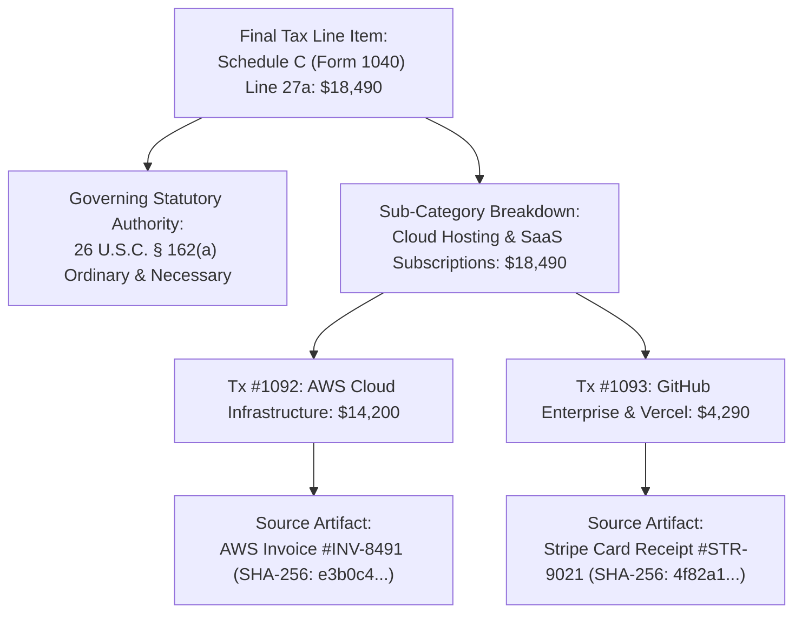

# Autonomous Tax OS — "Prove This Number" Lineage Specification
**Status:** Canonical Explainability & Provenance Architecture  
**Guarantee:** 100% Deterministic Traceability from Tax Return Line Item to Primary Source Receipt and Governing Statute.

---

## 1. Lineage DAG Architecture

Whenever a user or CPA clicks any number on the dashboard or tax summary (e.g. `$18,490` on Schedule C Other Expenses), the **Prove This Number** drawer opens, revealing the exact Directed Acyclic Graph (DAG) of the figure:

---

## 2. Drawer Interaction Details

1. **Step-by-Step Mathematical Provenance**:
   - Shows the exact formula applied: $\sum \text{Transactions} - \text{Disallowed Personal} = \text{Deductible Net}$.
2. **Statutory Justification in Plain English**:
   - Explains *why* the expense is legally deductible under current IRS regulations.
   - Highlights any state-level non-conformity (e.g. "Deductible 100% on Federal return; California conforms under Cal. RTC § 17201").
3. **Receipt Preview & Verification Hash**:
   - In-app thumbnail preview of the parsed invoice or receipt with OCR bounding boxes over vendor name, date, and line items.
   - Cryptographic SHA-256 document fingerprint linking to the Evidence Graph.
