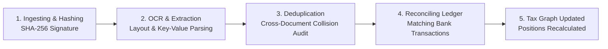

# Autonomous Tax OS — TaxDrop Ingestion UX Specification
**Status:** Core Product Capability  
**Formats Supported:** PDF, PNG, JPG, HEIC, CSV, XLSX, ZIP archives

---

## 1. Visual & Interactive Behavior

TaxDrop is the primary gateway through which financial reality enters the Tax Graph. It is prominent, frictionless, and reassuring.

```
┌────────────────────────────────────────────────────────────────────────┐
│ [CLOUD ICON]                                                           │
│ Drag & drop any tax documents, receipts, or spreadsheets here          │
│ Supporting PDF, CSV, Excel, Images, or ZIP archives (up to 100MB)       │
│                                                                        │
│ [ Browse Files ]       [ Connect Plaid Bank ]       [ Import 2025 PDF] │
└────────────────────────────────────────────────────────────────────────┘
```

---

## 2. Real-Time Processing Pipeline & Visual Feedback

When files are dropped, TaxDrop displays a multi-phase live progress indicator rather than a generic spinner:



### Live Feedback Metrics Banner
Once complete, the user is presented with immediate deterministic results:
> **"37 Documents Processed Successfully"**  
> - 1 exact duplicate receipt removed (saved duplicate deduction hazard)  
> - 4 independent income streams recognized (W-2, 1099-NEC, 1099-INT, 1099-DIV)  
> - 28 business expenses matched to Schedule C categories  
> - 2 missing tax documents detected (Brokerage 1099-B, Mortgage 1098)
