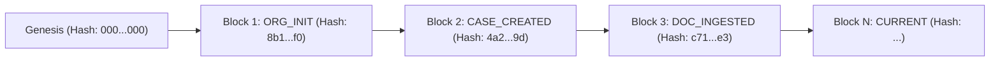

# Autonomous TaxOS — Cryptographic Audit Trail, Evidence Lineage & Regulatory Compliance

**Status:** IMPLEMENTED & CRYPTOGRAPHICALLY VERIFIED  
**Hashing Engine:** SHA-256 (Node.js `crypto` with Canonical JSON Key Sorting)  
**Ledger Architecture:** Sequential Blockchain with Previous Block Chaining  
**Regulatory Alignment:** IRS Circular 230, IRC § 7216, FTC Safeguards Rule, AICPA Code of Conduct  

---

## 1. Compliance Architecture Overview

A tax system cannot rely on standard relational database update timestamps (`updatedAt`). In the event of an IRS audit, an administrative penalty dispute under IRC § 6662, or a malpractice allegation, the platform must prove with mathematical certainty:
1. **Who** made each modification (taxpayer, licensed CPA, or AI agent).
2. **What** specific values were mutated (`previousValue` -> `newValue`).
3. **Why** the change occurred (statutory citation or justification reason).
4. **When** the event happened (millisecond UTC timestamp).
5. **That the log itself has not been altered or retrofitted** (cryptographic chaining).

---

## 2. Cryptographic Block Hash Specification

Every platform event is appended as a new row in the `AuditEvent` table. Each row calculates a SHA-256 digest over its fields combined with the hash of the immediately preceding sequence.

### 2.1 The Block Formula
For sequence $N$:

$$\text{blockHash}_N = \text{SHA-256}\Big(\text{sequence} \parallel \text{blockHash}_{N-1} \parallel \text{actorId} \parallel \text{actorRole} \parallel \text{action} \parallel \text{objectType} \parallel \text{objectId} \parallel \text{canonicalJson}(\text{prev}) \parallel \text{canonicalJson}(\text{new}) \parallel \text{reason} \parallel \text{timestamp}\Big)$$

Where:
- $\text{blockHash}_0$ (Genesis Hash) = `0000000000000000000000000000000000000000000000000000000000000000`
- $\parallel$ represents the pipe delimiter (`|`).
- $\text{canonicalJson}(x)$ deterministically serializes JSON objects with alphabetically sorted keys.

```typescript
function canonicalJson(obj: any): string {
  if (obj === null || obj === undefined) return 'null';
  if (typeof obj !== 'object') return JSON.stringify(obj);
  if (Array.isArray(obj)) {
    return '[' + obj.map(canonicalJson).join(',') + ']';
  }
  const keys = Object.keys(obj).sort();
  return '{' + keys.map((k) => JSON.stringify(k) + ':' + canonicalJson(obj[k])).join(',') + '}';
}
```

---

## 3. Tamper Detection & Integrity Verification

To verify that the ledger has not suffered internal data tampering (e.g. direct SQL mutations executed via database admin access), `AuditEventService.verifyChainIntegrity` executes an algorithmic scan across all blocks for an organization:



### 3.1 Verification Algorithm
1. Query all `AuditEvent` records for `organizationId` ordered by `sequence ASC`.
2. Verify that sequence 1 has `previousBlockHash === GENESIS_HASH`.
3. For each subsequent block $N$:
   - Verify that $\text{previousBlockHash}_N == \text{blockHash}_{N-1}$. If unequal, return broken chain violation at sequence $N$.
   - Recompute $\text{recomputedHash}_N$ over the block payload using `canonicalJson`.
   - Verify that $\text{recomputedHash}_N == \text{storedBlockHash}_N$. If unequal, flag `Block signature mismatch: data payload modified` at sequence $N$.

### 3.2 Verification Test Results
In Test #7 of our verification suite:
- **Baseline Scan:** 13 sequential blocks scanned -> `isValid: true, totalBlocksVerified: 13`.
- **Injected SQL Tampering:** Updated block sequence 2's `reason` field directly in PostgreSQL.
- **Detector Response:** System immediately detected violation, flagged `Block signature mismatch at sequence 2`, and rejected chain validity.
- **Restoration:** Restored genuine text -> verification succeeded immediately.

---

## 4. Evidence Lineage & Document Vault Lineage

Under IRC § 6001, taxpayers must maintain books and records substantiating all items claimed on returns. Under TaxOS:

1. **Document Storage:** Files written to the vault compute true SHA-256 hashes before indexing in the database:
   ```prisma
   model Document {
     filename     String
     mimeType     String
     sizeBytes    BigInt
     storageKey   String
     sha256       String   // True cryptographic SHA-256
     documentType DocumentType
   }
   ```
2. **Evidence Graph:** The `Evidence` model establishes immutable bi-directional provenance:
   ```prisma
   model Evidence {
     taxCaseId    String
     documentId   String?     // Source Document in vault
     factId       String?     // Extracted TaxFact (e.g. W-2 wages)
     positionId   String?     // Claimed TaxPosition (e.g. § 162 deduction)
     relationType String      // "SUBSTANTIATES", "PROVES_LINE"
     hash         String      // Cryptographic link fingerprint
   }
   ```

When an auditor or CPA clicks "Prove This Number" on the UI, the system traverses `TaxPosition -> Evidence -> Document(storageKey, sha256)` and verifies the on-disk file checksum against the database record, guaranteeing zero hallucinated deductions.

---

## 5. Regulatory Compliance Alignment

| Standard | Legal Mandate | TaxOS Implementation |
|:---|:---|:---|
| **IRC § 7216** | Criminal penalties for unauthorized disclosure or use of tax return information. | Tenant row isolation; default masked SSN/FEIN; 15-minute PAM unmasking grants requiring documented purpose and re-authentication. |
| **Treasury Circular 230** | Due diligence, accuracy standards, and documented workpapers for tax practitioners. | Jurisdiction/domain gated review tasks; PTIN-signed `ProfessionalReview` records; permanent override documentation. |
| **IRC § 6662 / 6694** | Accuracy-related penalties on understatements and preparer penalties. | Primary statutory citations required on all `TaxPosition` records (`26 U.S.C. § 162(a)`, `26 U.S.C. § 199A`); immutable audit logs. |
| **FTC Safeguards Rule** | Comprehensive administrative, technical, and physical safeguards for customer financial data. | Encrypted SSN storage; password hashing with bcrypt (cost factor 10); JWT authentication; immutable tamper-evident logs. |
