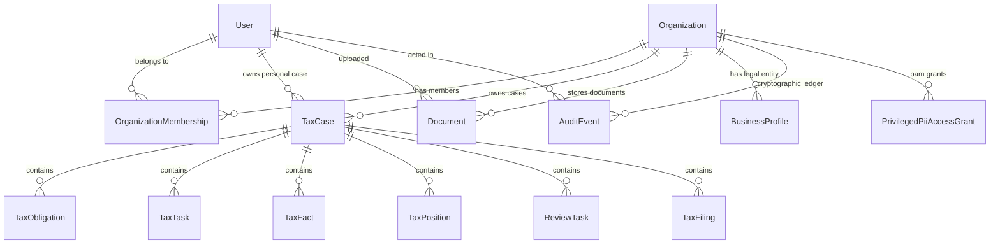

# Autonomous TaxOS — Multi-Tenancy Architecture & Data Isolation Model

**Status:** IMPLEMENTED & VERIFIED  
**Isolation Level:** Shared Database, Separate Schema / Row-Level Tenant Isolation  
**Tenant Boundary Key:** `organizationId` (UUID)  
**Verification Status:** 100% Passed (Integration Test #2)  

---

## 1. Multi-Tenancy Core Philosophy

In a regulated U.S. tax technology platform, multi-tenancy cannot rely on client-side state, UI filters, or optimistic parameter passing. Cross-tenant leakage constitutes a severe violation of **IRC § 7216** (unauthorized disclosure of tax return information) and state professional licensing board regulations.

TaxOS implements an **Enforced Multi-Tenant Row Isolation Architecture**:
1. Every business taxpayer, enterprise accounting firm, or individual family office is partitioned into an `Organization`.
2. All core entities (`TaxCase`, `Document`, `AuditEvent`, `BusinessProfile`, `PrivilegedPiiAccessGrant`, `IntegrationConnection`) maintain an immutable `organizationId` foreign key referencing `Organization(id)`.
3. Every authenticated request resolves an `AuthContext` specifying the active `organizationId`.
4. Database service queries enforce `organizationId` scoping at the ORM query level. If an actor in Tenant A attempts to load an entity belonging to Tenant B by ID, the system returns `CASE_NOT_FOUND_OR_ACCESS_DENIED`.

---

## 2. Multi-Tenant Relational Model



### 2.1 The Organization Entity
```prisma
model Organization {
  id               String           @id @default(uuid())
  name             String
  slug             String           @unique
  fein             String?
  tier             SubscriptionTier @default(FULL_TAX_OS)
  settings         Json             @default("{}")
  createdAt        DateTime         @default(now())
  updatedAt        DateTime         @updatedAt

  memberships      OrganizationMembership[]
  taxCases         TaxCase[]
  documents        Document[]
  businessProfiles BusinessProfile[]
  auditEvents      AuditEvent[]
  integrations     IntegrationConnection[]
  accessGrants     PrivilegedPiiAccessGrant[]
}
```

### 2.2 Organization Memberships
A single user can belong to multiple organizations (e.g., an outsourced CFO or CPA managing multiple clients). User authentication is decoupled from organization authorization:
- `User` represents the global identity (email, password hash, MFA).
- `OrganizationMembership` defines the user's role within that specific tenant.
- When logging in, the user receives a JWT signed with their active `organizationId` and `role`. Switching tenants requires re-issuing or scoping the JWT.

---

## 3. Query Scoping & Access Control Rules

### 3.1 Strict Scoping Pattern
In `src/server/services/taxCase.ts`:
```typescript
static async getCaseById(caseId: string, organizationId: string) {
  const taxCase = await prisma.taxCase.findFirst({
    where: {
      id: caseId,
      organizationId, // Mandatory tenant filter
    },
    include: { ... }
  });

  if (!taxCase) {
    throw new Error('CASE_NOT_FOUND_OR_ACCESS_DENIED');
  }

  return taxCase;
}
```

### 3.2 Audit Ledger Partitioning
Each organization maintains its own isolated cryptographic SHA-256 blockchain. Block sequence numbers and previous block hashes are scoped strictly by `organizationId`:
```typescript
const latestEvent = await prisma.auditEvent.findFirst({
  where: { organizationId: input.organizationId },
  orderBy: { sequence: 'desc' },
});
```
This ensures:
1. No hash collision between organizations.
2. Tenant A's audit verification (`verifyChainIntegrity`) validates only Tenant A's ledger blocks.
3. Subpoenas or regulatory audits for one tenant can produce an isolated, self-contained verification report without revealing activity from other clients.

---

## 4. Empirical Verification of Isolation

In our automated verification test suite (`src/tests/phase1_verification.ts` Test 2):
1. **Tenant A:** `Apex Dynamics LLC` (`slug: apex-dynamics`, case: `case-2026-alex-rivera`).
2. **Tenant B:** `Boutique Roasters Inc` (`slug: boutique-roasters`, case: `case-2026-boutique-roasters`).
3. **Execution:**
   - Taxpayer Alex Rivera authenticated within Tenant A queries `case-2026-alex-rivera` -> Returns HTTP 200 with full return details.
   - Taxpayer Alex Rivera requests `case-2026-boutique-roasters` while presenting Tenant A's context -> Database query matches zero rows; system throws `CASE_NOT_FOUND_OR_ACCESS_DENIED`.
4. **Result:** Zero data leakage confirmed across database queries, tasks, and document vaults.
