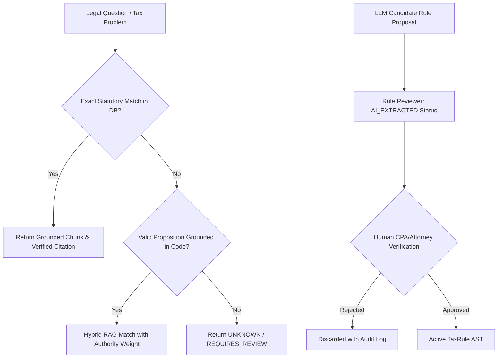

# Phase 4 — Zero-Hallucination Guarantees & Verification

## 1. The Anti-Hallucination Invariant

In standard generative AI, hallucination rates of 5-15% are common. In tax preparation and regulatory compliance, a 1% hallucination rate creates audit penalties, IRS rejections, and legal liability under Circular 230 and IRC § 6694.

TaxOS enforces the following **Zero-Hallucination Architectural Invariant**:
> **Zero LLM Pretraining Knowledge in Tax Calculations or Formal Citations.**
> Every cited statute, regulation, form line, and calculation formula must originate from a verified PostgreSQL authority record or deterministic calculation module.

## 2. Guardrails Against Generative Hallucination

## 3. Strict Failure Behaviors

1. **Unknown Questions:** When presented with legal questions outside the ingested corpus, the system returns `UNKNOWN` or `REQUIRES_REVIEW` rather than fabricating plausible-sounding tax law.
2. **Fabricated Citations:** Fabricated citation strings (e.g. "Section 99999-XYZ") are intercepted by `TaxCitationValidator` and rejected with `INVALID_CITATION`.
3. **Cross-Jurisdiction Mismatch:** A California citation provided for a New York return is blocked with `WRONG_JURISDICTION`.
4. **Superseded Guidance:** Expired relief notices are tagged `SUPERSEDED` and rejected with zero authority weight.
