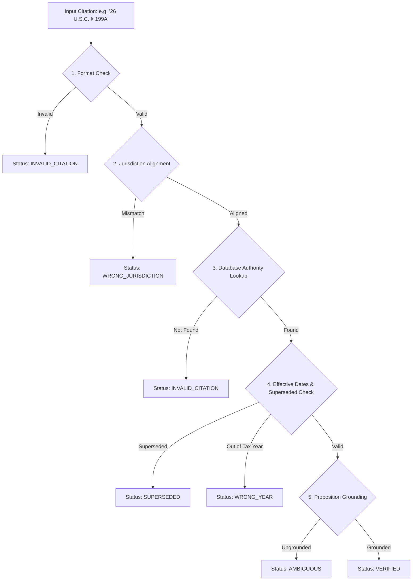

# Phase 4 — Statutory Citation Validation & Anti-Hallucination

## 1. Problem Statement

Commercial LLMs frequently hallucinate tax citations (e.g., citing non-existent code sections like "IRC § 199B" or citing California Revenue and Taxation Code sections when advising a New York resident).

TaxOS enforces an automated, mandatory validation gateway (`TaxCitationValidator` in `src/server/services/taxAuthority/validation/citationValidator.ts`). No calculation explanation, agent output, or client letter may reference a citation that has not passed verification.

## 2. Five-Point Verification Protocol

## 3. Jurisdiction-Specific Recognized Formats

| Jurisdiction | Recognized Citation Formats | Example |
| :--- | :--- | :--- |
| **Federal (`US-FED`)** | `26 U.S.C. § ...`, `IRC § ...`, `Treas. Reg. § ...`, `26 CFR ...`, `Rev. Rul. ...`, `Notice ...` | `26 U.S.C. § 199A` |
| **California (`US-CA`)** | `Cal. Rev. & Tax. Code § ...`, `Cal. RTC § ...`, `18 CCR ...`, `FTB Legal Ruling ...` | `Cal. RTC § 17041` |
| **New York (`US-NY`)** | `NY Tax Law § ...`, `20 NYCRR ...`, `TSB-M-...` | `NY Tax Law § 601` |
| **New Jersey (`US-NJ`)** | `N.J.S.A. 54A:...`, `N.J.A.C. 18:35-...`, `NJ GIT-...` | `N.J.S.A. 54A:5-2` |
| **Illinois (`US-IL`)** | `35 ILCS 5/...`, `86 Ill. Adm. Code ...`, `IL Regs. ...` | `35 ILCS 5/203` |
| **Massachusetts (`US-MA`)**| `M.G.L. c. 62 § ...`, `830 CMR ...`, `Mass. Const. Amend. Art. XLIV`, `TIR ...` | `Mass. Const. Amend. Art. XLIV` |

## 4. Proposition Grounding & Audit Ledger

When a proposition text is provided alongside a citation, the validator computes token overlap with the authoritative source chunk. If the asserted proposition terms do not appear in the chunk, the citation is rejected with `AMBIGUOUS` (Low grounding confidence).

Every verification attempt is recorded in the PostgreSQL table `CitationVerificationRecord` for compliance and audit trails.
