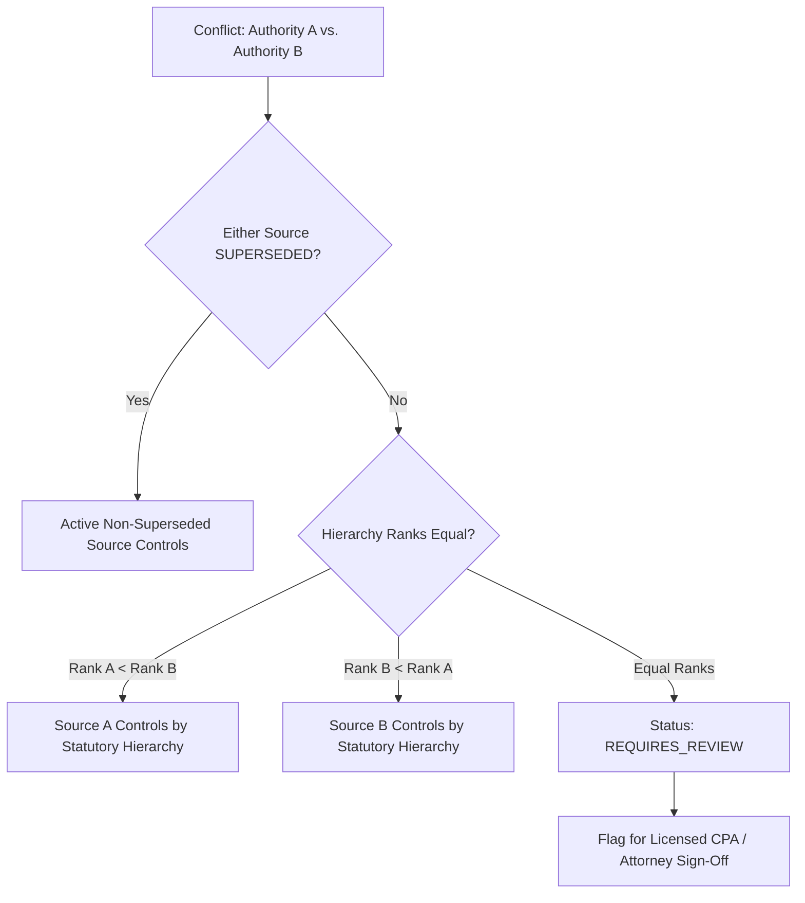

# Phase 4 — Statutory Conflict Resolution & Circuit Split Escalation

## 1. Conflict Types in American Tax Law

Tax law presents several categories of conflicting legal authorities:
1. **Vertical Conflict (Hierarchy Supremacy):** Higher-tier authority contradicts lower-tier authority (e.g., Internal Revenue Code vs. IRS FAQ or Form Instruction).
2. **Temporal Conflict (Supersession):** A subsequent legislative enactment or judicial decision supersedes prior guidance.
3. **Horizontal Conflict (Circuit Splits):** Federal circuit courts (e.g., 5th Circuit vs. 9th Circuit) reach divergent holdings on identical statutory questions.
4. **Federal-State Interplay:** State statute deliberately decoupling from federal definitions.

## 2. Deterministic Conflict Resolution Algorithm

Implemented in `TaxConflictResolver` (`src/server/services/taxAuthority/validation/conflictResolver.ts`):



## 3. Strict Anti-Guessing Standard

When evaluating equal-tier conflicts (e.g. conflicting Revenue Rulings or Circuit Splits), the algorithm enforces:
```typescript
return {
  hasConflict: true,
  resolution: 'REQUIRES_REVIEW',
  rationale: 'Substantive conflict between two equal-rank authorities. Escalated to licensed CPA/Tax Attorney for professional review.',
  isHumanEscalationNeeded: true
};
```
Under no circumstances does TaxOS allow an AI model to guess, hallucinate, or average conflicting judicial opinions. The tax position is flagged in the audit ledger and assigned to a credentialed reviewer.
