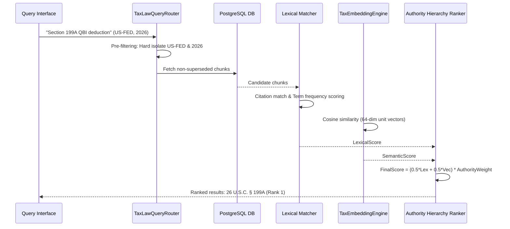

# Phase 4 — Hybrid Tax-Law Retrieval & Reranking Architecture

## 1. Overview

Pure vector search fails when searching legal corpora because semantic proximity cannot differentiate strict statutory subsections (e.g., distinguishing IRC § 199A(b)(2) from § 199A(b)(3)). Pure lexical search fails because taxpayers use conversational language ("Can I deduct my small business income?") rather than statutory phrases.

TaxOS implements true **Hybrid Search** with Reciprocal Rank Fusion (RRF) and Precedential Hierarchy Multipliers (`src/server/services/taxAuthority/rag/search.ts`).

## 2. Retrieval Pipeline



## 3. Mathematical Scoring Formulation

For any query $q$ and candidate chunk $c$:

$$\text{FinalScore}(q, c) = \left( w_{\text{lex}} \cdot S_{\text{lex}}(q, c) + w_{\text{vec}} \cdot S_{\text{vec}}(q, c) \right) \times W_{\text{auth}}(c) \times W_{\text{fresh}}(c)$$

Where:
- $w_{\text{lex}} = 0.5$, $w_{\text{vec}} = 0.5$
- $S_{\text{lex}}(q, c)$ combines exact statutory citation boost (+0.6) and term overlap (+0.4)
- $S_{\text{vec}}(q, c) = \frac{\mathbf{v}_q \cdot \mathbf{v}_c}{\|\mathbf{v}_q\| \|\mathbf{v}_c\|}$ (Cosine similarity)
- $W_{\text{auth}}(c) = \frac{16 - \text{Rank}(c)}{15} \times \text{StatusMultiplier}(c)$
- If $\text{Status}(c) == \text{SUPERSEDED}$, then $W_{\text{auth}}(c) = 0.0$ (Strict exclusion)

## 4. Hard Pre-Filtering

Before any vector or lexical math executes, queries are hard-filtered in PostgreSQL:
```sql
WHERE jurisdiction = :jurisdiction
  AND tax_year = :taxYear
  AND precedential_status != 'SUPERSEDED'
  AND effective_from <= :taxYearEnd
  AND (effective_to IS NULL OR effective_to >= :taxYearStart)
```
This guarantees zero chance of cross-jurisdiction leakage or obsolete prior-year laws contaminating active return calculations.
