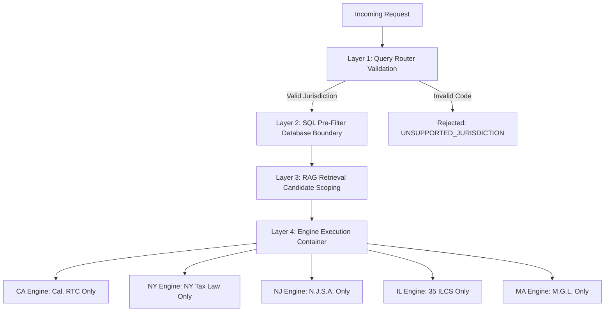

# Phase 4 — Multi-Jurisdiction Isolation & Security Guarantees

## 1. Threat Model

In multi-state tax platforms, cross-jurisdiction data leakage is catastrophic:
- Applying California community property rules to New York non-residents
- Allowing a New Jersey Gross Income Tax loss deduction to bleed into Illinois return calculations
- An LLM responding to a state query using federal assumptions

TaxOS enforces multi-layered jurisdiction isolation at the query, data, and execution layers (`TaxLawQueryRouter` in `src/server/services/taxAuthority/rag/router.ts`).

## 2. Hard Isolation Layers

## 3. Supported Jurisdictions Matrix

Only 6 sovereign jurisdictional codes are recognized:
1. `US-FED` (United States Federal — Internal Revenue Service)
2. `US-CA` (State of California — Franchise Tax Board)
3. `US-NY` (State of New York — Department of Taxation and Finance)
4. `US-NJ` (State of New Jersey — Division of Taxation)
5. `US-IL` (State of Illinois — Department of Revenue)
6. `US-MA` (Commonwealth of Massachusetts — Department of Revenue)

Any query or document extraction lacking an explicit, supported jurisdiction code is rejected with `UNSUPPORTED_JURISDICTION`. No cross-state fallback is permitted.
