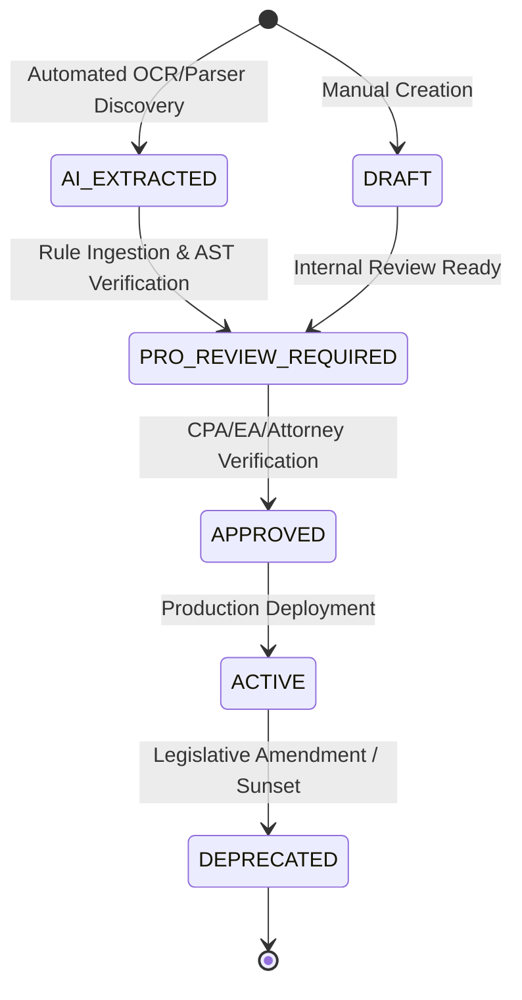

# Phase 4 — Tax Rule Lifecycle, Professional Governance & Immutability

## 1. Overview

In regulated financial software, AI models must never possess autonomous authority to alter compliance rules or tax calculations. TaxOS enforces a strict state machine governing the discovery, validation, approval, and release of tax rules (`src/server/services/taxAuthority/rules/ruleManager.ts`).

## 2. State Machine

## 3. The Human Credentialing Gate

### Prohibited Actions
- Automated AI agents **CANNOT** set `reviewStatus` to `ACTIVE` or `APPROVED`. Any rule registered by an automated parser is strictly tagged `AI_EXTRACTED`.
- Taxpayers (`TAXPAYER`), Business Owners (`BUSINESS_OWNER`), and Support Staff (`CUSTOMER_SUPPORT`) are blocked with `UNAUTHORIZED_RULE_ACTION`.

### Authorized Roles
Only credentialed professionals possessing verified licenses may approve or activate rules:
- `CPA` (Certified Public Accountant)
- `EA` (Enrolled Agent)
- `ATTORNEY` (Licensed Tax Attorney)
- `TAX_KNOWLEDGE_ADMIN`
- `SUPER_ADMIN`

## 4. Immutability and Versioning

An `ACTIVE` rule is **immutable**:
1. Active rules are never mutated in-place.
2. Updates require creating a new rule version (e.g. `2026.1` $\rightarrow$ `2026.2`).
3. The previous version transitions to `DEPRECATED`.
4. Prior return calculations permanently reference the exact historical `ruleVersion` and `contentHash` used during the original calculation run.
