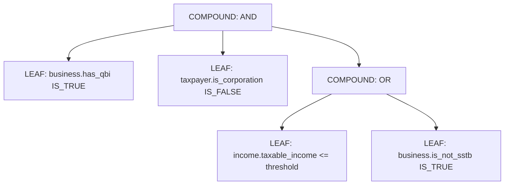

# Phase 4 — Structured Tax Rule Graph & AST Condition Tree

## 1. Overview

Tax rules in TaxOS are not stored as freeform Markdown text or unstructured LLM system prompts. Every rule is normalized into a machine-readable Abstract Syntax Tree (AST) condition graph (`TaxRule` model in PostgreSQL, evaluated by `TaxRuleEvaluator` in `src/server/services/taxAuthority/rules/ruleEvaluator.ts`).

## 2. Rule Schema

```typescript
interface NormalizedRulePayload {
  ruleId: string;                     // e.g. "FED-SEC-199A-QBI-DEDUCTION"
  jurisdiction: SupportedJurisdiction;// "US-FED", "US-CA", etc.
  taxYear: number;                    // 2026
  taxDomain: string;                  // "INCOME_TAX"
  topic: string;                      // "QUALIFIED_BUSINESS_INCOME"
  title: string;
  description: string;
  conditions: RuleConditionAST;       // Boolean AST
  requiredFacts: string[];            // Fact prerequisites
  exceptions: string[];               // Statutory carve-outs
  thresholds: Record<string, any>;    // Income/filing status thresholds
  phaseOuts: Record<string, any>;     // Phaseout slopes
  elections: Record<string, any>;     // Taxpayer elections
  calculationReference?: string;      // Deterministic engine hook
  formMappings: string[];             // Return line mappings
  authorityRefs: string[];            // Official citations
  ruleVersion: string;                // "2026.1"
  reviewStatus: RuleReviewStatus;     // ACTIVE
  effectiveFrom: Date;
  effectiveTo?: Date;
}
```

## 3. AST Condition Grammar

The condition tree supports two node types:
1. `LEAF`: Atomic predicate evaluated against a fact key
2. `COMPOUND`: Logical combination (`AND`, `OR`, `NOT`) of child nodes



### Supported Operators
- Comparison: `EQUALS`, `NOT_EQUALS`, `GREATER_THAN`, `GREATER_THAN_OR_EQUAL`, `LESS_THAN`, `LESS_THAN_OR_EQUAL`
- Set Membership: `IN`, `NOT_IN`, `CONTAINS`
- Existence & Boolean: `EXISTS`, `IS_TRUE`, `IS_FALSE`

## 4. Deterministic Calculation Decoupling

When `TaxRuleEvaluator.evaluate(rule, facts)` returns `isEligible: true`, the rule does NOT perform arithmetic itself. Instead, it provides `calculationReference: "federalEngine.calculateQbiDeduction"`, directly invoking Phase 3's deterministic engine.
