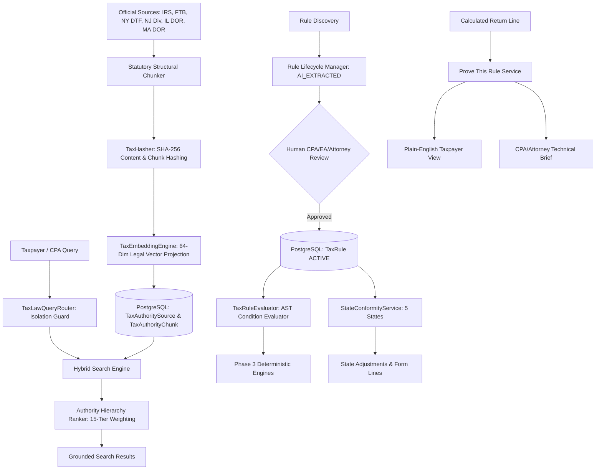

# Phase 4 — Tax Authority Engine & Real Tax-Law RAG Architecture

## 1. Executive Summary

Autonomous Tax OS Phase 4 eliminates reliance on static strings, hardcoded citations, LLM memory, or pre-training weights for tax law interpretation. The platform implements an authoritative, versioned, cryptographic Tax Authority Engine backed by PostgreSQL persistence, structural legal chunking, hybrid retrieval (lexical + dense vector + authority weighting), a structured AST rule graph, state conformity graphs, and rigorous citation verification.

## 2. Core Subsystems

| Subsystem | Source Path | Description |
| :--- | :--- | :--- |
| **Authority Hierarchy** | `src/server/services/taxAuthority/hierarchy.ts` | Enforces 15-tier legal supremacy and precedential multipliers. |
| **Statutory Chunker** | `src/server/services/taxAuthority/chunker.ts` | Parses codes by Section, Subsection, and Paragraph rather than naive character windows. |
| **Cryptographic Hasher** | `src/server/services/taxAuthority/hasher.ts` | SHA-256 canonical hashing of sources, chunks, rule ASTs, and rule set versions. |
| **Domain Vector Embeddings** | `src/server/services/taxAuthority/rag/embeddings.ts` | Normalized 64-dimensional feature projection vectors and cosine similarity. |
| **Query Router** | `src/server/services/taxAuthority/rag/router.ts` | Hard pre-filters queries by jurisdiction and tax year; blocks cross-contamination. |
| **Hybrid Search Engine** | `src/server/services/taxAuthority/rag/search.ts` | Merges lexical citations, text frequency, vector similarity, and statutory weights. |
| **Rule Lifecycle Manager** | `src/server/services/taxAuthority/rules/ruleManager.ts` | State machine: `DRAFT` $\rightarrow$ `AI_EXTRACTED` $\rightarrow$ `PRO_REVIEW_REQUIRED` $\rightarrow$ `APPROVED` $\rightarrow$ `ACTIVE`. |
| **Rule Condition Evaluator** | `src/server/services/taxAuthority/rules/ruleEvaluator.ts` | Evaluates boolean ASTs (`LEAF` & `COMPOUND`) against facts without LLM guesswork. |
| **State Conformity Engine** | `src/server/services/taxAuthority/rules/conformityService.ts` | Models rolling conformity, fixed-date conformity, selective decoupling, and gross income autonomy. |
| **Citation Validator** | `src/server/services/taxAuthority/validation/citationValidator.ts` | Validates format, jurisdiction, effective date, and textual grounding against source chunks. |
| **Conflict Resolver** | `src/server/services/taxAuthority/validation/conflictResolver.ts` | Resolves authority discrepancies; escalates equal-tier circuit splits to human CPAs. |
| **Explainability Engine** | `src/server/services/taxAuthority/explanation/explainRule.ts` | Bridges "Prove This Number" to "Prove This Rule" with dual consumer/professional views. |
| **Tax Law Watcher** | `src/server/services/taxAuthority/watcher/taxLawWatcher.ts` | Tracks rule updates and performs automated impact analysis across active TaxCases. |
| **Authority Providers** | `src/server/services/taxAuthority/providers/` | Official publishers for Federal (`US-FED`) and 5 States (`CA`, `NY`, `NJ`, `IL`, `MA`). |

## 3. Strict Compliance Invariants

1. **Deterministic Calculation Decoupling:** LLMs NEVER calculate taxes or qualify deductions autonomously. Arithmetic and threshold math are strictly performed by Phase 3 deterministic code.
2. **AI Rule Activation Block:** Automated AI agents can only propose candidate rules (`AI_EXTRACTED`). Transition to `ACTIVE` requires credentialed human sign-off (`CPA`, `EA`, `ATTORNEY`, `SUPER_ADMIN`).
3. **Zero Superseded Bleed:** Obsolete, repealed, or superseded statutory guidance is assigned weight `0.0` and excluded from active calculation and research workflows.
4. **Hard Multi-Jurisdictional Isolation:** Queries and cases are strictly walled by jurisdiction code (`US-FED`, `US-CA`, `US-NY`, `US-NJ`, `US-IL`, `US-MA`). Cross-jurisdiction leakage is fatal.
