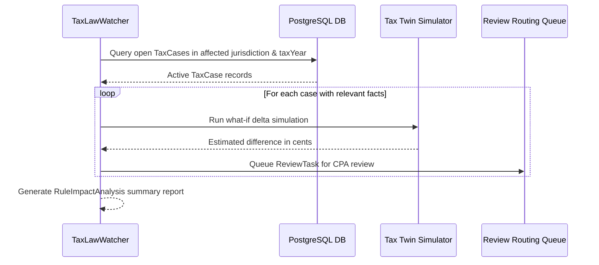

# Phase 4 — Tax Law Watcher & Automated Impact Analysis

## 1. Overview

Statutory changes (such as annual inflation adjustments under Rev. Proc. 2025-38, new state legislation, or emergency tax acts) require systematic change management across active taxpayer files.

The `TaxLawWatcher` (`src/server/services/taxAuthority/watcher/taxLawWatcher.ts`) provides:
1. Cryptographic AST diffing between rule versions
2. Classification of changes (threshold, phaseout, rate, condition)
3. Automated impact analysis across persisted `TaxCase` records in PostgreSQL.

## 2. Cryptographic Rule Diffing

The watcher computes SHA-256 hashes of canonical rule representations and compares sub-elements:

```typescript
interface RuleDiffResult {
  ruleId: string;
  isDifferent: boolean;
  hashOld: string;
  hashNew: string;
  changes: string[]; // Specific changed fields and formulas
}
```

Diff categories tracked:
- Condition AST modifications
- Threshold adjustments (e.g. standard deduction inflation increase)
- Phaseout ceiling/floor shifts
- Deterministic engine calculation reference updates

## 3. Automated Case Impact Analysis

When a rule is amended:


The resulting `RuleImpactAnalysis` details the total count of affected cases and sample dollar deltas, preventing tax surprises and enabling proactive CPA advisory.
