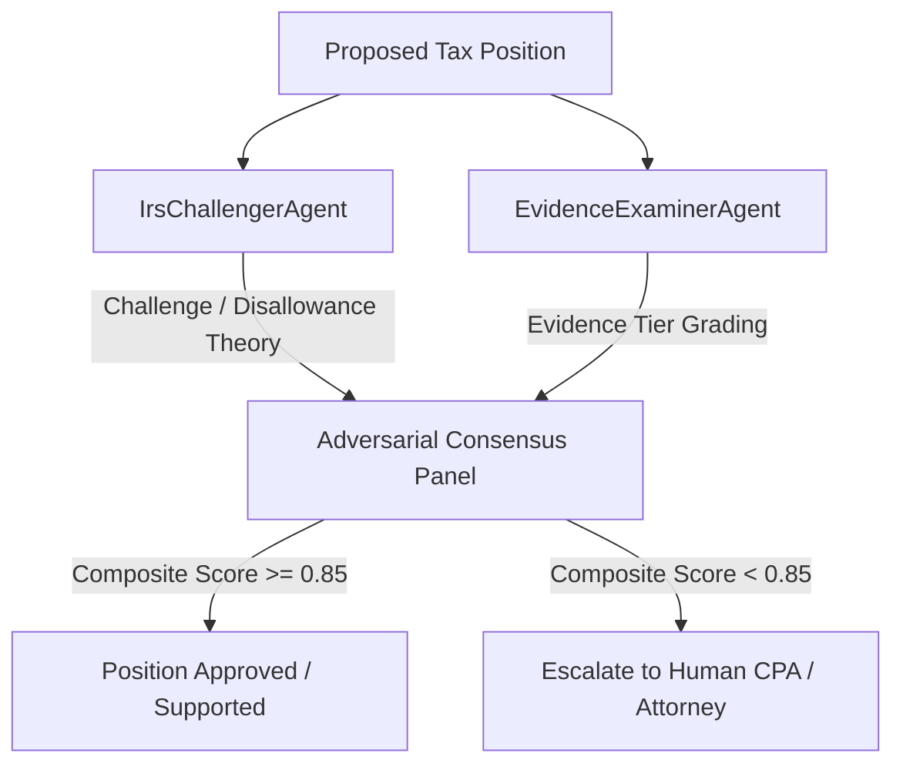

# Phase 5 — Adversarial Review & Audit Defense Architecture

## 1. Executive Summary

Autonomous Tax OS employs an **Adversarial Review Architecture** prior to finalizing any tax return. Rather than passively agreeing with proposed deductions, the system subjects every claimed tax position to aggressive scrutiny simulating an IRS revenue agent or state tax auditor.



---

## 2. The IRS Challenger Agent (`IrsChallengerAgent`)

The `IrsChallengerAgent` evaluates every deduction from the perspective of an IRS examiner:

### Scrutiny Dimensions:
1. **IRC § 162 vs IRC § 262 (Personal Disguise)**: Scrutinizes expenses that could possess personal utility (meals, travel, electronics, subscriptions).
2. **Strict Substantiation (IRC § 274(d))**: Disallows travel, entertainment, and vehicle deductions that lack contemporaneous records (date, place, business purpose, relationship).
3. **Hobby Loss Rules (IRC § 183)**: Evaluates businesses generating consecutive loss years to identify disguised personal hobbies.
4. **IRC § 280A (Home Office Disallowance)**: Challenges home office deductions lacking exclusive and regular use.
5. **Worker Classification (IRC § 3121)**: Flags potential misclassification of 1099 independent contractors who should be statutory W-2 employees.

```typescript
export interface ChallengerResult {
  positionId: string;
  isChallenged: boolean;
  challengerVerdict: 'SUSTAIN' | 'DISALLOW' | 'ADJUST' | 'FLAG_FOR_AUDIT';
  auditRiskScore: number; // 0.00 (negligible) to 1.00 (critical audit trap)
  legalVulnerabilities: string[];
  counterArguments: string[];
  recommendedSubstantiation: string[];
}
```

---

## 3. Five-Tier Evidence Grading (`EvidenceExaminerAgent`)

Evidence quality is strictly graded using a 5-tier statutory substantiation hierarchy:

| Tier | Category | Evidence Source | Inherent Reliability |
| :--- | :--- | :--- | :--- |
| **Tier 1** | Third-Party Direct Source | W-2, 1099-NEC, 1098, K-1 direct from IRS FIRE or financial institution | 1.00 |
| **Tier 2** | Objective Financial Records | Bank statements, credit card statements via authenticated API feeds | 0.90 |
| **Tier 3** | Commercial Vendor Invoices | Itemized receipts, point-of-sale receipts, paid bills | 0.80 |
| **Tier 4** | Contemporaneous Business Logs | Mileage logs, calendar entries, client communication threads | 0.65 |
| **Tier 5** | Self-Certification / Oral Testimony | Taxpayer written statement or post-hoc estimates | 0.30 |

### Statutory Evidentiary Rules:
- Under **IRC § 274(d)**, Tier 5 self-certification is **statutorily inadmissible** for travel, meal, or vehicle deductions. The Cohan rule (*Cohan v. Commissioner*, 39 F.2d 540) does not apply where § 274(d) governs.
- Any position supported solely by Tier 5 evidence where strict substantiation applies is automatically downgraded and routed to human review.
