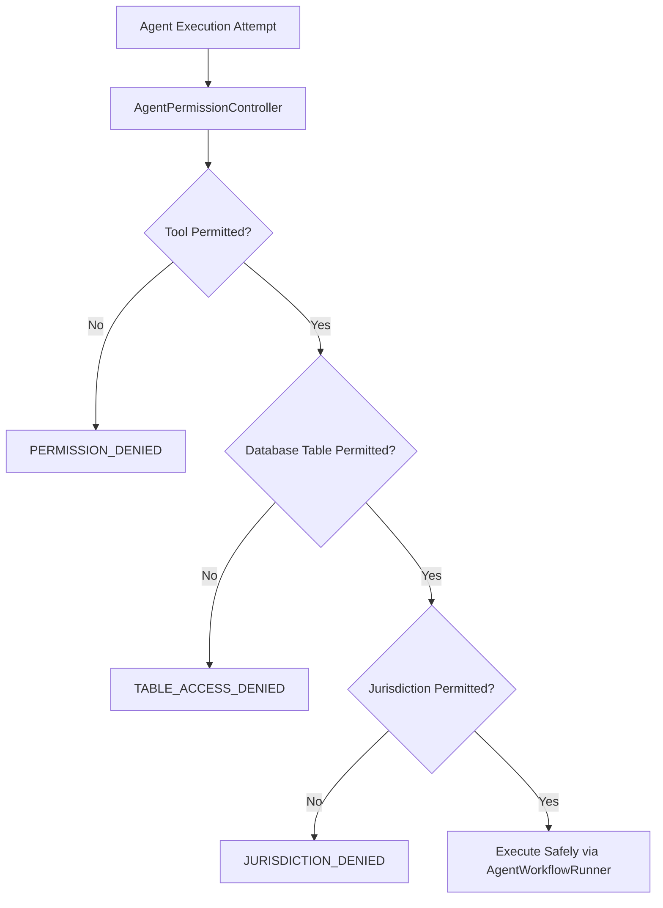

# Phase 5 — Agent Permissions & Least Privilege Access Control

## 1. Overview & Architecture

Autonomous Tax OS enforces the **Principle of Least Privilege (PoLP)** at the agent runtime boundary. No agent has unrestricted database access or ambient execution rights.



---

## 2. Permission Dimensions

Every agent in the runtime is governed by four explicit permission vectors:

1. **`allowedTools`**: Whitelist of callable function tools (e.g. `readTaxCase`, `searchTaxAuthority`, `createTaxPositionCandidate`).
2. **`allowedReadTables`**: Whitelist of PostgreSQL tables the agent is permitted to read.
3. **`allowedWriteTables`**: Whitelist of PostgreSQL tables the agent is permitted to insert or update.
4. **`allowedJurisdictions`**: Permitted tax jurisdictions (`US-FED`, `US-CA`, `US-NY`, `US-NJ`, `US-IL`, `US-MA`).

---

## 3. Agent Capability & Permission Matrix (Sample)

| Agent Type | Allowed Tools | Read Tables | Write Tables | Permitted Jurisdictions |
| :--- | :--- | :--- | :--- | :--- |
| **`INTAKE_AGENT`** | `readTaxCase`, `readDocuments`, `createTaxFact` | `TaxCase`, `Document`, `TaxpayerProfile` | `TaxFact`, `TaxCase` | `US-FED` |
| **`TRANSACTION_CLASSIFICATION_AGENT`** | `readTransactions`, `tagTransaction` | `Transaction`, `AgentMemory` | `Transaction` | `US-FED` |
| **`DEDUCTION_HUNTER`** | `readFacts`, `readRules`, `createTaxPosition` | `TaxCase`, `TaxFact`, `TaxRule`, `Transaction` | `TaxPosition` | `US-FED` |
| **`TAX_RESEARCH_AGENT`** | `searchTaxAuthority`, `validateCitation` | `TaxAuthoritySource`, `TaxAuthorityChunk`, `TaxRule` | None (Read-only) | `US-FED`, `US-CA`, `US-NY`, `US-NJ`, `US-IL`, `US-MA` |
| **`CALIFORNIA_TAX_AGENT`** | `runStateTaxCalculation`, `createStatePosition` | `TaxCase`, `TaxFact`, `TaxRule` | `TaxCalculationRun`, `TaxPosition` | `US-CA` (Strictly Isolated) |
| **`NEW_YORK_TAX_AGENT`** | `runStateTaxCalculation`, `createStatePosition` | `TaxCase`, `TaxFact`, `TaxRule` | `TaxCalculationRun`, `TaxPosition` | `US-NY` (Strictly Isolated) |
| **`IRS_CHALLENGER_AGENT`** | `readPositions`, `evaluateAtgRedFlags`, `recordChallenge` | `TaxPosition`, `TaxFact`, `Evidence` | `TaxPosition` (Notes/Risk only) | `US-FED` |
| **`HUMAN_ESCALATION_ROUTER`** | `createReviewTask`, `readDisputes` | `TaxCase`, `TaxPosition` | `ReviewTask` | All Supported |

---

## 4. Strict Enforcement Mechanisms

### Tool Verification:
```typescript
public static assertToolAllowed(agentType: AgentType, toolName: string): void {
  const perm = this.getPermissions(agentType);
  if (!perm.allowedTools.includes(toolName)) {
    throw new Error(`PERMISSION_DENIED: Agent '${agentType}' is not authorized to call tool '${toolName}'`);
  }
}
```

### Jurisdiction Boundary Verification:
```typescript
public static assertJurisdictionAllowed(agentType: AgentType, jurisdiction: string): void {
  const perm = this.getPermissions(agentType);
  if (!perm.allowedJurisdictions.includes(jurisdiction)) {
    throw new Error(
      `JURISDICTION_PERMISSION_DENIED: Agent '${agentType}' is restricted from accessing jurisdiction '${jurisdiction}'. Permitted: [${perm.allowedJurisdictions.join(', ')}]`
    );
  }
}
```

### Table Access Verification:
```typescript
public static assertTableAllowed(agentType: AgentType, tableName: string, mode: 'READ' | 'WRITE'): void {
  const perm = this.getPermissions(agentType);
  const allowed = mode === 'READ' ? perm.allowedReadTables : perm.allowedWriteTables;
  if (!allowed.includes(tableName)) {
    throw new Error(`PERMISSION_DENIED: Agent '${agentType}' cannot ${mode} table '${tableName}'`);
  }
}
```
