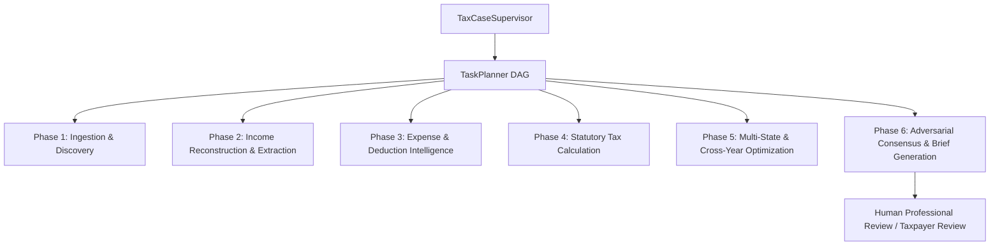

# Phase 5 — Typed Multi-Agent Workflow Runtime Architecture

## 1. Overview & Architecture Rationale

Autonomous Tax OS Phase 5 replaces unstructured, non-deterministic agent chat with a **strictly typed, DAG-orchestrated multi-agent workflow runtime**.

### Core Invariants:
1. **Zero Autonomous Tax Filing**: AI agents never approve final tax filing returns or electronically transmit them. The workflow strictly terminates at `READY_FOR_USER_REVIEW` or `READY_FOR_PROFESSIONAL_REVIEW`.
2. **Zero Freeform Chat**: Agents communicate exclusively through structured, strongly typed persisted outputs (`AgentResult<T>`), backed by PostgreSQL database records (`AgentRun`, `TaxPosition`, `TaxFact`, `ReviewTask`).
3. **Zero Hallucinated Tax Law**: LLMs are never authoritative tax calculators. All numbers are computed deterministically via Phase 3 calculation engines, and all statutory citations are verified against the Phase 4 Tax Authority Engine.
4. **Principle of Least Privilege**: Every agent operates under fine-grained tool, database table, and state jurisdiction permissions enforced at the runtime boundary.



---

## 2. Structured Agent Contract (`AgentResult<T>`)

Every agent must return an immutable, strongly-typed `AgentResult<T>`:

```typescript
export interface AgentResult<T = any> {
  status: ExecutionStatus; // SUCCESS, REQUIRES_MORE_EVIDENCE, CONFLICT_DETECTED, PERMANENT_FAILURE, RETRYABLE_FAILURE
  result: T;
  confidence: number; // 0.00 to 1.00 composite score
  evidenceRefs: string[]; // Linked EvidenceGraph / Document IDs
  ruleRefs: string[]; // Validated statutory rule IDs (e.g. IRC § 162)
  sourceRefs: string[]; // Official authority source citations
  taxCaseRefs: string[];
  contradictions: string[];
  unresolvedFacts: string[];
  warnings: string[];
  requiresUserInput: boolean;
  requiresProfessionalReview: boolean;
  recommendedNextAction: string;
  auditMetadata: {
    agentType: AgentType;
    agentVersion: string;
    modelClass: ModelClass;
    executionTimeMs: number;
    costUsd: number;
    timestamp: string;
  };
}
```

---

## 3. Principle of Least Privilege (`AgentPermissionController`)

The runtime enforces least privilege access control before executing any agent tool or accessing database tables:

- **Tool Whitelisting**: An agent attempting to invoke an unpermitted tool (e.g., `TRANSACTION_CLASSIFICATION_AGENT` attempting `approveTaxPosition`) is instantly halted with `PERMISSION_DENIED`.
- **Database Table Access Scoping**: Agents only have read/write access to necessary tables (e.g., `DeductionHunter` can create `TaxPosition`, but cannot modify `UserCredential`).
- **State Jurisdiction Scoping**: State-specific agents (e.g., `CALIFORNIA_TAX_AGENT`) can strictly access California data (`US-CA`) and are denied access to other state or federal records unless explicitly delegated.

---

## 4. Resiliency & Circuit Breakers (`AgentCircuitBreaker`)

To prevent runaway cascades or infinite loops:
- **Max Consecutive Failures**: After 3 consecutive unhandled failures, the circuit breaker trips to `OPEN`.
- **Cooldown Window**: Trips enforce a 30-second cooling period before half-open retry.
- **Kill Switch Integration**: Direct integration with the operational `KillSwitchManager` allows instant disabling of specific agents, model providers, jurisdictions, or statutory rules without redeployment.

---

## 5. Model Routing & Cost Efficiency (`ModelRouter`)

Agents are mapped to appropriate model classes to guarantee accuracy while respecting the **$5.00 per-return budget guardrail**:

| Task Class | Model Category | Routing Strategy | Target Unit Cost |
| :--- | :--- | :--- | :--- |
| `FAST_CLASSIFIER` | Lightweight LLM / Regex | High-volume merchant & transaction tagging | < $0.0001 / call |
| `DOCUMENT_REASONER` | Multimodal OCR Engine | W-2, 1099, receipt extraction | < $0.002 / doc |
| `DEEP_REASONER` | Frontier Reasoning Model | Adversarial consensus, statutory conflict resolution | < $0.02 / call |
| `TAX_RESEARCH_REASONER` | Hybrid RAG Engine | IRC & Treasury Reg interpretation | < $0.005 / query |
| `INTERNAL_DETERMINISTIC` | Deterministic TypeScript | Mathematical calculations (Fed + 5 States) | $0.0000 |

---

## 6. Execution Lifecycle & Audit Integrity (`AgentWorkflowRunner`)

Every execution follows an immutable lifecycle:
1. Validate permissions (Tools, Tables, Jurisdiction).
2. Validate Circuit Breaker & Kill Switch status.
3. Sanitize inputs against prompt injection.
4. Record `RUNNING` status in `AgentRun` table with input snapshot hash.
5. Execute under timeout protection (default 30,000 ms) and exponential backoff retry.
6. Generate SHA-256 cryptographic signature of results.
7. Record final cost, latency, token count, tool invocations, and output snapshots in PostgreSQL.
