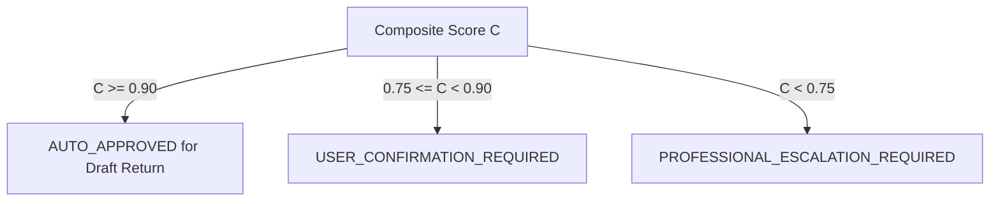

# Phase 5 — Multi-Factor Composite Confidence Engine & Routing

## 1. Executive Summary

Autonomous Tax OS does not rely on opaque or subjective LLM confidence ratings. Every position, fact, and decision is evaluated using a mathematically rigorous, 4-factor **Composite Confidence Score**.

---

## 2. Mathematical Formulation

The composite confidence score $C \in [0.00, 1.00]$ is computed as:

$$C = (0.35 \times W_{\text{evidence}}) + (0.25 \times W_{\text{authority}}) + (0.25 \times W_{\text{challenger}}) + (0.15 \times W_{\text{math}})$$

Where:

1. **$W_{\text{evidence}}$ (Evidence Weight — 35%)**:
   - Tier 1 (Third-Party Form / FIRE direct): `1.00`
   - Tier 2 (Financial Institution Bank / Card Feed): `0.90`
   - Tier 3 (Vendor Itemized Receipt / Invoice): `0.80`
   - Tier 4 (Contemporaneous Mileage / Calendar Log): `0.65`
   - Tier 5 (Self-Certification / Taxpayer Estimate): `0.30`
   - Missing Evidence: `0.00`

2. **$W_{\text{authority}}$ (Statutory Authority Weight — 25%)**:
   - Primary Code & Supreme Court Precedent (Rank 1): `1.00`
   - Treasury Regulations & Circuit Precedent (Rank 2–3): `0.95`
   - Revenue Rulings & Procedures (Rank 4–5): `0.90`
   - IRS Publications / Instructions: `0.75`
   - Invalid or Unverified Citation: `0.00` (causes immediate penalty)

3. **$W_{\text{challenger}}$ (Adversarial Robustness — 25%)**:
   - IRS Challenger Sustains Claim without Objection: `1.00`
   - Moderate Scrutiny (Minor ATG Red Flag, Cleared): `0.75`
   - High Scrutiny (Substantiation Gap Flagged): `0.40`
   - Challenger Disallows Claim (Direct statutory challenge): `0.10`

4. **$W_{\text{math}}$ (Deterministic Math Weight — 15%)**:
   - Computed via deterministic Phase 3 calculation engine: `1.00`
   - Estimated or heuristic value: `0.50`

---

## 3. Dynamic Routing Thresholds

Based on the calculated composite score $C$, positions are routed automatically:



### Routing Rules:
- **High Confidence ($C \ge 0.90$)**: Position is automatically incorporated into the draft return. Taxpayer sees a simple summary with full "Prove This Number" explainability.
- **Medium Confidence ($0.75 \le C < 0.90$)**: Position is placed in the "Needs You" queue for taxpayer confirmation or receipt upload.
- **Low Confidence ($C < 0.75$)**: Position cannot be claimed automatically. It generates a `ReviewTask` assigned to a credentialed CPA, EA, or Tax Attorney.

---

## 4. Traceable Explainability

Every score includes an audit-ready breakdown saved in `TaxPosition.confidence`:
```json
{
  "compositeScore": 0.9325,
  "factors": {
    "evidenceWeight": 0.90,
    "authorityWeight": 1.00,
    "challengerWeight": 1.00,
    "mathWeight": 1.00
  },
  "explanation": "High confidence supported by Tier 2 authenticated bank records, primary IRC § 162 statutory authority, no challenger disallowance, and deterministic arithmetic calculation."
}
```
