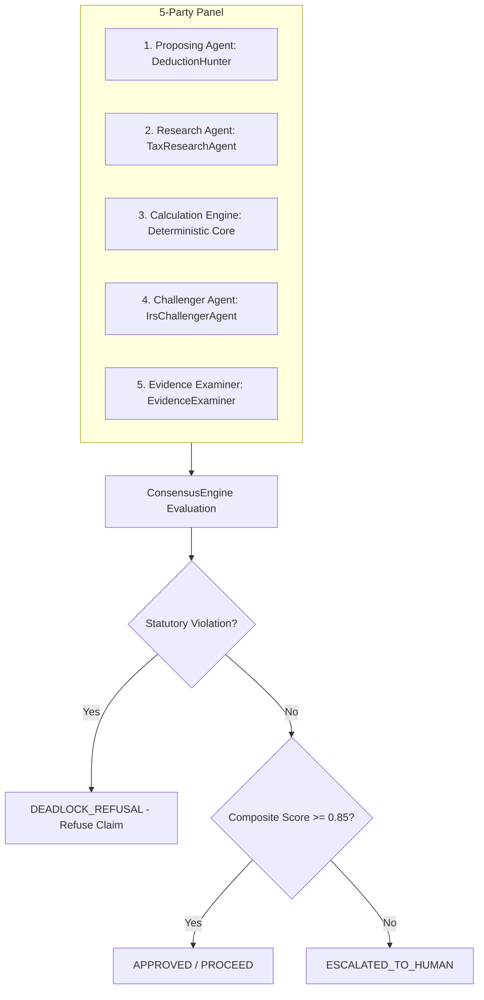

# Phase 5 — 5-Party Adversarial Consensus Protocol & Statutory Refusal Gate

## 1. Executive Summary

Autonomous Tax OS prohibits single-agent unchecked decisions and rejects naive "majority vote" paradigms. Statutory tax law cannot be overridden by democratic vote among AI agents.

The **ConsensusEngine** implements a 5-party adversarial protocol where affirmative consensus requires rigorous evidentiary backing, statutory validation, and complete absence of legal bar.

---

## 2. The 5-Party Adversarial Panel

For any material tax position, five specialized agent perspectives must submit independent findings:

### Roles in the Panel:
1. **The Proponent** (`DeductionHunter` / `CreditHunter`): Identifies fact-based deduction or credit opportunities.
2. **The Legal Grounding** (`TaxResearchAgent`): Confirms that the position is grounded in active, unrepealed statutes or regulations.
3. **The Deterministic Math** (`FederalTaxAgent` / `StateTaxAgent`): Verifies exact arithmetic impact without rounding errors.
4. **The Adversary** (`IrsChallengerAgent`): Challenges business connection, timing, personal utility, and audit exposure.
5. **The Substantiator** (`EvidenceExaminerAgent`): Audits the supporting documentation against Tier 1 - Tier 5 standards.

---

## 3. Statutory Refusal Gate (Zero Majority-Vote Tax Law)

### The Core Law Principle:
> **If a claimed position violates an express statutory disallowance (e.g. IRC § 274(a) entertainment disallowance, or lack of contemporaneous vehicle log under § 274(d)), NO MAJORITY VOTE OF AI AGENTS CAN APPROVE IT.**

Even if 4 out of 5 agents mistakenly vote in favor of a deduction, the **Statutory Refusal Gate** immediately triggers a `DEADLOCK_REFUSED` verdict if:
- An express statutory bar exists.
- The supporting citation is invalid, superseded, or out-of-jurisdiction.
- Required statutory substantiation is completely absent.

---

## 4. Verdict Classification

The `ConsensusEngine` outputs one of five explicit verdicts:

1. **`APPROVED`**:
   - High consensus agreement (score >= 0.85).
   - Solid Tier 1–3 documentation.
   - Statutory citation verified in Phase 4 authority corpus.
2. **`APPROVED_WITH_WARNING`**:
   - Legitimate position, but modest audit risk or slight documentation gap (e.g., Tier 4 log).
   - Disclosed with advisory warning for taxpayer.
3. **`ADJUSTED`**:
   - Panel agrees with the deduction category, but adjusts the dollar amount (e.g. enforcing the 50% meal limitation under IRC § 274(n) or standard mileage cap).
4. **`DEADLOCK_REFUSED`**:
   - Direct statutory conflict or unresolvable legal barrier.
   - Deduction is removed from the return.
5. **`ESCALATED_TO_HUMAN`**:
   - Genuine ambiguity in facts or unresolved legal dispute.
   - Automatically dispatched to a credentialed CPA, EA, or Tax Attorney via `ReviewTask`.
