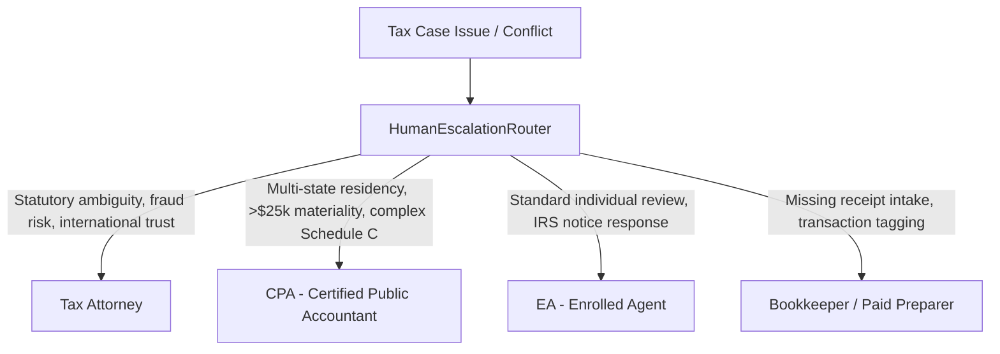

# Phase 5 — Human Professional Escalation Router Architecture

## 1. Executive Summary

Autonomous Tax OS recognizes that AI agents cannot and must not make subjective legal judgments or sign returns under penalty of perjury. 

The **HumanEscalationRouter** automatically detects when an issue exceeds AI competence boundaries or regulatory thresholds and routes the task to a licensed human tax professional matching the exact specialty and credential required.

---

## 2. Professional Routing Matrix



### Credential Tier Assignment:

| Issue Category | Trigger Condition | Assigned Role | Specialty Domain | SLA Target |
| :--- | :--- | :--- | :--- | :--- |
| **Statutory Conflict / Tax Controversy** | Legal dispute, civil fraud penalty risk, non-statutory shelter | `ATTORNEY` | Tax Controversy & Judicial Precedent | 4 Hours |
| **Complex Multi-State / Sourcing** | Dual statutory residency, NY 183-day rule, CA domicile | `CPA` | Multi-State Apportionment | 8 Hours |
| **High Materiality Write-Off** | Single deduction > $25,000 USD, or ambiguous business purpose | `CPA` | Senior Tax Reviewer | 12 Hours |
| **Standard Filing Sign-Off** | Routine return completion, W-2 + modest Schedule C | `EA` | Individual & Small Business Quality Review | 24 Hours |
| **Substantiation & Document Gaps** | Missing receipt ingestion, merchant alias confusion | `PAID_PREPARER` | Document Intake & Bookkeeping | 24 Hours |

---

## 3. Database Persistence (`ReviewTask`)

When an escalation triggers, the router creates a persistent `ReviewTask` in PostgreSQL:

```typescript
const task = await prisma.reviewTask.create({
  data: {
    taxCaseId: input.taxCaseId,
    jurisdiction: input.jurisdiction,
    taxDomain: 'INCOME_TAX',
    requiredRole: roleEnum, // ATTORNEY, CPA, EA, PAID_PREPARER
    riskLevel: input.urgency === 'CRITICAL' ? 'HIGH' : 'LOW',
    materialityCents: BigInt(Math.round(input.dollarMaterialityUsd * 100)),
    status: 'PENDING_ROUTING',
    deadline: calculatedDeadline,
    notes: input.rationale
  }
});
```

### Reviewer Workflow Capabilities:
- Professional receives an instant notification in the **CPA/EA Workspace**.
- Reviewer views the **Professional Review Brief** with full calculation lineage and evidence links.
- Reviewer can **Approve**, **Adjust**, or **Disallow** the position.
- Any manual adjustment automatically updates the return and feeds into `AgentMemory` for future learning.
