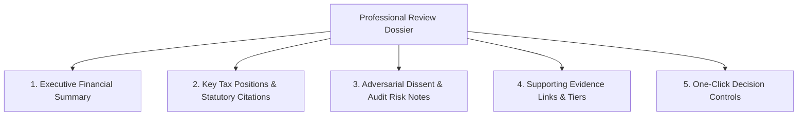
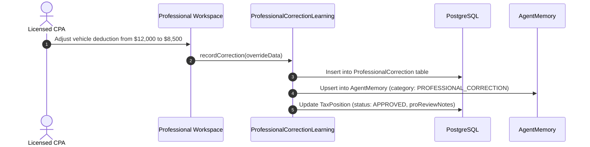

# Phase 5 — Professional Review Brief & CPA Feedback Learning System

## 1. Executive Summary

When a return is submitted for credentialed human review (`HUMAN_VERIFIED` or `FULL_SERVICE` review modes), the reviewing CPA or attorney must not be forced to dig through raw database tables or re-calculate numbers manually.

The **ProfessionalReviewBriefAgent** compiles an **Executive Review Dossier**, while the **ProfessionalCorrectionLearning** subsystem captures human overrides to train organizational agent memory.

---

## 2. Structure of the Professional Review Dossier

The generated brief provides a structured, audit-ready summary:



### Dossier Components:
1. **Executive Financial Summary**:
   - Adjusted Gross Income (AGI), Total Deductions, Taxable Income.
   - Total Payments/Withholding and Net Federal/State Balance Due or Refund.
2. **Key Tax Positions**:
   - Every claimed deduction or credit with amount, statutory citation (e.g. `IRC § 162`), and confidence score.
3. **Adversarial Dissent & Challenger Notes**:
   - Notes from `IrsChallengerAgent` highlighting audit exposures, lack of receipts, or high-risk deduction ratios.
4. **Evidence Lineage**:
   - Direct hyperlinks to primary source documents in the secure Document Vault.
5. **One-Click Decision Controls**:
   - Standard buttons: `Approve Position`, `Adjust Amount`, `Disallow & Remove`.

---

## 3. Professional Correction Learning Subsystem

When a human CPA or attorney overrides an agent recommendation, the action is captured as a permanent learning signal:



### Schema & Persistence:
```typescript
await prisma.professionalCorrection.create({
  data: {
    taxCaseId: input.taxCaseId,
    taxPositionId: input.taxPositionId,
    originalProposal: input.originalProposal,
    professionalDecision: input.professionalDecision,
    reason: input.reason,
    ruleRefs: input.ruleRefs || [],
    reviewerId: input.userId,
    reviewerRole: 'CPA'
  }
});

await prisma.agentMemory.create({
  data: {
    organizationId: input.organizationId,
    category: 'PROFESSIONAL_CORRECTION',
    key: `CORRECTION:${input.agentType}:${input.taxYear}:${Date.now()}`,
    value: {
      originalProposal: input.originalProposal,
      correction: input.professionalDecision,
      reason: input.reason,
      ruleRefs: input.ruleRefs
    },
    confidence: 1.0,
    taxYear: input.taxYear,
    sourceAgent: `PROFESSIONAL_USER:${input.userId}`
  }
});
```

### Learning Invariant:
- Professional corrections refine future deductions for that taxpayer/organization without altering universal statutory tax rules.
- Tax-year specific elections remain strictly year-scoped.
