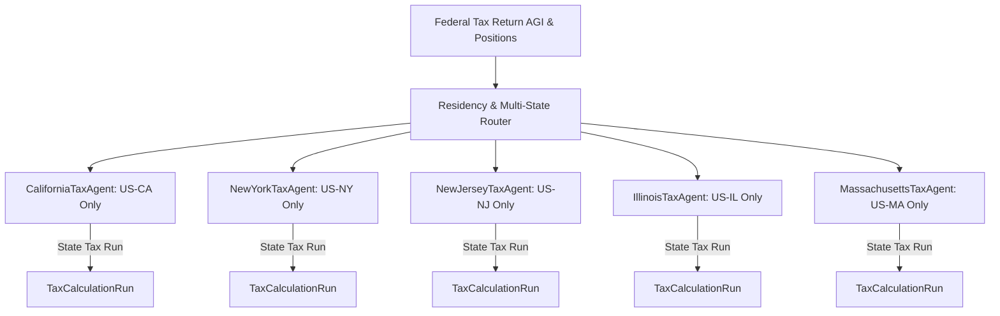

# Phase 5 — State Tax Agents & Jurisdiction Isolation Architecture

## 1. Overview & Architecture

Autonomous Tax OS Phase 5 implements dedicated, jurisdiction-isolated agents for the five major state tax modules:
1. **California** (`US-CA`) — Franchise Tax Board (FTB)
2. **New York** (`US-NY`) — Department of Taxation and Finance (DTF)
3. **New Jersey** (`US-NJ`) — Division of Taxation
4. **Illinois** (`US-IL`) — Department of Revenue (IDOR)
5. **Massachusetts** (`US-MA`) — Department of Revenue (DOR)

---

## 2. State Agent Specifications

### 2.1 California Tax Agent (`CALIFORNIA_TAX_AGENT`)
- **Statutory Scope**: California Personal Income Tax Law (Cal. Rev. & Tax. Code § 17041 et seq.).
- **Key Provisions**:
  - Progressive rate schedule up to 12.3%.
  - **CRTC § 17043 Mental Health Services Surtax**: 1.0% surtax on California taxable income exceeding $1,000,000.
  - **CRTC § 17215.4 HSA Add-Back**: California does not conform to IRC § 223; HSA contributions are added back to California AGI.
  - **Schedule S**: Other State Tax Credit (OSTC) to prevent double taxation on dual-state income.
- **Output Form**: CA Form 540 (Resident) / CA Form 540NR (Nonresident).

---

### 2.2 New York Tax Agent (`NEW_YORK_TAX_AGENT`)
- **Statutory Scope**: New York Tax Law Article 22.
- **Key Provisions**:
  - NY Form IT-201 individual income tax return.
  - High-earner tax bracket recapture.
  - **NYC Resident Personal Income Tax Surcharge**: Local surcharge up to 3.876% on NYC domiciled residents.
  - **IT-112-R**: Resident credit for taxes paid to other jurisdictions.
- **Output Form**: NY Form IT-201 / IT-203.

---

### 2.3 New Jersey Tax Agent (`NEW_JERSEY_TAX_AGENT`)
- **Statutory Scope**: New Jersey Gross Income Tax Act (N.J.S.A. 54A:1-1 et seq.).
- **Key Provisions**:
  - Strict gross income statutory categories (losses in one category cannot offset gains in another).
  - NJ Property Tax Deduction / Credit.
  - Schedule NJ-COJ credit for income taxes paid to other states (e.g. NY commuter credits).
- **Output Form**: NJ Form NJ-1040.

---

### 2.4 Illinois Tax Agent (`ILLINOIS_TAX_AGENT`)
- **Statutory Scope**: Illinois Income Tax Act (35 ILCS 5/).
- **Key Provisions**:
  - Statutory flat tax rate of 4.95%.
  - 100% deduction/exemption for federally taxed retirement and pension distributions.
  - Illinois Property Tax Credit (5% of residential real estate taxes paid).
- **Output Form**: IL Form IL-1040.

---

### 2.5 Massachusetts Tax Agent (`MASSACHUSETTS_TAX_AGENT`)
- **Statutory Scope**: Massachusetts General Laws Chapter 62.
- **Key Provisions**:
  - Part B income flat rate of 5.0%.
  - **Fair Share Amendment (Millionaires Tax)**: 4.0% constitutional surtax on taxable income exceeding $1,000,000 (indexed for inflation).
  - Separate 8.5% rate on short-term capital gains.
- **Output Form**: MA Form 1 / Form 1-NR/PY.

---

## 3. Strict State Jurisdiction Isolation

To prevent jurisdictional cross-talk and data leaks:
1. `AgentPermissionController.assertJurisdictionAllowed()` checks that `CALIFORNIA_TAX_AGENT` has access strictly to `US-CA`.
2. Any attempt by a California agent to access New York DTF records throws `JURISDICTION_PERMISSION_DENIED`.
3. Multi-state allocation is handled exclusively by the neutral `MultiStateAllocationAgent`, which partitions income across states before delegating to individual state calculation agents.

---

## 4. Multi-State Conflicts & Domicile Audits

- **ResidencyAgent (`RESIDENCY_AGENT`)**: Evaluates statutory presence (e.g. NY 183-day rule + permanent place of abode) versus historical domicile.
- **Escalation Trigger**: If a taxpayer is claimed as a full-year resident by two states simultaneously (e.g. CA domicile + NY statutory residency), the conflict cannot be auto-resolved; it triggers an automatic escalation to a State Residency CPA.
