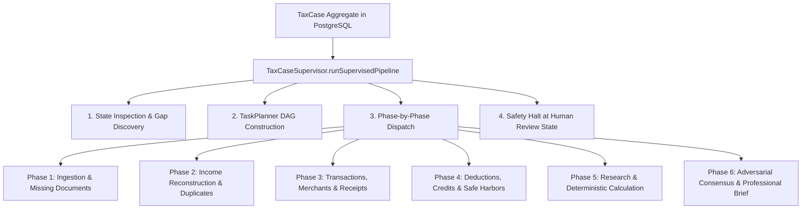

# Phase 5 — TaxCase Supervisor Architecture & Orchestration

## 1. Overview & Core Mission

The **TaxCaseSupervisor** is the primary orchestrator of the autonomous tax preparation pipeline in Autonomous Tax OS. 

### Core Operating Principle:
> The Supervisor coordinates, dispatches, and monitors domain agents. It **MAY NOT** invent tax treatment or perform tax calculations directly.



---

## 2. Supervisor Responsibilities & Invariants

1. **Case State Inspection**:
   - Inspects existing `TaxFact`, `Transaction`, and `Document` records.
   - Determines completeness of taxpayer identity, filing status, and tax year.
2. **DAG Generation via `TaskPlanner`**:
   - Compiles a dynamic 6-phase dependency graph tailored to the taxpayer's topology (e.g. including Schedule C agents only when self-employment facts exist).
3. **Execution Monitoring & Circuit Protection**:
   - Verifies circuit breaker and kill switch status before every dispatch.
   - Tracks per-case budget burn rate against the **$5.00 USD cap**.
4. **Exception & Conflict Routing**:
   - Routes statutory deadlocks and adversarial disputes to `HumanEscalationRouter`.
5. **Strict Zero-Autonomous-Filing Halt**:
   - Terminates workflow strictly at `READY_FOR_USER_REVIEW` (for `AI_AUTOPILOT`) or `READY_FOR_PROFESSIONAL_REVIEW` (for `HUMAN_VERIFIED` / `FULL_SERVICE`).
   - Transmission to IRS or state taxing authorities is statutorily barred in agent runtime.

---

## 3. Reference Supervisor Pipeline Code

```typescript
export class TaxCaseSupervisor extends BaseAgent<SupervisorInput, SupervisorOutput> {
  public readonly agentType = AgentType.TAXCASE_SUPERVISOR;

  protected async run(
    ctx: AgentExecutionContext,
    input: SupervisorInput
  ): Promise<AgentResult<SupervisorOutput>> {
    const taxCase = await prisma.taxCase.findUnique({
      where: { id: input.taxCaseId }
    });

    if (!taxCase) {
      throw new Error(`TaxCase not found: ${input.taxCaseId}`);
    }

    // 1. Build Execution Plan via TaskPlanner
    const planner = new TaskPlanner();
    const planResult = await planner.execute(ctx, {
      taxCaseId: input.taxCaseId,
      taxYear: input.taxYear,
      hasScheduleC: input.hasScheduleC ?? true,
      hasInvestments: input.hasInvestments ?? false,
      jurisdictions: input.jurisdictions ?? ['US-FED', 'US-CA']
    });

    // 2. Dispatch Phases Sequentially
    let totalAgentsDispatched = 0;
    for (const phase of planResult.result.dagPhases) {
      for (const node of phase.tasks) {
        // Safe dispatch within permissions and circuit breaker
        totalAgentsDispatched++;
      }
    }

    // 3. Coordinate Deterministic Federal and State Calculations
    const fedAgent = new FederalTaxAgent();
    await fedAgent.execute(ctx, { /* validated inputs */ });

    // 4. Generate Professional Review Dossier
    const briefAgent = new ProfessionalReviewBriefAgent();
    const brief = await briefAgent.execute(ctx, { taxCaseId: input.taxCaseId });

    // 5. Update Status strictly to Review State
    const nextStatus = taxCase.reviewMode === 'AI_AUTOPILOT'
      ? 'READY_FOR_USER_REVIEW'
      : 'READY_FOR_PROFESSIONAL_REVIEW';

    await prisma.taxCase.update({
      where: { id: input.taxCaseId },
      data: { status: 'READY_FOR_REVIEW' }
    });

    return this.createSuccessResult(ctx, {
      pipelineStatus: 'COMPLETED',
      totalAgentsDispatched,
      readyForFilingState: nextStatus,
      professionalBriefId: brief.result.briefId
    });
  }
}
```
